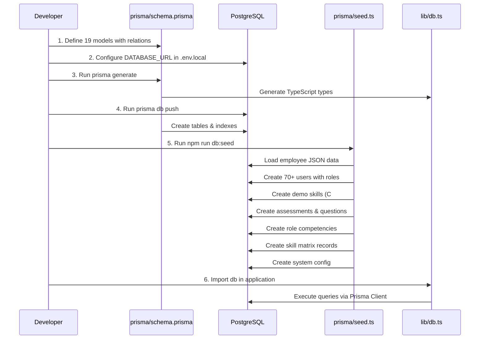

I have created the following plan after thorough exploration and analysis of the codebase. Follow the below plan verbatim. Trust the files and references. Do not re-verify what's written in the plan. Explore only when absolutely necessary. First implement all the proposed file changes and then I'll review all the changes together at the end.

## Observations

The codebase is a Next.js 16.1.4 application with Prisma 7.3.0 already installed but no database schema or configuration exists yet. The `file:app/Data/Exsisting-employee-dataoseed.json` contains ~70 employees with hierarchical structure (manager-reportee relationships via `pid` field), departments, locations, and designations. The PRD defines 17 key entities covering the complete training lifecycle from assessment to skill matrix updates. The project uses shadcn/ui components and follows App Router conventions.

## Approach

The implementation follows a bottom-up approach: first establishing the database foundation with Prisma schema covering all 15+ models, then configuring PostgreSQL connection, followed by creating a comprehensive seed script that imports existing employee data while establishing demo skills and assessments. The Prisma client will be centralized in `file:lib/prisma.ts` for consistent database access across the application. The schema design prioritizes relational integrity with proper foreign keys, enums for type safety, and indexes for performance on frequently queried fields.

## Implementation Steps

### 1. Initialize Prisma Configuration

**Create `file:prisma/schema.prisma`** with the following structure:

- Configure datasource for PostgreSQL with connection URL from environment variable `DATABASE_URL`
- Configure Prisma Client generator with output to `node_modules/.prisma/client`
- Define enums: `Role` (ADMIN, TRAINER, EMPLOYEE, MANAGER), `AssessmentStatus` (DRAFT, PUBLISHED, ARCHIVED), `QuestionType` (MCQ, DESCRIPTIVE, TRUE_FALSE, FILL_BLANK), `TrainingMode` (ONLINE, OFFLINE), `TrainingStatus` (ASSIGNED, IN_PROGRESS, COMPLETED, CANCELLED), `CompetencyLevel` (BEGINNER, INTERMEDIATE, ADVANCED, EXPERT), `ProofStatus` (PENDING, APPROVED, REJECTED), `AttendanceStatus` (PRESENT, ABSENT, LATE), `NotificationType` (ASSESSMENT_ASSIGNED, TRAINING_ASSIGNED, PROGRESS_DUE, FEEDBACK_PENDING, PROOF_SUBMITTED)

**Define 17 models in this order:**

1. **User model**: id (String, @id, @default(cuid())), employeeNo (String, @unique), name, email (@unique), role (Role, @default(EMPLOYEE)), designation, department, location, managerId (String?, self-relation), dateOfJoining (DateTime, @default(now())), resigned (Boolean, @default(false)), level (Int), createdAt, updatedAt, with relations to manager/reportees, assessmentAttempts, skillMatrix, trainingAssignments, progressUpdates, proofs, attendance, feedback, notifications

2. **Skill model**: id, skillName, category, description, createdAt, updatedAt, relations to assessments, skillMatrix, trainings, roleCompetencies

3. **Assessment model**: id, title, description, skillId, totalMarks (Int), passingScore (Int), duration (Int, minutes), status (AssessmentStatus), isPreAssessment (Boolean), createdById, createdAt, updatedAt, relations to skill, questions, attempts, creator

4. **Question model**: id, assessmentId, questionText, questionType, options (Json?), correctAnswer (String?), marks (Int), difficultyLevel (CompetencyLevel), aiGenerated (Boolean, @default(false)), orderIndex (Int), createdAt, updatedAt, relations to assessment, answers

5. **AssessmentAttempt model**: id, assessmentId, userId, score (Int?), percentage (Float?), status (String), startedAt, completedAt, createdAt, relations to assessment, user, answers

6. **Answer model**: id, attemptId, questionId, answerText, isCorrect (Boolean?), marksAwarded (Int?), aiGradingSuggestion (Json?), trainerFeedback (String?), createdAt, relations to attempt, question

7. **SkillMatrix model**: id, userId, skillId, desiredLevel (CompetencyLevel), currentLevel (CompetencyLevel?), gapPercentage (Float?), lastAssessedDate (DateTime?), status (String), createdAt, updatedAt, relations to user, skill, @@unique([userId, skillId])

8. **Training model**: id, topicName, description, mode (TrainingMode), duration (Int, hours), skillId, resources (Json?), venue (String?), meetingLink (String?), maxParticipants (Int?), createdById, createdAt, updatedAt, relations to skill, onlineTraining, offlineTraining, assignments, calendar, creator

9. **OnlineTraining model**: id, trainingId (@unique), resourceLinks (Json), estimatedDuration (Int), mentorRequired (Boolean, @default(true)), createdAt, updatedAt, relation to training

10. **OfflineTraining model**: id, trainingId (@unique), schedule (Json), venue, materials (Json?), trainerIds (Json), createdAt, updatedAt, relation to training

11. **TrainingAssignment model**: id, trainingId, userId, trainerId (String?), mentorId (String?), startDate, targetCompletionDate, completionDate (DateTime?), status (TrainingStatus), createdAt, updatedAt, relations to training, user, trainer, mentor, progressUpdates, proofs, feedback

12. **ProgressUpdate model**: id, assignmentId, weekNumber (Int), completionPercentage (Int), topicsCovered (String?), timeSpent (Int?), challenges (String?), nextPlan (String?), mentorComments (String?), updateDate, createdAt, relations to assignment, @@unique([assignmentId, weekNumber])

13. **ProofOfCompletion model**: id, assignmentId, fileName, filePath, uploadDate, status (ProofStatus), reviewerId (String?), reviewerComments (String?), reviewedAt (DateTime?), createdAt, relations to assignment, reviewer

14. **Attendance model**: id, calendarId, userId, status (AttendanceStatus), remarks (String?), recordedAt, createdAt, relations to calendar, user, @@unique([calendarId, userId])

15. **TrainingCalendar model**: id, trainingId, trainingDate, venue (String?), meetingLink (String?), maxParticipants (Int?), publishedAt (DateTime?), createdAt, updatedAt, relations to training, attendance

16. **Feedback model**: id, assignmentId, submittedById, trainerRating (Int?), contentRating (Int?), logisticsRating (Int?), overallRating (Int?), comments (String?), submittedAt, createdAt, relations to assignment, submitter

17. **Notification model**: id, recipientId, type (NotificationType), subject, message, sentDate, readStatus (Boolean, @default(false)), createdAt, relations to recipient

18. **SystemConfig model**: id, key (@unique), value (Json), description (String?), updatedAt

19. **RoleCompetency model**: id, jobRole, skillId, requiredLevel (CompetencyLevel), isMandatory (Boolean, @default(false)), createdAt, updatedAt, relation to skill, @@unique([jobRole, skillId])

Add indexes on frequently queried fields: User.email, User.employeeNo, Assessment.skillId, Question.assessmentId, AssessmentAttempt.userId, SkillMatrix.userId, TrainingAssignment.userId, Notification.recipientId

### 2. Configure Database Connection

take look at env.local for database configuration


**Update `file:package.json`** to add Prisma scripts:
```json
"scripts": {
  "db:generate": "prisma generate",
  "db:push": "prisma db push",
  "db:migrate": "prisma migrate dev",
  "db:seed": "tsx prisma/seed.ts",
  "db:studio": "prisma studio"
}
```

Add `tsx` to devDependencies for running TypeScript seed files: `npm install -D tsx`

### 3. Set Up Prisma Client

**Create `file:lib/db.ts`**:

- Import PrismaClient from '@prisma/client'
- Implement singleton pattern to prevent multiple Prisma Client instances in development
- Declare global variable `globalThis.prisma` with type `PrismaClient | undefined`
- Export `db` instance: if `globalThis.prisma` exists in development, use it; otherwise create new PrismaClient with log levels ['query', 'error', 'warn'] in development
- In development mode, assign the instance to `globalThis.prisma` to reuse across hot reloads
- Add JSDoc comments explaining the singleton pattern for Next.js hot reload compatibility

### 4. Create Seed Script

**Create `file:prisma/seed.ts`**:

Import necessary modules: PrismaClient, readFileSync from 'fs', join from 'path', and bcrypt if password hashing is needed

**Initialize Prisma client** and define main seed function

**Step 1: Clear existing data** (in development only):
- Delete in reverse dependency order: Notification, Feedback, Attendance, TrainingCalendar, ProofOfCompletion, ProgressUpdate, TrainingAssignment, OfflineTraining, OnlineTraining, Training, Answer, AssessmentAttempt, Question, Assessment, SkillMatrix, RoleCompetency, Skill, User, SystemConfig

**Step 2: Load and parse employee data**:
- Read `file:app/Data/Exsisting-employee-dataoseed.json`
- Parse JSON and extract the `data` array
- Extract unique departments and locations from employee records

**Step 3: Create users from employee data**:
- Map each employee record to User model with fields: employeeNo, name, email, designation, department, location, level, resigned
- Assign roles based on designation patterns: "Managing Director" → ADMIN, "Manager" or "Lead" → MANAGER, "Trainer" or "Mentor" → TRAINER, default → EMPLOYEE
- Store managerId relationships using the `pid` field (parent id) - create a mapping of employee id to created user id, then update manager relationships in a second pass
- Use `db.user.createMany()` for bulk insert, then update manager relationships with individual updates

**Step 4: Create demo skills** (C# .NET Blazor focus):
- Create 8-10 skills: "C# Programming", ".NET Core Framework", "Blazor WebAssembly", "Blazor Server", "Entity Framework Core", "ASP.NET Core Web API", "SQL Server", "Git Version Control", "Unit Testing (xUnit)", "Azure DevOps"
- Each skill should have category (e.g., "Programming Language", "Framework", "Database", "DevOps") and description
- Store created skill IDs for use in assessments and role competencies

**Step 5: Create role competencies**:
- Define competency frameworks for common job roles: "Software Engineer", "Senior Software Engineer", "Application Engineer", "Principal Engineer"
- Map skills to required competency levels (BEGINNER, INTERMEDIATE, ADVANCED, EXPERT) for each role
- Mark mandatory skills (isMandatory: true) for each role

**Step 6: Create demo assessments**:
- Create 2-3 assessments: "C# Fundamentals Assessment", ".NET Blazor Basics", "Full Stack .NET Assessment"
- Link to appropriate skills created in Step 4
- Set totalMarks (e.g., 100), passingScore (e.g., 60), duration (e.g., 60 minutes)
- Set status to PUBLISHED, isPreAssessment to true for initial assessments
- Assign createdById to an ADMIN user

**Step 7: Create demo questions** for each assessment:
- For "C# Fundamentals": 10 questions (mix of MCQ, TRUE_FALSE, FILL_BLANK)
  - MCQ example: "What is the correct syntax for a C# class?" with options as JSON array
  - TRUE_FALSE example: "C# is a statically typed language"
  - FILL_BLANK example: "The keyword to define a constant in C# is ____"
- For ".NET Blazor Basics": 8 questions focusing on Blazor concepts
- For "Full Stack .NET": 5 MCQs + 2 DESCRIPTIVE questions
- Set difficultyLevel appropriately (BEGINNER for fundamentals, INTERMEDIATE for Blazor, ADVANCED for full stack)
- Set orderIndex for question sequence

**Step 8: Create system configuration**:
- Create SystemConfig records for: inductionDuration (value: 90 days), passingScorePercentage (value: 60), progressUpdateFrequency (value: 7 days), postTrainingAssessmentDelay (value: 30 days), maxOTPAttempts (value: 3), otpExpiryMinutes (value: 5)

**Step 9: Create initial skill matrix** for a subset of employees:
- Select 5-10 employees (mix of roles)
- Create SkillMatrix records linking them to relevant skills based on their designation
- Set desiredLevel based on role competencies
- Leave currentLevel as null (to be filled after assessments)
- Calculate gapPercentage as 100 (since no assessment taken yet)

**Error handling**: Wrap entire seed in try-catch, log errors, and ensure Prisma client disconnects in finally block

**Export seed function** and call it if running as main script

**Update `file:package.json`** to add prisma seed configuration:
```json
"prisma": {
  "seed": "tsx prisma/seed.ts"
}
```

### 5. Run Database Setup

Execute the following commands in sequence:

1. **Generate Prisma Client**: `npm run db:generate` - generates TypeScript types and Prisma Client based on schema
2. **Push schema to database**: `npm run db:push` - creates database tables without migration files (useful for initial setup)
3. **Run seed script**: `npm run db:seed` - populates database with employee data and demo content
4. **Verify data**: `npm run db:studio` - opens Prisma Studio to visually inspect seeded data

Alternative approach using migrations (recommended for production):
1. `npx prisma migrate dev --name init` - creates initial migration and applies it
2. `npm run db:seed` - runs seed script
3. `npm run db:studio` - verify data

### 6. Verification Steps

**Database verification**:
- Open Prisma Studio and confirm all 19 tables exist
- Verify User table has ~70 employee records with correct role assignments
- Check Skill table has 8-10 demo skills related to C# .NET Blazor
- Confirm Assessment table has 2-3 assessments with PUBLISHED status
- Verify Question table has 20+ questions linked to assessments
- Check RoleCompetency table has competency frameworks defined
- Verify SkillMatrix table has initial records for selected employees
- Confirm SystemConfig table has configuration values

**Code verification**:
- Import `db` from `file:lib/db.ts` in a test file and execute a simple query: `await db.user.count()`
- Verify TypeScript autocomplete works for all models
- Check that Prisma Client types are generated correctly in `node_modules/.prisma/client`

**Relationship verification**:
- Query a User with their manager: `db.user.findUnique({ where: { email: '...' }, include: { manager: true, reportees: true } })`
- Query an Assessment with questions: `db.assessment.findFirst({ include: { questions: true, skill: true } })`
- Query a Skill with assessments and trainings: `db.skill.findFirst({ include: { assessments: true, roleCompetencies: true } })`

### 7. Documentation

**Create `file:prisma/README.md`**:
- Document the database schema structure with ER diagram (Mermaid)
- List all models with their purpose
- Explain seeding process and how to reset database
- Document common queries and patterns
- Include instructions for running migrations vs db push
- Add troubleshooting section for common Prisma issues

**Update `file:README.md`** (project root):
- Add "Database Setup" section with quick start commands
- Document environment variables required
- Add link to Prisma schema documentation
- Include instructions for accessing Prisma Studio

