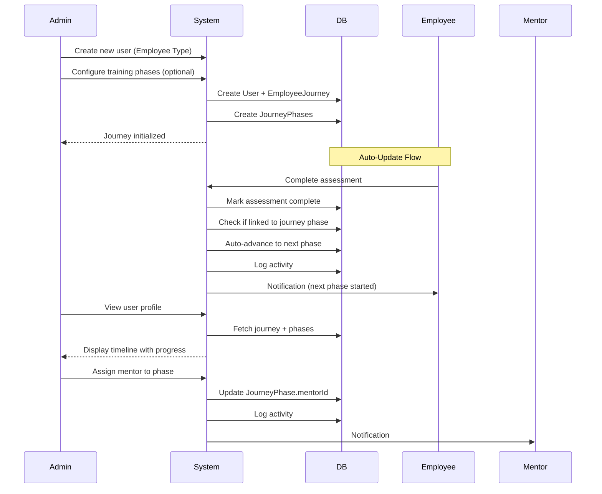

# Phase 10: Employee Development Lifecycle Management

## Overview
Build an automated employee development lifecycle system with configurable training phases for new employee onboarding (45-day induction) and continuous development for existing employees. Journey stages auto-update based on assessment/training completions. Display journey status in user profiles with visual progress tracking.

---

## Implementation Plan

### 1. Database Schema

**Extend `prisma/schema.prisma`:**

Add enums:

```prisma
enum EmployeeType {
  NEW_EMPLOYEE
  EXISTING_EMPLOYEE
}

enum JourneyStatus {
  NOT_STARTED
  IN_PROGRESS
  COMPLETED
  PAUSED
}

enum PhaseType {
  // New Employee (Configurable phases - admin can add/skip)
  INDUCTION_INITIAL_ASSESSMENT
  INDUCTION_TRAINING
  SKILL_ASSESSMENT
  TNA_GENERATION
  PROGRESS_TRACKING
  FEEDBACK_COLLECTION
  POST_ASSESSMENT
  
  // Existing Employee (Auto-updated)
  ROLE_ASSESSMENT
  TRAINING_ASSIGNMENT
  TRAINING_EXECUTION
  RE_ASSESSMENT
  MATRIX_UPDATE
}

enum PhaseStatus {
  NOT_STARTED
  IN_PROGRESS
  COMPLETED
  OVERDUE
}
```

Extend User model:

```prisma
model User {
  // ... existing fields
  
  // Employee Lifecycle Fields
  employeeType              EmployeeType?
  journeyStatus             JourneyStatus @default(NOT_STARTED)
  currentPhaseId            String?
  inductionStartDate        DateTime?
  
  // Relations
  journey                   EmployeeJourney?
  currentPhase              JourneyPhase? @relation("CurrentPhase")
  phasesAsMentor            JourneyPhase[] @relation("PhaseMentor")
  journeyActivities         JourneyActivity[]
}
```

Add Journey models:

```prisma
// Main journey tracker
model EmployeeJourney {
  id              String        @id @default(cuid())
  userId          String        @unique
  employeeType    EmployeeType
  status          JourneyStatus @default(NOT_STARTED)
  startedAt       DateTime?
  completedAt     DateTime?
  cycleNumber     Int           @default(1) // For existing employees
  createdAt       DateTime      @default(now())
  updatedAt       DateTime      @updatedAt
  
  user            User          @relation(fields: [userId], references: [id], onDelete: Cascade)
  phases          JourneyPhase[]
  activities      JourneyActivity[]
  
  @@index([userId, status])
}

// Configurable phases
model JourneyPhase {
  id                    String      @id @default(cuid())
  journeyId             String
  phaseType             PhaseType
  phaseNumber           Int
  title                 String
  description           String?
  durationDays          Int         @default(3)
  status                PhaseStatus @default(NOT_STARTED)
  startedAt             DateTime?
  completedAt           DateTime?
  dueDate               DateTime?
  
  // Optional mentor per phase
  mentorId              String?
  
  // Linked entities (auto-tracked)
  assessmentId          String?
  trainingAssignmentId  String?
  
  createdAt             DateTime    @default(now())
  updatedAt             DateTime    @updatedAt
  
  journey               EmployeeJourney @relation(fields: [journeyId], references: [id], onDelete: Cascade)
  mentor                User?           @relation("PhaseMentor", fields: [mentorId], references: [id])
  currentUsers          User[]          @relation("CurrentPhase")
  
  @@unique([journeyId, phaseNumber])
  @@index([journeyId, status])
}

// Activity log
model JourneyActivity {
  id              String          @id @default(cuid())
  journeyId       String
  phaseNumber     Int?
  activityType    String          // PHASE_AUTO_COMPLETED, MENTOR_ASSIGNED, etc.
  title           String
  description     String?
  metadata        Json?
  createdAt       DateTime        @default(now())
  
  journey         EmployeeJourney @relation(fields: [journeyId], references: [id], onDelete: Cascade)
  
  @@index([journeyId, createdAt])
}
```

Run migration:
```bash
npx prisma migrate dev --name add_employee_journey_system
npx prisma generate
```

---

### 2. Journey Engine (Auto-Update Logic)

**Create `lib/journey-engine.ts`:**

Core functions:
- `initializeJourney(userId, employeeType, phases)` - Create journey with configurable phases
- `autoAdvancePhase(journeyId, triggeredBy)` - Auto-advance when assessment/training completes
- `calculatePhaseProgress(journeyId)` - Calculate % completion
- `checkOverduePhases()` - Daily cron to mark overdue

Key logic:
- New employee phases are configurable (admin adds/removes)
- Existing employee phases auto-update on events:
  - Assessment completion → advances from ROLE_ASSESSMENT
  - Training assignment → advances from TRAINING_ASSIGNMENT
  - Training completion → advances from TRAINING_EXECUTION
  - Post-assessment → advances from RE_ASSESSMENT
  - Skill matrix update → advances from MATRIX_UPDATE

---

### 3. Server Actions

**Create `actions/journeys.ts`:**

- `createJourney(userId, employeeType, customPhases?)` - Initialize with configurable phases
- `addJourneyPhase(journeyId, phaseConfig)` - Add custom phase (new employees only)
- `skipJourneyPhase(journeyId, phaseNumber)` - Skip phase
- `assignMentorToPhase(phaseId, mentorId)` - Assign mentor for specific training phase
- `getEmployeeJourney(userId)` - Fetch full journey with progress
- `getAllJourneys(filters)` - Filter by type/status/department

**Modify existing actions:**

**`actions/assessments.ts` → `completeGrading`:**
```typescript
// After grading, check if linked to journey
if (assessment.user.journey?.currentPhase?.assessmentId === assessmentId) {
  await autoAdvancePhase(journey.id, 'assessment_completed')
}
```

**`actions/trainings.ts` → `updateTrainingCompletion`:**
```typescript
// After marking complete
if (assignment.user.journey?.currentPhase?.trainingAssignmentId === assignmentId) {
  await autoAdvancePhase(journey.id, 'training_completed')
}
```

---

### 4. Users Table Enhancement (WHERE JOURNEY IS FIRST VISIBLE)

**Modify `app/(dashboard)/admin/users/page.tsx`:**

This is the **FIRST PLACE** admin sees employee journeys:

**Tab Navigation:**
```
┌─────────────────────────────────────────────────────────────┐
│  [All Employees]  [New Employees (12)]  [Existing (45)]    │
└─────────────────────────────────────────────────────────────┘
```

**Table Columns (with journey info):**
```
┌──────────────┬────────────┬────────────────┬─────────────┬──────────────┬─────────┐
│ Name         │ Role       │ Employee Type  │ Current     │ Progress     │ Actions │
│              │            │                │ Phase       │              │         │
├──────────────┼────────────┼────────────────┼─────────────┼──────────────┼─────────┤
│ John Doe     │ Developer  │ 🆕 New         │ Day 12/45   │ [████░░] 35% │ [View]  │
│              │            │                │ Training    │              │         │
├──────────────┼────────────┼────────────────┼─────────────┼──────────────┼─────────┤
│ Jane Smith   │ Designer   │ 🔄 Existing    │ Training    │ [██░░░░] 20% │ [View]  │
│              │            │                │ Execution   │              │         │
└──────────────┴────────────┴────────────────┴─────────────┴──────────────┴─────────┘
```

**Each row shows:**
- **Employee Type:** Badge with icon (🆕 New / 🔄 Existing)
- **Current Phase:** Text badge with phase name
- **Progress:** Visual progress bar with percentage
- **Days:** "Day 12/45" for new employees or "Cycle 2" for existing
- **Actions:** "View Journey" button → Opens full timeline

**Interaction:**
- Click any row or "View Journey" button
- Opens: `app/(dashboard)/admin/users/[id]/journey/page.tsx`

**shadcn components:** `tabs`, `table`, `badge`, `progress`, `button`, `tooltip`

---

### 5. User Profile with Journey Timeline (MAIN JOURNEY VIEW)

**Create `app/(dashboard)/admin/users/[id]/journey/page.tsx`:**

This is the **DETAILED JOURNEY VISUALIZATION** page:

---

**🎯 Page Layout:**

```
┌─────────────────────────────────────────────────────────────────────┐
│                        HEADER SECTION                               │
│ ┌─────────────────────────────────────────────────────────────────┐ │
│ │  [Avatar]  John Doe                                             │ │
│ │            Software Developer | Engineering Dept                │ │
│ │                                                                 │ │
│ │  🆕 New Employee Journey                    Day 25 of 45       │ │
│ │                                                                 │ │
│ │  Overall Progress:  [████████░░] 55%                           │ │
│ │  Started: Jan 1, 2026  |  Expected End: Feb 15, 2026          │ │
│ └─────────────────────────────────────────────────────────────────┘ │
└─────────────────────────────────────────────────────────────────────┘
```

---

**📍 VERTICAL TIMELINE (Left Side - 60% width):**

Built with `accordion` component from shadcn:

```
┌─────────────────────────────────────────────────────────────────┐
│                      JOURNEY PHASES                             │
│                                                                 │
│  ✅ Phase 1: Initial Assessment                                │
│     └─ Completed on Jan 5, 2026                                │
│     └─ Mentor: Sarah Johnson                                   │
│     └─ [View Assessment Results →]                             │
│                                                                 │
│  ✅ Phase 2: Induction Training                                │
│     └─ Completed on Jan 12, 2026                               │
│     └─ Mentor: Mike Chen                                       │
│     └─ [View Training Materials →]                             │
│                                                                 │
│  🔵 Phase 3: Skill Assessment (IN PROGRESS) ← PULSING          │
│  ┌─────────────────────────────────────────────────────────┐   │
│  │ 📝 Description: Comprehensive skill evaluation          │   │
│  │                                                          │   │
│  │ 👤 Mentor: David Kumar                                  │   │
│  │ 📅 Started: Jan 20, 2026                                │   │
│  │ ⏰ Due: Jan 27, 2026 (2 days left)                      │   │
│  │                                                          │   │
│  │ Progress: [██████░░░░] 60%                              │   │
│  │                                                          │   │
│  │ 🔗 Linked: Assessment #ASM-2026-0123                    │   │
│  │            [Open Assessment →]                           │   │
│  │                                                          │   │
│  │ ⚡ Auto-advances when assessment is graded              │   │
│  └─────────────────────────────────────────────────────────┘   │
│                                                                 │                  │
│                                                                 │
└─────────────────────────────────────────────────────────────────┘
```

**Visual Design:**
- **Vertical line** connecting all phases (using `separator` or custom CSS)
- **Status dots:**
  - ✅ Green checkmark (completed)
  - 🔵 Blue pulsing dot (in progress)
  - ⏳ Gray outline (upcoming)
  - 🔴 Red exclamation (overdue)
- **Accordion items** expand/collapse on click
- **Glassmorphism cards** for expanded phase details
- **Hover effect** shows tooltip with quick info

---

**📊 ACTIVITY LOG (Right Side - 40% width):**

```
┌─────────────────────────────────────────────────────────────┐
│              RECENT ACTIVITY                                │
│                                                             │
│  🎯 Phase 3 started                                         │
│     Jan 20, 2026 at 9:00 AM                                 │
│                                                             │
│  ─────────────────────────────────                          │
│                                                             │
│  ✅ Phase 2 completed                                       │
│     Jan 12, 2026 at 4:30 PM                                 │
│     Completed 2 days early                                  │
│                                                             │
│  ─────────────────────────────────                          │
│                                                             │
│  👤 Mentor assigned: David Kumar                            │
│     Jan 11, 2026 at 10:15 AM                                │
│     Assigned to Phase 3                                     │
│                                                             │
│  ─────────────────────────────────                          │
│                                                             │
│  ✅ Phase 1 completed                                       │
│     Jan 5, 2026 at 2:00 PM                                  │
│                                                             │
│  ─────────────────────────────────                          │
│                                                             │
│  🚀 Journey started                                         │
│     Jan 1, 2026 at 9:00 AM                                  │
│                                                             │
│  [Load More Activity...]                                    │
└─────────────────────────────────────────────────────────────┘
```

**Scrollable with `scroll-area` component**
**Icons:** Different emoji/icon per activity type
**Timestamps:** Relative ("2 days ago") with absolute on hover

---

**🎛️ ACTION BUTTONS (Top Right):**

```
[ 👤 Assign Mentor ] [ ⏸️ Pause Journey ] [ 📧 Send Reminder ] [ ⋮ More ]
```

Click "Assign Mentor" → Opens `MentorAssignmentDialog.tsx`

---

**shadcn components:** 
- Primary: `accordion` (timeline), `card`, `badge`, `avatar`, `progress`, `scroll-area`
- Supporting: `separator`, `button`, `tooltip`, `dialog`, `sheet`, `skeleton`

---

### 6. Journey Initialization (WHEN JOURNEY STARTS)

**Modify `components/dashboard/users/create-user-dialog.tsx`:**

This is **WHEN** admin creates a journey for a new employee:

---

**🎨 Dialog UI:**

```
┌──────────────────────────────────────────────────────────────┐
│                    Create New Employee                       │
│                                                              │
│  Basic Information:                                          │
│  ┌────────────────────────────────────────────────────────┐ │
│  │ Name: [_______________]  Email: [_________________]    │ │
│  │ Role: [_______________]  Dept:  [_________________]    │ │
│  └────────────────────────────────────────────────────────┘ │
│                                                              │
│  Employee Type:                                              │
│  ⚫ New Employee                         │
│  ⚪ Existing Employee (continuous training)                  │
│                                                              │
│  ┌──────────────────────────────────────────────────────────┐ │
│  │ ✅ Initialize Training Journey                           │ │
│  │                                                          │ │
│  │ Journey Start Date: [📅 Feb 1, 2026      ]              │ │
│  │                                                          │ │
│  │ Configure Training Phases:                               │ │
│  │                                                          │ │
│  │  1. ✓ Initial Assessment (2 days)         [Edit] [✗]   │ │
│  │  2. ✓ Phase 1 Training (15 days)          [Edit] [✗]   │ │
│  │  3. ✓ Phase 2 Training (15 days)          [Edit] [✗]   │ │
│  │  3. ✓ Skill Assessment          [Edit] [✗]   │ │
│  │  4. ✓ TNA Generation           [Edit] [✗]   │ │
│  │  5. ✓ Training Execution (30 days)        [Edit] [✗]   │ │
│  │  6. ✓ Progress Tracking        [Edit] [✗]   │ │
│  │  7. ✓ Post-Assessment             [Edit] [✗]   │ │
│  │  8. ✓ Feedback Collection       [Edit] [✗]   │ │
│  │                                                          │ │
│  │  [+ Add Custom Phase]                                    │ │
│  │                                                          │ │
│  │  Total Duration: 45 days                                 │ │
│  │  Expected Completion: Mar 18, 2026                       │ │
│  │                                                          │ │
│  │  Assign Initial Mentor: [Select Mentor ▼]               │ │
│  │  (Can assign different mentors per phase later)         │ │
│  └──────────────────────────────────────────────────────────┘ │
│                                                              │
│              [Cancel]           [Create Employee & Start]    │
└──────────────────────────────────────────────────────────────┘
```

---

**🔧 Functionality:**

**If "New Employee" selected:**
- Shows journey configuration panel
- Admin can:
  - ✏️ Edit phase durations
  - 🗑️ Remove unnecessary phases
  - ➕ Add custom training phases
  - 👤 Assign initial mentor
  - 📅 Set start date


**On "Create Employee & Start" button click:**
```typescript
if (startJourney && employeeType === 'NEW_EMPLOYEE') {
  await createJourney(userId, employeeType, customPhases)
  // Journey is now visible in users table
}
```

---

**If "Existing Employee" selected:**
- No journey configuration needed
- Journey starts automatically on first skill assessment
- Uses fixed 5-phase cycle:
  1. Role Assessment
  2. Training Assignment
  3. Training Execution
  4. Re-Assessment
  5. Matrix Update

---

**shadcn components:** 
- `radio-group` (employee type)
- `dialog` (container)
- `checkbox` (initialize journey)
- `calendar` (start date picker)
- `button` (edit/remove/add phases)
- `input` (phase duration)
- `select` (mentor dropdown)
- `separator` (visual breaks)

---

### 7. Mentor Assignment Dialog (ASSIGN MENTORS TO PHASES)

**Create `components/journeys/MentorAssignmentDialog.tsx`:**

Dialog to assign different mentors to different phases:

```
┌───────────────────────────────────────────────────────────┐
│              Assign Mentor to Phase                       │
│                                                           │
│  For Employee: John Doe                                   │
│                                                           │
│  Select Phase:                                            │
│  ┌─────────────────────────────────────────────────────┐ │
│  │ Phase 3: Skill Assessment (In Progress)         ▼  │ │
│  └─────────────────────────────────────────────────────┘ │
│                                                           │
│  Select Mentor:                                           │
│  ┌─────────────────────────────────────────────────────┐ │
│  │ 👤 David Kumar - Senior Developer              ▼  │ │
│  └─────────────────────────────────────────────────────┘ │
│                                                           │
│  ┌─────────────────────────────────────────────────────┐ │
│  │ Available Mentors:                                  │ │
│  │                                                     │ │
│  │ 👤 David Kumar     Senior Developer    [Select]    │ │
│  │ 👤 Sarah Johnson   Lead Designer       [Select]    │ │
│  │ 👤 Mike Chen       Tech Lead           [Select]    │ │
│  │ 👤 Lisa Wang       Product Manager     [Select]    │ │
│  └─────────────────────────────────────────────────────┘ │
│                                                           │
│  Notification Message (optional):                         │
│  ┌─────────────────────────────────────────────────────┐ │
│  │ Hi David, you've been assigned as mentor for       │ │
│  │ John's skill assessment phase...                   │ │
│  └─────────────────────────────────────────────────────┘ │
│                                                           │
│  ☑️ Send email notification to mentor                    │
│  ☑️ Send notification to employee                        │
│                                                           │
│              [Cancel]           [Assign Mentor]           │
└───────────────────────────────────────────────────────────┘
```

**Features:**
- Shows list of available mentors with avatars
- Filter mentors by role/department
- Preview mentor's current mentorship load
- Customizable notification message
- Logs activity when assigned

**shadcn components:** `dialog`, `select`, `avatar`, `button`, `textarea`, `checkbox`, `scroll-area`

---

### 8. Dashboard Statistics Widget

**Update `app/(dashboard)/admin/page.tsx`:**


**shadcn components:** `card`, `badge`, `button`, `separator`


---

## Complete UI/UX Flow Summary

### 🎯 Where Employee Journey Appears:

**1️⃣ First Visibility: Users Table**
- Location: `app/(dashboard)/admin/users/page.tsx`
- Shows: Employee type badge, current phase, progress bar, days remaining
- Action: Click row → Opens detailed journey view

**2️⃣ Detailed View: Journey Timeline Page**
- Location: `app/(dashboard)/admin/users/[id]/journey/page.tsx`
- Shows: Full vertical timeline with all phases, activity log, mentor info
- Interactive: Expand/collapse phases, view linked assessments/trainings

**3️⃣ Creation: User Creation Dialog**
- Location: `components/dashboard/users/create-user-dialog.tsx`
- Shows: Configurable phase builder for new employees
- Action: Creates journey when user is created

**4️⃣ Dashboard: Statistics Widget**
- Location: `app/(dashboard)/admin/page.tsx`
- Shows: Active journeys count, completed, overdue phases
- Quick overview of system-wide journey status

---

## Components Breakdown

### 📦 New Components to Create:

1. **`components/journeys/JourneyTimeline.tsx`**
   - Vertical timeline with accordion phases
   - Color-coded status indicators
   - Expandable phase details
   - Pulsing animation for active phase
   - Uses: `accordion`, `card`, `badge`, `progress`, `separator`

2. **`components/journeys/PhaseCard.tsx`**
   - Individual phase display card
   - Shows: title, duration, mentor, status, due date
   - Links to assessments/trainings
   - Uses: `card`, `badge`, `avatar`, `button`

3. **`components/journeys/ActivityLog.tsx`**
   - Scrollable activity feed
   - Timeline-style list with icons
   - Relative timestamps
   - Load more pagination
   - Uses: `scroll-area`, `separator`, `button`

4. **`components/journeys/MentorAssignmentDialog.tsx`**
   - Dialog for assigning mentors to phases
   - Mentor selection with avatars
   - Custom notification message
   - Uses: `dialog`, `select`, `avatar`, `textarea`, `checkbox`

5. **`components/journeys/PhaseConfigBuilder.tsx`**
   - Used in create user dialog
   - Add/edit/remove training phases
   - Duration adjustment
   - Drag-to-reorder phases
   - Uses: `button`, `input`, `card`, `badge`

6. **`components/journeys/JourneyStatsCard.tsx`**
   - Dashboard statistics widget
   - Shows active/completed/overdue counts
   - Recent activity feed
   - Uses: `card`, `badge`, `button`, `separator`

---

## Pages Breakdown

### 📄 New Pages to Create:

1. **`app/(dashboard)/admin/users/[id]/journey/page.tsx`**
   - **Main journey visualization page**
   - Layout: 60% timeline + 40% activity log
   - Header with employee info and overall progress
   - Action buttons (assign mentor, pause, remind)
   - Server component fetching journey data

---

### 📝 Pages to Modify:

1. **`app/(dashboard)/admin/users/page.tsx`**
   - Add tabs for employee types
   - Add journey columns (type, phase, progress)
   - Add "View Journey" button per row
   - Table click handler → navigate to journey page

2. **`app/(dashboard)/admin/page.tsx`**
   - Add `JourneyStatsCard` component
   - Show active onboarding count
   - Show overdue phases alert
   - Recent journey activities list

3. **`components/dashboard/users/create-user-dialog.tsx`**
   - Add employee type radio selection
   - Add "Initialize Journey" checkbox
   - Conditionally show `PhaseConfigBuilder`
   - Add start date picker
   - Call `createJourney` server action on submit

---

## Modern UI Design Specifications

**Journey Timeline Visual Style:**
- Vertical stepper with modern circular status dots
- Connecting line between phases (CSS border or `separator`)
- Animated progress transitions (Framer Motion)
- Color-coded phases:
  - 🟢 **Green:** Completed (with checkmark ✅)
  - 🔵 **Blue:** In Progress (pulsing animation)
  - 🔴 **Red:** Overdue (exclamation mark ⚠️)
  - ⚪ **Gray:** Not Started (outline circle)
- Glassmorphism cards for expanded phase details
- Blur backdrop effects
- Smooth hover effects with scale transform
- Gradient accents matching app theme

**Progress Indicators:**
- Circular progress ring for overall % (using `progress` or custom SVG)
- Linear progress bars per phase
- Animated number counters with counting animation
- Trend indicators (↑↓) comparing to average

**Activity Feed Visual Style:**
- Timeline layout with left-aligned timestamps
- Icon badges for different activity types:
  - 🎯 Phase started
  - ✅ Phase completed
  - 👤 Mentor assigned
  - 📝 Assessment linked
  - 🎓 Training assigned
  - ⚠️ Overdue notification
- Relative timestamps ("2 hours ago", "yesterday")
- Absolute timestamp on hover
- Grouped by date with date separators
- Load more button with skeleton loading states

**Color Palette:**
```css
--phase-completed: hsl(142, 76%, 36%)     /* Green */
--phase-progress: hsl(221, 83%, 53%)      /* Blue */
--phase-overdue: hsl(0, 84%, 60%)         /* Red */
--phase-pending: hsl(215, 16%, 47%)       /* Gray */
--glassmorphism-bg: rgba(255,255,255,0.05)
--glassmorphism-border: rgba(255,255,255,0.1)
```

**Animations:**
- Pulsing dot for active phase (CSS keyframes)
- Progress bar fill animation (transition)
- Accordion expand/collapse (smooth height transition)
- Number counting animation for stats
- Skeleton loading for async data

**Responsive Design:**
- Desktop (>1024px): Side-by-side timeline + activity
- Tablet (768-1024px): Stacked layout
- Mobile (<768px): Single column, condensed timeline

---

## shadcn Components Install Command

Install all required components:

```bash
npx shadcn@latest add accordion collapsible card badge progress separator avatar scroll-area button dialog select radio-group calendar checkbox input sheet skeleton tabs table tooltip textarea
```

---

**Journey Timeline:**
- Vertical stepper with modern dots
- Animated progress transitions
- Color-coded phases:
  - Blue: In Progress
  - Green: Completed
  - Red: Overdue
  - Gray: Not Started
- Glassmorphism cards
- Hover effects showing phase details
ecommended Approach for Interactive Timeline:
Primary Components:

@shadcn/accordion - For expandable phase details (best choice for interactive timeline)

Each phase as an accordion item
Expand to show details (duration, mentor, linked entities)
Smooth animations
@shadcn/collapsible - Alternative for simpler expand/collapse

Lighter weight than accordion
Good for activity log sections
Supporting Components:

@shadcn/card - For phase containers
@shadcn/badge - For status indicators (Completed, In Progress, Overdue)
@shadcn/separator - For connecting lines between phases
@shadcn/progress - For progress bars
@shadcn/avatar - For mentor profiles
@shadcn/scroll-area - For activity log

**Progress Indicators:**
- Circular progress ring for overall %
- Linear progress bars per phase
- Animated number counters
- Trend indicators (↑↓)

**Activity Feed:**
- Timeline with icons
- Relative timestamps ("2 days ago")
- Grouped by date
- Load more pagination

```

---

## Component Details

**`accordion` for Interactive Timeline:**
- Each phase = one accordion item
- Click to expand/collapse phase details
- Smooth animations built-in
- Shows: duration, mentor, linked entities, status, due date
- Custom trigger styling for status colors

---

## shadcn Components Summary

Core: `tabs`, `table`, `badge`, `progress`, `card`, `avatar`, `button`, `separator`, `collapsible`, `scroll-area`, `dialog`, `select`, `radio-group`, `calendar`, `checkbox`, `input`, `sheet`, `skeleton`

---

## Sequence Diagram



---

## Key Features

✅ **Configurable Phases** - Admin can add/skip training phases for new employees
✅ **Auto-Update** - Phases advance automatically on assessment/training completion
✅ **Flexible Mentors** - Different mentors per phase
✅ **No Manual Updates** - Admin doesn't manually complete phases
✅ **Visual Timeline** - Modern vertical stepper showing progress
✅ **Tabs in Users Table** - New/Existing employee views
✅ **Profile-Based** - Click user row → opens journey in profile
✅ **Activity Logging** - Complete audit trail
✅ **Overdue Detection** - Automated notifications

---

## Files to Create

1. `lib/journey-engine.ts` - Auto-update logic
2. `actions/journeys.ts` - Journey management
3. `app/(dashboard)/admin/users/[id]/journey/page.tsx` - Journey profile view
4. `components/journeys/MentorAssignmentDialog.tsx` - Mentor assignment
5. `components/journeys/JourneyTimeline.tsx` - Visual timeline component
6. `components/journeys/ActivityLog.tsx` - Activity feed
7. `app/api/cron/journey-reminders/route.ts` - Cron job

## Files to Modify

1. `prisma/schema.prisma` - Add journey models
2. `actions/assessments.ts` - Hook for auto-advance
3. `actions/trainings.ts` - Hook for auto-advance
4. `app/(dashboard)/admin/users/page.tsx` - Add tabs
5. `components/dashboard/users/create-user-dialog.tsx` - Add journey setup
6. `app/(dashboard)/admin/page.tsx` - Add journey stats
