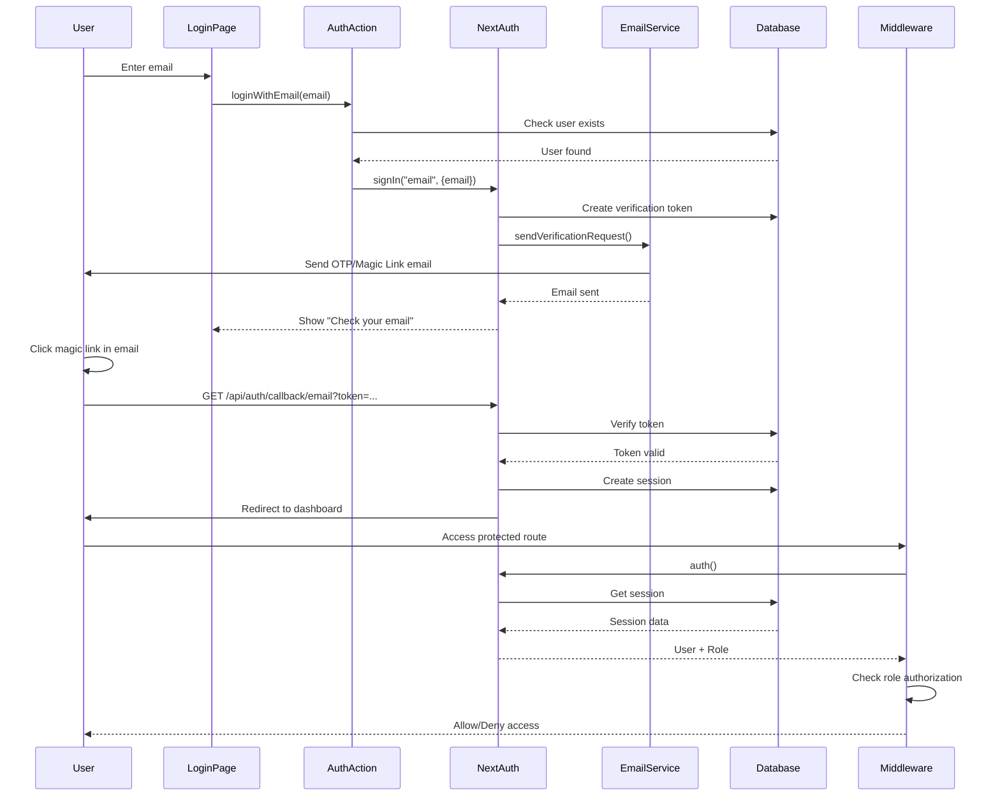
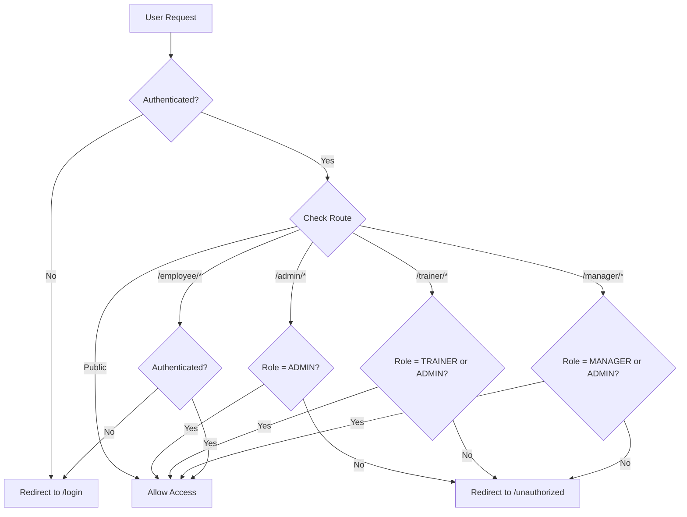

I have created the following plan after thorough exploration and analysis of the codebase. Follow the below plan verbatim. Trust the files and references. Do not re-verify what's written in the plan. Explore only when absolutely necessary. First implement all the proposed file changes and then I'll review all the changes together at the end.

## Observations

The foundation phase has been successfully completed with Prisma schema containing 15+ models and PostgreSQL database setup. NextAuth v5 (beta.30), @auth/prisma-adapter (2.11.1), and nodemailer (7.0.12) are already installed. The User model exists with Role enum supporting ADMIN, TRAINER, EMPLOYEE, and MANAGER roles. However, NextAuth's required Prisma adapter models (Account, Session, VerificationToken) are missing from the schema. The project uses shadcn/ui components with Nova preset and emerald theme. No authentication infrastructure exists yet - no auth config, middleware, login pages, or server actions.

## Approach

Implement passwordless email authentication using NextAuth v5 with a custom nodemailer-based OTP delivery system. Extend the existing Prisma schema with NextAuth adapter models while preserving the current User model structure. Configure NextAuth with Email provider using nodemailer for OTP generation and delivery (avoiding Resend as specified). Build a clean login interface using existing shadcn/ui components. Implement role-based access control (RBAC) middleware to protect routes based on the four user roles. Create server actions for authentication flows and session management. This approach leverages NextAuth v5's native Prisma adapter integration while maintaining full control over email delivery through nodemailer.

## Implementation Steps

### 0. Install Required shadcn/ui Components

Before implementing authentication, ensure all required UI components are available. The project uses **shadcn/ui with Radix Nova preset and emerald theme**.

**Existing Components (Already Installed):**
- ✅ Card (card.tsx)
- ✅ Input (input.tsx)
- ✅ Button (button.tsx)
- ✅ Label (label.tsx)
- ✅ Badge (badge.tsx)
- ✅ Separator (separator.tsx)
- ✅ Alert Dialog (alert-dialog.tsx)

**Components to Install:**

Run the following command to install missing components needed for authentication:

```bash
npx shadcn@latest add @shadcn/form @shadcn/alert @shadcn/spinner
```

**Component Usage in Authentication:**
- **Form** - For structured login form with validation
- **Alert** - For displaying error/success messages
- **Spinner** - For loading states during authentication

**Note:** The project is already configured with:
- Style: `radix-nova`
- Icon Library: `remixicon`
- Base Color: `gray`
- CSS Variables: Enabled
- TypeScript: Enabled
- RSC: Enabled

All components will follow the existing theme (emerald) and design system.

### 1. Update Prisma Schema with NextAuth Models

**File:** `file:prisma/schema.prisma`

Add the following models after the existing User model to support NextAuth's Prisma adapter:

```prisma
// NextAuth.js Models
model Account {
  id                String  @id @default(cuid())
  userId            String
  type              String
  provider          String
  providerAccountId String
  refresh_token     String?
  access_token      String?
  expires_at        Int?
  token_type        String?
  scope             String?
  id_token          String?
  session_state     String?

  user User @relation(fields: [userId], references: [id], onDelete: Cascade)

  @@unique([provider, providerAccountId])
  @@index([userId])
}

model Session {
  id           String   @id @default(cuid())
  sessionToken String   @unique
  userId       String
  expires      DateTime

  user User @relation(fields: [userId], references: [id], onDelete: Cascade)

  @@index([userId])
}

model VerificationToken {
  identifier String
  token      String   @unique
  expires    DateTime

  @@unique([identifier, token])
}
```

Update the existing User model to add relations for NextAuth:

```prisma
model User {
  // ... existing fields ...
  
  // Add these relations to existing relations section
  accounts Account[]
  sessions Session[]
}
```

Run migration:
```bash
npx prisma migrate dev --name add_nextauth_models
npx prisma generate
```

### 2. Create Email Service with Nodemailer

**File:** `file:lib/email.ts`

Create a nodemailer-based email service for sending magic links:

- Import `createTransport` from `nodemailer`
- Import types from `next-auth/providers/nodemailer` (if needed for typing)
- Create `sendVerificationRequest` async function with parameters:
  - `identifier` (string): user's email address
  - `url` (string): magic link URL for authentication
  - `provider` (object): contains `server` and `from` config
  - `theme` (object): optional theme configuration for email styling
- Configure nodemailer transporter:
  - Use `provider.server` which contains EMAIL_SERVER connection string
  - Alternatively parse individual variables (EMAIL_SERVER_HOST, EMAIL_SERVER_PORT, etc.)
- Design HTML email template with:
  - Company branding (Skill Loop)
  - Clear call-to-action button with the `url` parameter
  - Expiration notice (default 24 hours unless customized)
  - Security warning about not sharing the link
  - Text fallback version for non-HTML email clients
- Implement error handling:
  - Use `transport.sendMail()` and check for `result.rejected` and `result.pending`
  - Throw error if any emails failed: `throw new Error(\`Email(s) could not be sent\`)`
- Add console logging for debugging email issues
- Export the function for use in NextAuth Nodemailer provider configuration

**Note:** Auth.js generates a secure token automatically - you don't need to generate your own OTP. The magic link includes the token in the URL.

### 3. Configure NextAuth v5 Authentication

**File:** `file:lib/auth.ts`

Set up NextAuth v5 with Prisma adapter and Email provider:

- Import NextAuth from `next-auth`, PrismaAdapter from `@auth/prisma-adapter`, and Nodemailer from `next-auth/providers/nodemailer`
- Import `db` (Prisma client) from `file:lib/db.ts`
- Import `sendVerificationRequest` from `file:lib/email.ts`
- Configure NextAuth with:
  - `adapter: PrismaAdapter(db)` for database integration
  - `providers: [Nodemailer({ ... })]` with custom sendVerificationRequest
  - Nodemailer provider configuration:
    - `server`: Use EMAIL_SERVER environment variable or construct from individual variables
    - `from`: Use EMAIL_FROM environment variable
    - `sendVerificationRequest`: Custom function from email.ts
    - **NOTE**: Do not set `maxAge` in provider config - it's not a valid option. Token expiration is handled by the adapter (default 24 hours)
  - **DO NOT** set `session: { strategy: "database" }` - this is the default when using an adapter
  - `pages: { signIn: "/login", error: "/login" }` for custom login page
  - `callbacks`:
    - `session({ session, user })`: Include user role and additional fields in session object
      - Add `session.user.role = user.role`
      - Add `session.user.id = user.id`
      - Add other custom fields like employeeNo, department, designation, location
      - Return the modified session
- Export `{ handlers, auth, signIn, signOut }` for use in route handlers and server components
- Type augmentation should be in a separate `types/next-auth.d.ts` file (see step 12)

### 4. Create NextAuth API Route Handler

**File:** `file:app/api/auth/[...nextauth]/route.ts`

Create the catch-all route handler for NextAuth:

- Import `handlers` from `file:lib/auth.ts`
- Export `GET` and `POST` handlers from the imported handlers
- This route handles all NextAuth endpoints: signin, signout, callback, session, providers, etc.

### 5. Build Login Page UI

**File:** `file:app/(auth)/login/page.tsx`

Create a passwordless login interface using shadcn/ui components with the Radix Nova preset and emerald theme:

**Required Components:**
- `Card`, `CardHeader`, `CardTitle`, `CardDescription`, `CardContent` from `@/components/ui/card`
- `Input` from `@/components/ui/input`
- `Button` from `@/components/ui/button`
- `Label` from `@/components/ui/label`
- `Alert`, `AlertDescription` from `@/components/ui/alert` (for error/success messages)
- `Spinner` from `@/components/ui/spinner` (for loading states)

**Implementation:**
- Implement single-step login flow (email-only, magic link):
  - **Email Input Form**:
    - Email input field with validation
    - "Send Login Link" button
    - Call server action to trigger email sending via `signIn("nodemailer", { email, redirect: false })`
  - **After Submission**:
    - Display success message: "Check your email for the login link"
    - Show the email address where link was sent
    - Option to resend link
    - Note: No OTP verification step needed - users click the magic link in their email
- Add loading states during email sending
- Display error messages for invalid email or failed delivery
- Handle error via searchParams (e.g., `?error=...`) for auth errors
- Add branding: Skill Loop logo, tagline
- Make responsive for mobile and desktop
- Include redirect logic after successful authentication using `searchParams.callbackUrl`

**File:** `file:app/(auth)/layout.tsx`

Create auth layout for centered login page:

- Center the login card vertically and horizontally
- Add background gradient or pattern
- Include footer with company info
- Ensure no navigation or sidebar

**Note:** The magic link authentication flow means users receive an email with a link. Clicking that link authenticates them automatically - no manual OTP entry needed.

### 6. Implement RBAC Middleware

**Important Note - Next.js 16 Changes:**
Next.js 16 renamed `middleware` to `proxy`. However, Auth.js v5 still uses the `middleware.ts` convention. You have two options:

**RECOMMENDED: Use `middleware.ts` (Auth.js Convention)**

**File:** `file:middleware.ts`

This approach is recommended because Auth.js v5 is designed to work with `middleware.ts` and the auth wrapper pattern.

**Option 1: Simple middleware (just exports auth)**
```typescript
export { auth as middleware } from "@/lib/auth"

export const config = {
  matcher: ["/((?!api|_next/static|_next/image|favicon.ico).*)"]
}
```

**Option 2: Custom middleware with role-based logic (RECOMMENDED for RBAC)**
- Import `auth` from `file:lib/auth.ts`
- Import `NextResponse` from `next/server`
- Create default export function that wraps the auth result:
  ```typescript
  export default auth((req) => {
    // req.auth contains the session
    // req.nextUrl contains the URL being accessed
  })
  ```
- Define route protection rules:
  - `/admin/*` → ADMIN only
  - `/trainer/*` → TRAINER and ADMIN
  - `/manager/*` → MANAGER and ADMIN
  - `/employee/*` → All authenticated users
  - `/api/*` → Protect API routes based on role (except `/api/auth/*`)
- Implement middleware logic:
  - Check `req.auth` for session (automatically provided by auth wrapper)
  - If no `req.auth` and accessing protected route → redirect to `/login`
  - If session exists but insufficient role → redirect to `/unauthorized` or user's default dashboard
  - Allow public routes: `/login`, `/api/auth/*`, `/`, `/unauthorized`
- Add role-based dashboard redirects:
  - ADMIN → `/admin`
  - TRAINER → `/trainer`
  - MANAGER → `/manager`
  - EMPLOYEE → `/employee`
- Export `config` with matcher to apply middleware to specific routes:
  ```typescript
  export const config = {
    matcher: ["/((?!api|_next/static|_next/image|favicon.ico).*)"]
  }
  ```

**Alternative: Use `proxy.ts` (Next.js 16 Native)**

If you prefer Next.js 16's native `proxy.ts` pattern, you can manually call `auth()` inside the proxy function. Note that this requires more manual session handling and doesn't use Auth.js's built-in middleware wrapper.

```typescript
// proxy.ts
import { auth } from "@/lib/auth"
import { NextResponse } from "next/server"

export default async function proxy(req: Request) {
  const session = await auth()
  const { pathname } = new URL(req.url)
  
  // Your authentication logic here
  if (!session && isProtectedRoute(pathname)) {
    return NextResponse.redirect(new URL('/login', req.url))
  }
  
  return NextResponse.next()
}

export const config = {
  matcher: ["/((?!api|_next/static|_next/image|favicon.ico).*)"]
}
```

**For this project, we will use `middleware.ts` (Option 2) as it's the Auth.js recommended pattern and provides the cleanest integration.**

### 7. Create Authentication Server Actions

**File:** `file:actions/auth.ts`

Create server actions for authentication flows:

- Mark file with `"use server"` directive
- Import `signIn`, `signOut` from `file:lib/auth.ts`
- Import `redirect` from `next/navigation`

**Actions to implement:**

1. **`loginWithEmail(email: string)`**
   - Validate email format
   - Check if user exists in database with this email
   - If user doesn't exist, return error (or create user based on requirements)
   - Call `signIn("email", { email, redirect: false })`
   - Return success/error response

2. **`logout()`**
   - Call `signOut({ redirect: false })`
   - Redirect to `/login`

3. **`getCurrentUser()`**
   - Call `auth()` to get session
   - Return user object with role, name, email, employeeNo
   - Return null if not authenticated

4. **`checkAuthorization(requiredRole: Role | Role[])`**
   - Get current user session
   - Check if user's role matches required role(s)
   - Return boolean for authorization status

Add proper error handling and TypeScript types for all actions.

### 8. Environment Variables

**Note:** `.env.local` already has all the needed variables for authentication system as confirmed:

Required environment variables:
- ✅ `DATABASE_URL` - PostgreSQL connection string (already set)
- ✅ `NEXTAUTH_URL` - Application URL (already set: "http://localhost:3000")
- ✅ `NEXTAUTH_SECRET` - Generated secret for NextAuth (already set)
- ✅ `EMAIL_SERVER` - SMTP connection string (already set)
- ✅ `EMAIL_FROM` - Sender email address (already set: "AmiT Skill Loop <amgmiot@acemicromatic.com>")
- ✅ `EMAIL_SERVER_HOST` - SMTP host (already set: "smtp.office365.com")
- ✅ `EMAIL_SERVER_PORT` - SMTP port (already set: "587")
- ✅ `EMAIL_SERVER_USER` - SMTP username (already set)
- ✅ `EMAIL_SERVER_PASSWORD` - SMTP password (already set)

**Additional variable to add (if not present):**
- `AUTH_TRUST_HOST` - Set to "true" for development/deployment environments

All variables are already configured in `.env.local` - no changes needed for basic authentication to work.

### 9. Create Session Provider Wrapper

**File:** `file:components/providers/session-provider.tsx`

Create a client component wrapper for SessionProvider:

- Mark as `"use client"`
- Import `SessionProvider` from `next-auth/react`
- Create wrapper component that accepts children and session props
- Export for use in root layout

**File:** `file:app/layout.tsx`

Update root layout to include SessionProvider:

- Import `auth` from `file:lib/auth.ts`
- Import SessionProvider wrapper from `file:components/providers/session-provider.tsx`
- Get session in root layout: `const session = await auth()`
- Wrap children with `<SessionProvider session={session}>`

### 10. Create Utility Functions and Hooks

**File:** `file:lib/auth-utils.ts`

Create helper functions for authentication:

- `getServerSession()`: Wrapper around `auth()` for server components
- `requireAuth(requiredRole?: Role | Role[])`: Throw error or redirect if not authenticated/authorized
- `hasRole(user: User, role: Role | Role[])`: Check if user has specific role(s)
- `getRoleBasedRedirect(role: Role)`: Get default dashboard URL for role

**File:** `file:hooks/use-session.ts`

Create client-side hook for session access:

- Mark as `"use client"`
- Re-export `useSession` from `next-auth/react` with proper typing
- Add custom hooks:
  - `useCurrentUser()`: Returns user object or null
  - `useRequireAuth()`: Redirects to login if not authenticated
  - `useRequireRole(role: Role | Role[])`: Redirects if user doesn't have required role

### 11. Create Unauthorized Page

**File:** `file:app/unauthorized/page.tsx`

Create page for unauthorized access attempts using shadcn/ui components:

**Required Components:**
- `Card`, `CardHeader`, `CardTitle`, `CardDescription`, `CardContent` from `@/components/ui/card`
- `Button` from `@/components/ui/button`
- `Badge` from `@/components/ui/badge` (to display user role)
- `Alert`, `AlertDescription` from `@/components/ui/alert`

**Implementation:**
- Display message: "You don't have permission to access this page"
- Show user's current role using Badge component with appropriate variant
- Provide link to their appropriate dashboard
- Add "Logout" button with proper styling
- Use Card component with emerald theme for consistent styling

### 12. Add Type Definitions

**File:** `file:types/next-auth.d.ts`

Extend NextAuth types to include custom User fields:

```typescript
import { Role } from "@prisma/client"
import { DefaultSession } from "next-auth"

declare module "next-auth" {
  /**
   * Returned by `auth`, `useSession`, `getSession` and received as a prop on the `SessionProvider` React Context
   */
  interface Session {
    user: {
      id: string
      role: Role
      employeeNo: string
      department: string
      designation: string
      location: string
      /**
       * By default, TypeScript merges new interface properties and overwrites existing ones.
       * In this case, the default session user properties will be overwritten,
       * with the new ones defined above. To keep the default session user properties,
       * you need to add them back into the newly declared interface.
       */
    } & DefaultSession["user"]
  }

  interface User {
    role: Role
    employeeNo: string
    department: string
    designation: string
    location: string
  }
}
```

**Note:** This file should be placed in the `types` folder at the root level, and TypeScript will automatically pick it up for module augmentation.

### 13. Testing and Verification

Create a simple test page to verify authentication:

**File:** `file:app/test-auth/page.tsx`

- Display current session information
- Show user role, email, name
- Add login/logout buttons
- Test role-based access by attempting to access different routes
- Verify email delivery in development

### Architecture Diagram



### Role-Based Access Control Flow



### File Structure Summary

```
skillloop/
├── prisma/
│   └── schema.prisma (updated with Account, Session, VerificationToken)
├── lib/
│   ├── auth.ts (NextAuth configuration)
│   ├── email.ts (nodemailer email service)
│   ├── auth-utils.ts (helper functions)
│   ├── db.ts (existing)
│   └── prisma.ts (existing)
├── app/
│   ├── (auth)/
│   │   ├── layout.tsx (auth layout)
│   │   └── login/
│   │       └── page.tsx (login page)
│   ├── api/
│   │   └── auth/
│   │       └── [...nextauth]/
│   │           └── route.ts (NextAuth handler)
│   ├── unauthorized/
│   │   └── page.tsx (unauthorized access page)
│   └── layout.tsx (updated with SessionProvider)
├── actions/
│   └── auth.ts (authentication server actions)
├── components/
│   └── providers/
│       └── session-provider.tsx (SessionProvider wrapper)
├── hooks/
│   └── use-session.ts (client-side auth hooks)
├── types/
│   └── next-auth.d.ts (NextAuth type extensions)
├── middleware.ts (RBAC middleware)
└── .env.local (updated with auth variables)
```

### Environment Variables Checklist

- [ ] `NEXTAUTH_URL` - Application URL
- [ ] `NEXTAUTH_SECRET` - Generated secret for NextAuth
- [ ] `AUTH_TRUST_HOST` - Set to true for development
- [ ] `EMAIL_SERVER` - SMTP connection string
- [ ] `EMAIL_FROM` - Sender email address
**Phase 2A: Database & Backend Setup**
1. Run database migration and verify new tables exist (Account, Session, VerificationToken)
2. Verify Prisma Client regenerated successfully with new models
3. Test email service configuration with nodemailer
4. Verify environment variables are correctly loaded

**Phase 2B: UI Components**
5. Verify all shadcn/ui components are installed correctly:
   ```bash
   # Check if these files exist:
   ls components/ui/form.tsx
   ls components/ui/alert.tsx
   ls components/ui/spinner.tsx
   ```
6. Test component rendering with proper Radix Nova styling and emerald theme
7. Verify remixicon icons load correctly

**Phase 2C: Authentication Flow**
8. Test email delivery in development environment
9. Verify login flow with magic link
10. Test link expiration (default 24 hours)
11. Test error handling for invalid emails
12. Verify email template renders correctly in different email clients (Gmail, Outlook, etc.)

**Phase 2D: Authorization & Security**
13. Test role-based access control for all 4 roles (ADMIN, TRAINER, MANAGER, EMPLOYEE)
14. Verify session persistence across page refreshes
15. Test logout functionality
16. Verify middleware redirects work correctly
17. Check that unauthorized access is properly blocked
18. Test role-based dashboard redirects
19. Verify protected API routes respect role permissions

**Phase 2E: User Experience**
20. Test responsive design on mobile and desktop
21. Verify loading states display correctly with Spinner component
22. Test error messages display properly with Alert component
23. Verify success messages and feedback are clear
24. Test accessibility (keyboard navigation, screen readers)
4. Test role-based access control for all 4 roles
5. Verify session persistence across page refreshes
6. Test logout functionality
7. Verify middleware redirects work correctly
8. Check that unauthorized access is properly blocked
9. Test error handling for invalid emails
10. Verify email template renders correctly in different email clients