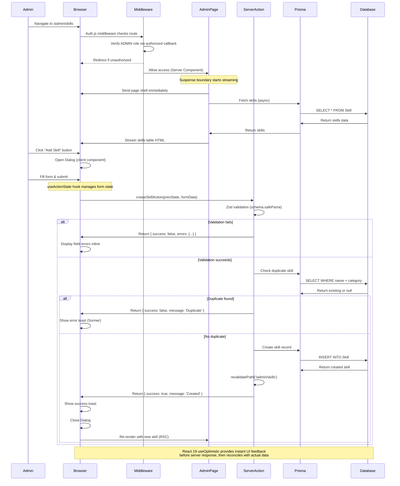
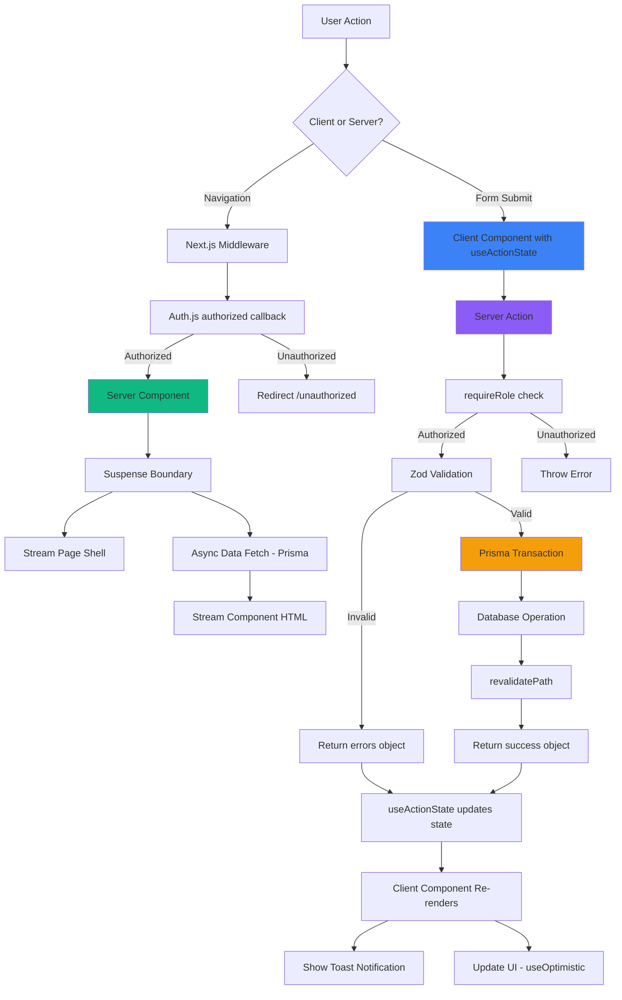

I have created the following plan after thorough exploration and analysis of the codebase. Follow the below plan verbatim. Trust the files and references. Do not re-verify what's written in the plan. Explore only when absolutely necessary. First implement all the proposed file changes and then I'll review all the changes together at the end.

## Observations

The codebase uses **Next.js 16.1.4** with **React 19.2.3** and has a solid foundation with Prisma schema containing all 15+ models (User, Skill, RoleCompetency, Assessment, Training, etc.), **NextAuth v5 (Auth.js)** authentication with OTP/magic link using **JWT session strategy**, and shadcn/ui components. The database is seeded with 70+ employees from `file:Data/Exsisting-employee-dataoseed.json`. Key architectural patterns include Server Components by default, Server Actions in `file:actions/` directory with `requireRole()` helper, and emerald theme design system. No dashboard structure exists yet - this phase creates the first admin interface. The schema correctly separates skills per employee (via SkillMatrix) rather than per role, with RoleCompetency defining role-skill frameworks.

## Approach

Build a comprehensive admin configuration module following **Next.js 16 App Router** best practices with React Server Components and Server Actions. Leverage **React 19 features** including `useActionState` for form state management and `useOptimistic` for optimistic UI updates. Create a dashboard layout with role-based navigation using the new **shadcn/ui Sidebar component**, then implement four core admin interfaces: skill catalog management, role competency framework editor, user management, and system configuration. Use shadcn/ui components (Table, Dialog, Form, Sonner, Sidebar, etc. will be added via CLI) with the emerald theme. Implement CRUD operations via Server Actions with proper validation using Zod, returning structured error states for `useActionState`. Add **Auth.js middleware with `authorized` callback** for route protection ensuring only ADMIN role can access admin routes. Use streaming with `loading.tsx` and Suspense boundaries for optimal UX. Focus on data integrity with Prisma transactions and proper validation.

## Implementation Steps

### 1. Add Required UI Components

**Install missing shadcn/ui components needed for admin interfaces:**

```bash
npx shadcn@latest add @shadcn/table @shadcn/dialog @shadcn/form @shadcn/sonner @shadcn/switch @shadcn/checkbox @shadcn/calendar @shadcn/breadcrumb @shadcn/skeleton @shadcn/sheet @shadcn/sidebar
```

These components provide:
- **Table**: Data grids for skill catalog, user management, and role management pages
- **Dialog**: Modal forms for create/edit operations
- **Form**: React Hook Form integration with Zod validation for all forms
- **Sonner**: Toast notifications for success/error feedback
- **Switch**: Boolean toggles (active/inactive, enabled/disabled states)
- **Checkbox**: Multi-select operations and form checkboxes
- **Calendar**: Date selection for dateOfJoining and other date fields
- **Breadcrumb**: Navigation breadcrumbs showing current page hierarchy
- **Skeleton**: Loading states for async data fetching
- **Sheet**: Mobile-responsive sidebar/drawer
- **Sidebar**: New collapsible sidebar component with built-in state management

**Note**: shadcn/ui components automatically use the emerald theme configured in `file:components.json` and work with Remix icons (@remixicon/react) already installed.

### 2. Create Middleware for Route Protection

**Implement Auth.js middleware in `file:middleware.ts`:**

- Create middleware using NextAuth's `auth` export from `file:lib/auth.ts` (Auth.js v5 pattern)
- Implement the `authorized` callback to handle RBAC route protection
- Define protected route patterns with role requirements:
  - `/admin/*` requires ADMIN role
  - `/trainer/*` requires TRAINER or ADMIN role
  - `/manager/*` requires MANAGER or ADMIN role
  - `/employee/*` requires any authenticated user
- Return `false` from `authorized` callback to redirect unauthorized users to `/unauthorized`
- Return `true` for authenticated users on allowed routes
- Configure matcher to run middleware on all routes except:
  - Public routes: `/`, `/login`, `/unauthorized`
  - API routes: `/api/*`
  - Static assets: `/_next/static`, `/_next/image`, `*.png`, `*.jpg`, `*.svg`, etc.
- Use Response redirect for public route redirects (login page for unauthenticated)
- Server Actions will still use `requireRole()` helper from `file:actions/auth.ts` for double protection

**Key Pattern**: Auth.js v5 middleware uses the `authorized` callback instead of manual session checks, providing cleaner and more maintainable RBAC implementation.

### 3. Create Dashboard Layout Structure

**Build shared dashboard layout in `file:app/(dashboard)/layout.tsx`:**

- Create Server Component layout that fetches session using `auth()` from `file:lib/auth.ts`
- Use the new **shadcn/ui Sidebar component** (`@shadcn/sidebar`) for navigation instead of custom sidebar
- Implement role-based navigation menu showing different links per user role:
  - ADMIN: Dashboard, Skills, Roles, Users, Configuration, Analytics (placeholder)
  - TRAINER: Dashboard, My Trainings, Grade Assessments, Progress Reviews
  - MANAGER: Dashboard, My Team, Assign Training, Team Skills
  - EMPLOYEE: Dashboard, My Trainings, Assessments, Skill Matrix, Feedback
- Add user profile section with avatar, name, email, role badge, and logout button in sidebar footer
- Use **Remix icons** (@remixicon/react) for menu items: RiDashboardLine, RiBookLine, RiUserLine, RiSettings3Line, etc.
- Implement mobile responsiveness using the Sidebar's built-in Sheet integration
- Add breadcrumb component in main content area below header
- Include notification bell placeholder (RiBellLine icon) in header for Phase 12
- Use emerald theme colors for active navigation states (emerald-600 bg, emerald-50 text)
- The sidebar component handles state management internally (open/closed state)

**Note**: The new Sidebar component from shadcn/ui provides better accessibility, mobile responsiveness, and follows React Server Component patterns.

### 4. Build Admin Dashboard Home

**Create admin overview dashboard at `file:app/(dashboard)/admin/page.tsx`:**

- Create **async Server Component** fetching key metrics using Prisma aggregations
- Display stat cards showing:
  - Total users count: `await db.user.count()`
  - Total skills count: `await db.skill.count()`
  - Total assessments count: `await db.assessment.count({ where: { status: 'PUBLISHED' } })`
  - Active trainings count: `await db.training.count({ where: { status: 'IN_PROGRESS' } })`
  - Pending approvals count: `await db.proofOfCompletion.count({ where: { status: 'PENDING' } })`
- Add quick action buttons navigating to: "Add Skill" (/admin/skills), "Add User" (/admin/users), "Create Assessment", "View Reports"
- Show recent activity feed using Prisma queries with `orderBy: { createdAt: 'desc' }` and `take: 10`:
  - Recently added users with name, role, department
  - Recently added skills with skillName, category
  - Recently published assessments with title, createdBy
- Use Card components from `file:components/ui/card.tsx` for stat cards with emerald accent colors
- Wrap async data fetches in **Suspense boundaries** for streaming:
  ```tsx
  <Suspense fallback={<StatCardsSkeleton />}>
    <StatCards />
  </Suspense>
  ```
- Protect route by calling `await requireRole(['ADMIN'])` at top of page component
- Use `unstable_cache` for stat data that changes infrequently (with 60s revalidation)

**Performance Note**: Using Suspense with async Server Components enables **streaming SSR**, showing the page shell immediately while stats load progressively.

### 5. Implement Skill Catalog Management

**Create skill CRUD interface at `file:app/(dashboard)/admin/skills/page.tsx`:**

- Build **async Server Component** fetching skills with Prisma: `await db.skill.findMany({ orderBy: { createdAt: 'desc' } })`
- Display skills in shadcn/ui **Table component** with columns: skillName, category, description, created date, actions
- Implement client-side search/filter using a separate `'use client'` **SkillsTable component** that receives skills as props
- Add "Add Skill" button opening Dialog with **Form component** (react-hook-form + Zod validation)
- Form fields: skillName (required, min 2 chars), category (Select with predefined categories), description (Textarea, optional)
- Create "Edit" and "Delete" action buttons per table row
- Show skill usage count as tooltip/badge: queries for related Assessment, Training, SkillMatrix records
- Implement pagination on server-side using `skip` and `take` with searchParams: `page`, `limit`
- Wrap table in Suspense: `<Suspense fallback={<SkillsTableSkeleton />}><SkillsTable /></Suspense>`
- Protect route with `await requireRole(['ADMIN'])` at top

**Create client form component `file:app/(dashboard)/admin/skills/_components/skill-form.tsx`:**

- Use `'use client'` directive with **React 19 `useActionState` hook** for form state management
- Define Zod schema inline matching server-side validation
- Call `useActionState(createSkillAction, initialState)` where initialState = `{ success: false, message: '' }`
- Display inline validation errors from `state.errors?.fieldName`
- Show loading state on submit button using `pending` from useActionState
- Use **`useOptimistic`** for instant UI feedback before server response
- Close Dialog on successful submission (`state.success === true`)
- Show toast notification via sonner for success/error feedback

**Create server actions in `file:actions/skills.ts`:**

```typescript
'use server'

import { z } from 'zod'
import { revalidatePath } from 'next/cache'
import { db } from '@/lib/db'
import { requireRole } from '@/actions/auth'

// Zod schema for validation
const skillSchema = z.object({
  skillName: z.string().min(2, 'Skill name must be at least 2 characters'),
  category: z.string().min(1, 'Category is required'),
  description: z.string().optional(),
})

// Action signature for useActionState (prevState + formData)
export async function createSkillAction(prevState: any, formData: FormData) {
  await requireRole(['ADMIN'])
  
  const validatedFields = skillSchema.safeParse({
    skillName: formData.get('skillName'),
    category: formData.get('category'),
    description: formData.get('description'),
  })

  if (!validatedFields.success) {
    return {
      success: false,
      errors: validatedFields.error.flatten().fieldErrors,
      message: 'Validation failed',
    }
  }

  try {
    // Check duplicate
    const existing = await db.skill.findFirst({
      where: {
        skillName: validatedFields.data.skillName,
        category: validatedFields.data.category,
      },
    })

    if (existing) {
      return {
        success: false,
        message: 'Skill already exists in this category',
      }
    }

    await db.skill.create({
      data: validatedFields.data,
    })

    revalidatePath('/admin/skills')

    return {
      success: true,
      message: 'Skill created successfully',
    }
  } catch (error) {
    return {
      success: false,
      message: 'Failed to create skill',
    }
  }
}

export async function updateSkillAction(prevState: any, formData: FormData) {
  // Similar implementation with id from formData
}

export async function deleteSkillAction(skillId: string) {
  await requireRole(['ADMIN'])
  
  // Check dependencies before deletion
  const [assessmentCount, trainingCount, skillMatrixCount] = await Promise.all([
    db.assessmentSkill.count({ where: { skillId } }),
    db.trainingSkill.count({ where: { skillId } }),
    db.skillMatrix.count({ where: { skillId } }),
  ])

  if (assessmentCount > 0 || trainingCount > 0 || skillMatrixCount > 0) {
    return {
      success: false,
      message: `Cannot delete skill. It is used in ${assessmentCount} assessments, ${trainingCount} trainings, and ${skillMatrixCount} skill matrices.`,
    }
  }

  await db.skill.delete({ where: { id: skillId } })
  revalidatePath('/admin/skills')

  return {
    success: true,
    message: 'Skill deleted successfully',
  }
}
```

**Key Pattern**: Server Actions with `useActionState` provide type-safe form handling with progressive enhancement. Forms work without JavaScript, then upgrade to client-side interactivity.

### 6. Build Role Competency Framework Editor

**Create role management interface at `file:app/(dashboard)/admin/roles/page.tsx`:**

- Create **async Server Component** fetching role frameworks grouped by jobRole:
  ```typescript
  const roleFrameworks = await db.roleCompetency.findMany({
    include: { skill: true },
    orderBy: { jobRole: 'asc' },
  })
  // Group by jobRole in JavaScript
  ```
- Display each role framework in expandable **Accordion** or **Card** components
- Show skills table per role with columns: skill name, required level (BEGINNER/INTERMEDIATE/ADVANCED/EXPERT), mandatory status
- Add "Create Role Framework" button opening multi-step Dialog (use tabs or stepper pattern)
- **Step 1**: Enter job role name with Combobox showing existing User.designation values for autocomplete
- **Step 2**: Multi-select skills from Skill table using Combobox with search
- **Step 3**: Configure each selected skill's requiredLevel (Select) and isMandatory (Checkbox)
- Add "Edit Framework" allowing modification of skill requirements for existing roles
- Add "Delete Framework" with confirmation showing count of users with this designation
- Implement "Clone Framework" to duplicate role requirements to a new role name
- Create "Export to CSV" action for role frameworks
- Protect with `await requireRole(['ADMIN'])`

**Create client form component `file:app/(dashboard)/admin/roles/_components/role-framework-form.tsx`:**

- Multi-step form using **shadcn/ui Tabs** or custom stepper
- Use **`useActionState`** for form submission with proper validation
- Step state management with React `useState` for current step
- Display selected skills with level/mandatory controls in a mini table
- Use **`useOptimistic`** to show skill additions immediately before server confirmation

**Create server actions in `file:actions/roles.ts`:**

```typescript
'use server'

import { z } from 'zod'
import { revalidatePath } from 'next/cache'
import { db } from '@/lib/db'
import { requireRole } from '@/actions/auth'

const roleFrameworkSchema = z.object({
  jobRole: z.string().min(2, 'Job role is required'),
  skillRequirements: z.array(z.object({
    skillId: z.string(),
    requiredLevel: z.enum(['BEGINNER', 'INTERMEDIATE', 'ADVANCED', 'EXPERT']),
    isMandatory: z.boolean(),
  })).min(1, 'At least one skill is required'),
})

export async function createRoleFrameworkAction(prevState: any, formData: FormData) {
  await requireRole(['ADMIN'])
  
  // Parse JSON stringified skillRequirements from FormData
  const skillRequirementsJson = formData.get('skillRequirements') as string
  const validatedFields = roleFrameworkSchema.safeParse({
    jobRole: formData.get('jobRole'),
    skillRequirements: JSON.parse(skillRequirementsJson),
  })

  if (!validatedFields.success) {
    return {
      success: false,
      errors: validatedFields.error.flatten().fieldErrors,
      message: 'Validation failed',
    }
  }

  try {
    // Check if role framework already exists
    const existing = await db.roleCompetency.findFirst({
      where: { jobRole: validatedFields.data.jobRole },
    })

    if (existing) {
      return {
        success: false,
        message: 'Role framework already exists. Use edit instead.',
      }
    }

    // Ensure at least one mandatory skill
    const hasMandatory = validatedFields.data.skillRequirements.some(sr => sr.isMandatory)
    if (!hasMandatory) {
      return {
        success: false,
        message: 'At least one skill must be mandatory',
      }
    }

    // Create all RoleCompetency records in transaction
    await db.$transaction(
      validatedFields.data.skillRequirements.map(sr =>
        db.roleCompetency.create({
          data: {
            jobRole: validatedFields.data.jobRole,
            skillId: sr.skillId,
            requiredLevel: sr.requiredLevel,
            isMandatory: sr.isMandatory,
          },
        })
      )
    )

    revalidatePath('/admin/roles')

    return {
      success: true,
      message: 'Role framework created successfully',
    }
  } catch (error) {
    return {
      success: false,
      message: 'Failed to create role framework',
    }
  }
}

export async function updateRoleFrameworkAction(prevState: any, formData: FormData) {
  await requireRole(['ADMIN'])
  
  // Similar to create but with deleteMany + createMany pattern in transaction
  const jobRole = formData.get('jobRole') as string
  const skillRequirementsJson = formData.get('skillRequirements') as string
  
  try {
    await db.$transaction([
      db.roleCompetency.deleteMany({ where: { jobRole } }),
      ...JSON.parse(skillRequirementsJson).map((sr: any) =>
        db.roleCompetency.create({
          data: {
            jobRole,
            skillId: sr.skillId,
            requiredLevel: sr.requiredLevel,
            isMandatory: sr.isMandatory,
          },
        })
      ),
    ])

    revalidatePath('/admin/roles')
    return { success: true, message: 'Role framework updated' }
  } catch (error) {
    return { success: false, message: 'Update failed' }
  }
}

export async function deleteRoleFrameworkAction(jobRole: string) {
  await requireRole(['ADMIN'])
  
  // Check if any users have this designation
  const usersCount = await db.user.count({ where: { designation: jobRole } })
  
  if (usersCount > 0) {
    return {
      success: false,
      message: `Cannot delete role framework. ${usersCount} users have this designation.`,
    }
  }

  await db.roleCompetency.deleteMany({ where: { jobRole } })
  revalidatePath('/admin/roles')

  return {
    success: true,
    message: 'Role framework deleted successfully',
  }
}

// Helper action for autocomplete
export async function getJobRolesAction() {
  const users = await db.user.findMany({
    select: { designation: true },
    distinct: ['designation'],
  })
  return users.map(u => u.designation)
}
```

**Note**: Using Prisma transactions ensures atomicity - either all skill requirements are created/updated, or none are.

### 7. Create User Management Interface

**Build user CRUD at `file:app/(dashboard)/admin/users/page.tsx`:**

- Create **async Server Component** with URL searchParams for filtering/pagination:
  ```typescript
  export default async function UsersPage({
    searchParams,
  }: {
    searchParams: { page?: string; role?: string; department?: string; search?: string }
  }) {
    await requireRole(['ADMIN'])
    
    const page = parseInt(searchParams.page || '1')
    const filters = {
      role: searchParams.role,
      department: searchParams.department,
      search: searchParams.search,
    }
    
    const [users, totalCount] = await Promise.all([
      db.user.findMany({
        where: {
          ...(filters.role && { role: filters.role }),
          ...(filters.department && { department: filters.department }),
          ...(filters.search && {
            OR: [
              { name: { contains: filters.search, mode: 'insensitive' } },
              { email: { contains: filters.search, mode: 'insensitive' } },
              { employeeNo: { contains: filters.search } },
            ],
          }),
        },
        include: {
          manager: { select: { name: true, employeeNo: true } },
          _count: { select: { reportees: true } },
        },
        skip: (page - 1) * 20,
        take: 20,
        orderBy: { name: 'asc' },
      }),
      db.user.count({ where: { /* same filters */ } }),
    ])
    // ...
  }
  ```
- Display users in shadcn/ui **Table** with columns: employeeNo, name, email, role (Badge), designation, department, location, manager name, status (Badge: active/resigned), actions
- Add filter controls (client component) using Select for role/department, Input for search, Switch for resigned filter
- Implement "Add User" button opening Dialog with comprehensive form
- Form fields:
  - employeeNo (required, unique validation)
  - name (required, min 2 chars)
  - email (required, email validation, unique)
  - role (Select: ADMIN/TRAINER/MANAGER/EMPLOYEE)
  - designation (Combobox with existing values, allows new entry)
  - department (Select from distinct departments in DB)
  - location (Select from distinct locations in DB)
  - managerId (Combobox with user search, nullable)
  - dateOfJoining (Calendar date picker, defaults to today)
  - level (number input, min 1, max 10)
- Add "Edit User" Dialog pre-filled with user data (fetch on button click)
- Add "Deactivate/Activate" toggle with Switch component calling server action
- Show manager hierarchy breadcrumb: "John (Manager) > Mary (Manager) > Current User"
- Display reportees count badge and "View Skill Matrix" link
- Implement server-side pagination with proper prev/next controls
- Wrap table in Suspense for streaming

**Create client components:**
- `file:app/(dashboard)/admin/users/_components/users-table.tsx` - Client table with local state for filters
- `file:app/(dashboard)/admin/users/_components/user-form.tsx` - Form using `useActionState`
- `file:app/(dashboard)/admin/users/_components/user-filters.tsx` - Filter controls updating URL searchParams

**Create server actions in `file:actions/users.ts`:**

```typescript
'use server'

import { z } from 'zod'
import { revalidatePath } from 'next/cache'
import { db } from '@/lib/db'
import { requireRole } from '@/actions/auth'

const userSchema = z.object({
  employeeNo: z.string().min(1, 'Employee number is required'),
  name: z.string().min(2, 'Name must be at least 2 characters'),
  email: z.string().email('Invalid email address'),
  role: z.enum(['ADMIN', 'TRAINER', 'MANAGER', 'EMPLOYEE']),
  designation: z.string().min(2, 'Designation is required'),
  department: z.string().min(1, 'Department is required'),
  location: z.string().min(1, 'Location is required'),
  managerId: z.string().nullable().optional(),
  dateOfJoining: z.string().transform(str => new Date(str)),
  level: z.number().min(1).max(10),
})

export async function createUserAction(prevState: any, formData: FormData) {
  await requireRole(['ADMIN'])
  
  const validatedFields = userSchema.safeParse({
    employeeNo: formData.get('employeeNo'),
    name: formData.get('name'),
    email: formData.get('email'),
    role: formData.get('role'),
    designation: formData.get('designation'),
    department: formData.get('department'),
    location: formData.get('location'),
    managerId: formData.get('managerId') || null,
    dateOfJoining: formData.get('dateOfJoining'),
    level: parseInt(formData.get('level') as string),
  })

  if (!validatedFields.success) {
    return {
      success: false,
      errors: validatedFields.error.flatten().fieldErrors,
      message: 'Validation failed',
    }
  }

  try {
    // Check unique constraints
    const [existingEmail, existingEmpNo] = await Promise.all([
      db.user.findUnique({ where: { email: validatedFields.data.email } }),
      db.user.findUnique({ where: { employeeNo: validatedFields.data.employeeNo } }),
    ])

    if (existingEmail) {
      return { success: false, message: 'Email already exists' }
    }
    if (existingEmpNo) {
      return { success: false, message: 'Employee number already exists' }
    }

    // Validate manager relationship (no self-reference, no circular)
    if (validatedFields.data.managerId) {
      // Check circular reference by traversing manager chain
      let currentManagerId = validatedFields.data.managerId
      let depth = 0
      const visited = new Set<string>()

      while (currentManagerId && depth < 10) {
        if (visited.has(currentManagerId)) {
          return { success: false, message: 'Circular manager relationship detected' }
        }
        visited.add(currentManagerId)

        const manager = await db.user.findUnique({
          where: { id: currentManagerId },
          select: { managerId: true },
        })

        currentManagerId = manager?.managerId || null
        depth++
      }
    }

    await db.user.create({
      data: validatedFields.data,
    })

    revalidatePath('/admin/users')

    return {
      success: true,
      message: 'User created successfully',
    }
  } catch (error) {
    return {
      success: false,
      message: 'Failed to create user',
    }
  }
}

export async function updateUserAction(prevState: any, formData: FormData) {
  await requireRole(['ADMIN'])
  
  const userId = formData.get('userId') as string
  // Similar to create with additional validation for self-manager check
  
  if (validatedFields.data.managerId === userId) {
    return { success: false, message: 'User cannot be their own manager' }
  }
  
  // Rest of implementation...
}

export async function toggleUserStatusAction(userId: string) {
  await requireRole(['ADMIN'])
  
  const user = await db.user.findUnique({
    where: { id: userId },
    select: { resigned: true },
  })

  await db.user.update({
    where: { id: userId },
    data: { resigned: !user?.resigned },
  })

  revalidatePath('/admin/users')

  return {
    success: true,
    message: `User ${user?.resigned ? 'activated' : 'deactivated'} successfully`,
  }
}

// Helper actions for form dropdowns
export async function getDepartmentsAction() {
  const users = await db.user.findMany({
    select: { department: true },
    distinct: ['department'],
  })
  return users.map(u => u.department)
}

export async function getLocationsAction() {
  const users = await db.user.findMany({
    select: { location: true },
    distinct: ['location'],
  })
  return users.map(u => u.location)
}

export async function searchManagersAction(query: string) {
  const managers = await db.user.findMany({
    where: {
      OR: [
        { name: { contains: query, mode: 'insensitive' } },
        { employeeNo: { contains: query } },
      ],
      resigned: false,
    },
    select: { id: true, name: true, employeeNo: true, designation: true },
    take: 10,
  })
  return managers
}
```

**Key Validation**: Preventing circular manager relationships is critical. The validation traverses the manager chain to ensure no loops exist.

### 8. Implement System Configuration Settings

**Create system config interface at `file:app/(dashboard)/admin/config/page.tsx`:**

- Create **async Server Component** fetching all SystemConfig records:
  ```typescript
  const configRecords = await db.systemConfig.findMany()
  const config = configRecords.reduce((acc, record) => {
    acc[record.key] = JSON.parse(record.value)
    return acc
  }, {} as Record<string, any>)
  ```
- Display configuration settings in grouped **Card components** by category with descriptive labels
- **Induction Settings Card**:
  - inductionDurationDays (number input, default: 90)
  - autoAssignInductionTraining (Switch, default: true)
- **Assessment Settings Card**:
  - defaultPassingScore (number input 0-100, default: 70)
  - allowRetakes (Switch, default: true)
  - maxRetakeAttempts (number input, default: 3)
  - assessmentTimerEnabled (Switch, default: false)
- **Training Settings Card**:
  - defaultTrainingDuration (number input in hours, default: 40)
  - requireMentorApproval (Switch, default: true)
  - autoSendReminders (Switch, default: true)
  - reminderFrequencyDays (number input, default: 7)
- **Notification Settings Card**:
  - emailNotificationsEnabled (Switch, default: true)
  - enabledNotificationTypes (multi-select Checkboxes for each NotificationType enum value)
- **Skill Gap Settings Card**:
  - criticalGapThreshold (number input %, default: 80)
  - highGapThreshold (number input %, default: 60)
  - mediumGapThreshold (number input %, default: 40)
- Add "Save Configuration" button at bottom calling server action
- Show last updated info: "Last updated by {user.name} on {timestamp}" (fetch from SystemConfig.updatedBy/updatedAt)
- Add validation warning if thresholds are not in descending order
- Protect with `await requireRole(['ADMIN'])`

**Create client form component `file:app/(dashboard)/admin/config/_components/config-form.tsx`:**

- Use `'use client'` with **`useActionState`** for form submission
- Local state management for form values initialized from server props
- Real-time validation for threshold ordering (critical > high > medium)
- Disable submit button until changes are made (compare with initial values)
- Show loading state during save operation

**Create server actions in `file:actions/config.ts`:**

```typescript
'use server'

import { z } from 'zod'
import { revalidatePath } from 'next/cache'
import { db } from '@/lib/db'
import { requireRole } from '@/actions/auth'

const configSchema = z.object({
  inductionDurationDays: z.number().min(1).max(365),
  autoAssignInductionTraining: z.boolean(),
  defaultPassingScore: z.number().min(0).max(100),
  allowRetakes: z.boolean(),
  maxRetakeAttempts: z.number().min(0).max(10),
  assessmentTimerEnabled: z.boolean(),
  defaultTrainingDuration: z.number().min(1),
  requireMentorApproval: z.boolean(),
  autoSendReminders: z.boolean(),
  reminderFrequencyDays: z.number().min(1).max(90),
  emailNotificationsEnabled: z.boolean(),
  enabledNotificationTypes: z.array(z.string()),
  criticalGapThreshold: z.number().min(0).max(100),
  highGapThreshold: z.number().min(0).max(100),
  mediumGapThreshold: z.number().min(0).max(100),
}).refine(
  (data) => data.criticalGapThreshold > data.highGapThreshold && data.highGapThreshold > data.mediumGapThreshold,
  {
    message: 'Thresholds must be in descending order: Critical > High > Medium',
    path: ['criticalGapThreshold'],
  }
)

export async function updateSystemConfigAction(prevState: any, formData: FormData) {
  const session = await requireRole(['ADMIN'])
  
  // Parse all form fields
  const rawData = {
    inductionDurationDays: parseInt(formData.get('inductionDurationDays') as string),
    autoAssignInductionTraining: formData.get('autoAssignInductionTraining') === 'true',
    defaultPassingScore: parseInt(formData.get('defaultPassingScore') as string),
    allowRetakes: formData.get('allowRetakes') === 'true',
    maxRetakeAttempts: parseInt(formData.get('maxRetakeAttempts') as string),
    assessmentTimerEnabled: formData.get('assessmentTimerEnabled') === 'true',
    defaultTrainingDuration: parseInt(formData.get('defaultTrainingDuration') as string),
    requireMentorApproval: formData.get('requireMentorApproval') === 'true',
    autoSendReminders: formData.get('autoSendReminders') === 'true',
    reminderFrequencyDays: parseInt(formData.get('reminderFrequencyDays') as string),
    emailNotificationsEnabled: formData.get('emailNotificationsEnabled') === 'true',
    enabledNotificationTypes: JSON.parse(formData.get('enabledNotificationTypes') as string),
    criticalGapThreshold: parseInt(formData.get('criticalGapThreshold') as string),
    highGapThreshold: parseInt(formData.get('highGapThreshold') as string),
    mediumGapThreshold: parseInt(formData.get('mediumGapThreshold') as string),
  }

  const validatedFields = configSchema.safeParse(rawData)

  if (!validatedFields.success) {
    return {
      success: false,
      errors: validatedFields.error.flatten().fieldErrors,
      message: 'Validation failed',
    }
  }

  try {
    // Upsert each config value in transaction
    await db.$transaction(
      Object.entries(validatedFields.data).map(([key, value]) =>
        db.systemConfig.upsert({
          where: { key },
          update: {
            value: JSON.stringify(value),
            updatedBy: session.user.id,
            updatedAt: new Date(),
          },
          create: {
            key,
            value: JSON.stringify(value),
            createdBy: session.user.id,
            updatedBy: session.user.id,
          },
        })
      )
    )

    revalidatePath('/admin/config')

    return {
      success: true,
      message: 'System configuration updated successfully',
    }
  } catch (error) {
    return {
      success: false,
      message: 'Failed to update system configuration',
    }
  }
}

// Helper to get single config value with default
export async function getConfigValue(key: string, defaultValue: any) {
  const config = await db.systemConfig.findUnique({ where: { key } })
  if (!config) return defaultValue
  return JSON.parse(config.value)
}

// Helper to get all config as typed object
export async function getAllConfigAction() {
  const configRecords = await db.systemConfig.findMany()
  return configRecords.reduce((acc, record) => {
    acc[record.key] = JSON.parse(record.value)
    return acc
  }, {} as Record<string, any>)
}
```

**Design Note**: Storing configuration as key-value pairs with JSON values provides maximum flexibility for different data types (boolean, number, array, object).

### 9. Add Navigation and Breadcrumbs

**Use shadcn/ui Sidebar component in `file:app/(dashboard)/layout.tsx`:**

- Import and use the **@shadcn/sidebar** components (already added in Step 1):
  ```tsx
  import {
    Sidebar,
    SidebarContent,
    SidebarFooter,
    SidebarGroup,
    SidebarGroupContent,
    SidebarGroupLabel,
    SidebarHeader,
    SidebarMenu,
    SidebarMenuButton,
    SidebarMenuItem,
    SidebarProvider,
  } from '@/components/ui/sidebar'
  ```
- Create role-based menu structure with **Remix icons**:
  - Admin: RiDashboardLine (Dashboard), RiBook2Line (Skills), RiBriefcaseLine (Roles), RiUserLine (Users), RiSettings3Line (Configuration), RiBarChartLine (Analytics placeholder)
  - Trainer: RiDashboardLine (Dashboard), RiBookOpenLine (My Trainings), RiCheckLine (Grade Assessments), RiLineChartLine (Progress Reviews)
  - Manager: RiDashboardLine (Dashboard), RiTeamLine (My Team), RiUserAddLine (Assign Training), RiMindMap (Team Skills)
  - Employee: RiDashboardLine (Dashboard), RiBookmarkLine (My Trainings), RiFileListLine (Assessments), RiDashboard3Line (Skill Matrix), RiMessageLine (Feedback)
- Use `SidebarMenuButton` with active state using `usePathname()` hook
- Add `SidebarFooter` with user profile showing:
  - Avatar (first letter of name with emerald bg)
  - Name and role badge
  - Logout button with RiLogoutBoxLine icon
- The Sidebar component handles mobile responsiveness automatically with built-in Sheet integration
- Use emerald-600 for active menu items background

**Create breadcrumb component in `file:components/dashboard/breadcrumb.tsx`:**

- Use **@shadcn/breadcrumb** components:
  ```tsx
  import {
    Breadcrumb,
    BreadcrumbItem,
    BreadcrumbLink,
    BreadcrumbList,
    BreadcrumbPage,
    BreadcrumbSeparator,
  } from '@/components/ui/breadcrumb'
  ```
- Build dynamic breadcrumb based on `usePathname()` hook
- Map route segments to readable labels:
  ```typescript
  const labelMap: Record<string, string> = {
    admin: 'Admin',
    skills: 'Skills',
    users: 'Users',
    roles: 'Roles',
    config: 'Configuration',
    trainer: 'Trainer',
    manager: 'Manager',
    employee: 'Employee',
    // ... more mappings
  }
  ```
- Add home icon (RiHome2Line) linking to role-specific dashboard
- Style with emerald theme for active breadcrumb (emerald-600 text)
- Place breadcrumb in main content area below header, above page content

**Key Benefit**: The new Sidebar component provides better a11y, mobile support, and follows React Server Component patterns with minimal client-side JavaScript.

### 10. Implement Toast Notifications

**Add toast notification system using Sonner (already added in Step 1):**

- Sonner is already included via `@shadcn/sonner` installation
- Add `Toaster` component to root layout `file:app/layout.tsx`:
  ```tsx
  import { Toaster } from '@/components/ui/sonner'
  
  export default function RootLayout({ children }) {
    return (
      <html lang="en">
        <body>
          {children}
          <Toaster position="bottom-right" richColors />
        </body>
      </html>
    )
  }
  ```
- Use `toast` function from sonner in client components:
  ```tsx
  'use client'
  
  import { toast } from 'sonner'
  
  // In useActionState callback
  useEffect(() => {
    if (state?.success) {
      toast.success(state.message)
    } else if (state?.message) {
      toast.error(state.message)
    }
  }, [state])
  ```
- Configure toast variants:
  - **Success**: `toast.success(message)` with checkmark icon (auto-provided by Sonner)
  - **Error**: `toast.error(message)` with error icon
  - **Info**: `toast.info(message)` with info icon
  - **Warning**: `toast.warning(message)` with warning icon
- Set duration: 4s for success, 6s for errors (Sonner defaults)
- Sonner automatically handles:
  - Emerald theme integration (via CSS variables from tailwind.config)
  - Stacking multiple toasts
  - Dismiss on click
  - Progress bar animation
  - Mobile-responsive positioning

**Usage Pattern**: In client form components using `useActionState`, check the returned state and trigger toasts based on `success` boolean and `message` string.

### 11. Add Loading and Error States

**Implement proper loading and error handling with Next.js 16 conventions:**

**Loading States** (`loading.tsx` files):
- Create `file:app/(dashboard)/admin/loading.tsx` for admin section:
  ```tsx
  import { Skeleton } from '@/components/ui/skeleton'
  
  export default function AdminLoading() {
    return (
      <div className="space-y-4">
        <Skeleton className="h-8 w-64" /> {/* Page title */}
        <Skeleton className="h-[400px] w-full" /> {/* Main content */}
      </div>
    )
  }
  ```
- Create specific loading files for each route:
  - `file:app/(dashboard)/admin/skills/loading.tsx` - Table skeleton with 5 rows
  - `file:app/(dashboard)/admin/users/loading.tsx` - Table skeleton with filter controls
  - `file:app/(dashboard)/admin/roles/loading.tsx` - Card skeletons in grid
  - `file:app/(dashboard)/admin/config/loading.tsx` - Form skeleton with sections
- Use **Skeleton component** from `@shadcn/skeleton` (added in Step 1)
- Loading UI automatically shown during navigation by Next.js 16

**Error Handling** (`error.tsx` files):
- Create `file:app/(dashboard)/admin/error.tsx`:
  ```tsx
  'use client'
  
  import { useEffect } from 'react'
  import { Button } from '@/components/ui/button'
  import { Alert, AlertDescription, AlertTitle } from '@/components/ui/alert'
  import { RiErrorWarningLine } from '@remixicon/react'
  
  export default function AdminError({
    error,
    reset,
  }: {
    error: Error & { digest?: string }
    reset: () => void
  }) {
    useEffect(() => {
      // Log error to monitoring service
      console.error('Admin error:', error)
    }, [error])
  
    return (
      <div className="flex min-h-[400px] flex-col items-center justify-center">
        <Alert variant="destructive" className="max-w-md">
          <RiErrorWarningLine className="h-4 w-4" />
          <AlertTitle>Something went wrong</AlertTitle>
          <AlertDescription>
            {process.env.NODE_ENV === 'development' 
              ? error.message 
              : 'An error occurred while loading this page.'}
          </AlertDescription>
        </Alert>
        <Button onClick={reset} className="mt-4">
          Try again
        </Button>
      </div>
    )
  }
  ```
- Error boundaries automatically catch errors in Server Components
- Create route-specific error pages for custom error messaging

**Suspense Boundaries** (for granular streaming):
- Wrap slow data fetches in individual Suspense boundaries:
  ```tsx
  <Suspense fallback={<StatCardsSkeleton />}>
    <StatCards /> {/* async Server Component */}
  </Suspense>
  <Suspense fallback={<ActivityFeedSkeleton />}>
    <ActivityFeed /> {/* async Server Component */}
  </Suspense>
  ```
- This enables **progressive rendering**: static content shows immediately, dynamic content streams in

**Empty States**:
- Create empty state components for tables with no data:
  ```tsx
  {skills.length === 0 ? (
    <div className="flex flex-col items-center justify-center py-12">
      <RiFileListLine className="h-12 w-12 text-muted-foreground mb-4" />
      <h3 className="text-lg font-semibold mb-2">No skills found</h3>
      <p className="text-sm text-muted-foreground mb-4">
        Get started by adding your first skill
      </p>
      <Button>Add Skill</Button>
    </div>
  ) : (
    <Table>...</Table>
  )}
  ```

**Form Loading States**:
- Show loading spinner in submit buttons using `pending` from `useActionState`:
  ```tsx
  <Button type="submit" disabled={pending}>
    {pending && <Spinner className="mr-2 h-4 w-4 animate-spin" />}
    {pending ? 'Saving...' : 'Save'}
  </Button>
  ```

**Key Pattern**: Next.js 16 automatically handles `loading.tsx` and `error.tsx` by wrapping route segments in Suspense and Error boundaries. This provides instant loading feedback and graceful error recovery.

### 12. Optimize Data Fetching

**Implement efficient data fetching patterns with Next.js 16 best practices:**

**Prisma Query Optimization**:
- Use `select` to fetch only required fields in list views:
  ```typescript
  const skills = await db.skill.findMany({
    select: {
      id: true,
      skillName: true,
      category: true,
      createdAt: true,
      // Omit description for table view
    },
  })
  ```
- Use `include` strategically with nested selects to avoid over-fetching:
  ```typescript
  const users = await db.user.findMany({
    include: {
      manager: {
        select: { id: true, name: true, employeeNo: true },
      },
      _count: {
        select: { reportees: true },
      },
    },
  })
  ```
- Avoid N+1 queries by using Prisma's relation loading

**Pagination**:
- Implement **cursor-based pagination** for large datasets (better than offset):
  ```typescript
  const users = await db.user.findMany({
    take: 20,
    skip: 1, // Skip cursor
    cursor: cursor ? { id: cursor } : undefined,
    orderBy: { name: 'asc' },
  })
  ```
- Return `nextCursor` from last item for "Load More" pattern
- Use offset pagination for pages with direct page number navigation

**Database Indexes** (add to Prisma schema):
- Add indexes for frequently queried fields:
  ```prisma
  model User {
    // ... fields
    
    @@index([email])
    @@index([employeeNo])
    @@index([department])
    @@index([role])
  }
  
  model Skill {
    // ... fields
    
    @@index([category])
    @@index([skillName])
  }
  ```
- Run `prisma migrate dev` after adding indexes

**React Server Component Caching**:
- Use `unstable_cache` (now stable in Next.js 16 as `cache`) for static data:
  ```typescript
  import { unstable_cache } from 'next/cache'
  
  const getSystemConfig = unstable_cache(
    async () => {
      return await db.systemConfig.findMany()
    },
    ['system-config'],
    {
      revalidate: 60, // Cache for 60 seconds
      tags: ['config'],
    }
  )
  ```
- Use cache tags for targeted revalidation:
  ```typescript
  revalidateTag('config') // Instead of revalidatePath
  ```

**Request Deduplication**:
- Next.js 16 automatically deduplicates identical requests in Server Components:
  ```typescript
  // Both calls in same render are deduplicated to single DB query
  const skills = await db.skill.findMany()
  const skills2 = await db.skill.findMany()
  ```
- No need for manual request memoization

**Parallel Data Fetching**:
- Use `Promise.all` for independent queries:
  ```typescript
  const [skills, users, stats] = await Promise.all([
    db.skill.findMany(),
    db.user.count(),
    db.assessment.count({ where: { status: 'PUBLISHED' } }),
  ])
  ```

**Streaming and Suspense**:
- Defer slow queries to separate Suspense boundaries:
  ```tsx
  export default async function Page() {
    // Fast query - shown immediately
    const config = await db.systemConfig.findMany()
    
    return (
      <>
        <ConfigForm config={config} />
        
        {/* Slow query - streamed in later */}
        <Suspense fallback={<ActivitySkeleton />}>
          <RecentActivity />
        </Suspense>
      </>
    )
  }
  ```

**Optimistic Updates** (client-side):
- Use React 19 `useOptimistic` for instant UI feedback:
  ```tsx
  'use client'
  
  import { useOptimistic } from 'react'
  
  function SkillsList({ skills }) {
    const [optimisticSkills, addOptimisticSkill] = useOptimistic(
      skills,
      (state, newSkill) => [...state, newSkill]
    )
    
    async function handleAdd(formData) {
      // Show optimistic update immediately
      addOptimisticSkill({ 
        id: 'temp', 
        skillName: formData.get('skillName'),
        category: formData.get('category'),
      })
      
      // Send to server
      await createSkillAction(null, formData)
    }
    
    return (
      <Table>
        {optimisticSkills.map(skill => <Row key={skill.id} skill={skill} />)}
      </Table>
    )
  }
  ```

**Key Principle**: Fetch data at the Server Component level, pass to Client Components as props. Keep client-side JavaScript minimal.

### 13. Next.js 16 & React 19 Modern Patterns Summary

**This phase leverages cutting-edge features:**

1. **React 19 Hooks**:
   - `useActionState` - Form state management with server actions (replaces old useFormState)
   - `useOptimistic` - Optimistic UI updates before server response
   - These hooks provide type-safe, progressive enhancement for forms

2. **Next.js 16 App Router**:
   - Automatic Suspense boundaries with `loading.tsx`
   - Error boundaries with `error.tsx`
   - Streaming SSR for progressive page rendering
   - Automatic request deduplication in Server Components
   - Built-in form progressive enhancement

3. **Auth.js v5 (NextAuth v5)**:
   - `authorized` callback in middleware for clean RBAC
   - JWT session strategy (required with Credentials provider)
   - Type-safe session with custom user fields
   - Simplified middleware pattern

4. **shadcn/ui Latest Components**:
   - New Sidebar component with built-in mobile responsiveness
   - Sonner for toast notifications (better than react-hot-toast)
   - Form component with react-hook-form + Zod integration
   - All components use CSS variables for theming

5. **Server Actions Best Practices**:
   - Zod validation for type-safe forms
   - Return structured objects: `{ success: boolean, errors?: {}, message?: string }`
   - Use `revalidatePath()` after mutations
   - Call `requireRole()` at start of each action
   - Progressive enhancement - forms work without JS

6. **TypeScript Patterns**:
   - Async Server Components by default
   - Props passed from Server to Client Components
   - Type-safe form actions with Zod schemas
   - Prisma types auto-generated

**Performance Benefits**:
- Streaming SSR reduces TTFB (Time to First Byte)
- Suspense boundaries enable progressive rendering
- Optimistic updates provide instant feedback
- Server Components reduce client JS bundle size
- Automatic request deduplication reduces redundant queries

## Visual Representation



## Architecture Flow: Modern Next.js 16 + React 19 Pattern



## Key Files Reference

**Core Infrastructure:**
- `file:middleware.ts` - Auth.js middleware with authorized callback for RBAC route protection
- `file:lib/auth.ts` - NextAuth v5 configuration with JWT session strategy
- `file:actions/auth.ts` - Auth helpers (requireAuth, requireRole for server-side protection)

**Dashboard Layout:**
- `file:app/(dashboard)/layout.tsx` - Shared dashboard layout with Sidebar component
- `file:components/dashboard/breadcrumb.tsx` - Dynamic breadcrumb navigation

**Admin Pages (Server Components):**
- `file:app/(dashboard)/admin/page.tsx` - Admin dashboard home with metrics
- `file:app/(dashboard)/admin/skills/page.tsx` - Skill catalog management
- `file:app/(dashboard)/admin/roles/page.tsx` - Role competency framework editor
- `file:app/(dashboard)/admin/users/page.tsx` - User management interface
- `file:app/(dashboard)/admin/config/page.tsx` - System configuration settings

**Loading States:**
- `file:app/(dashboard)/admin/loading.tsx` - Admin section loading skeleton
- `file:app/(dashboard)/admin/skills/loading.tsx` - Skills table skeleton
- `file:app/(dashboard)/admin/users/loading.tsx` - Users table skeleton
- `file:app/(dashboard)/admin/roles/loading.tsx` - Roles cards skeleton
- `file:app/(dashboard)/admin/config/loading.tsx` - Config form skeleton

**Error Boundaries:**
- `file:app/(dashboard)/admin/error.tsx` - Admin section error handler

**Client Components (Forms using useActionState):**
- `file:app/(dashboard)/admin/skills/_components/skill-form.tsx` - Skill create/edit form
- `file:app/(dashboard)/admin/roles/_components/role-framework-form.tsx` - Role framework multi-step form
- `file:app/(dashboard)/admin/users/_components/user-form.tsx` - User create/edit form
- `file:app/(dashboard)/admin/users/_components/user-filters.tsx` - User filter controls
- `file:app/(dashboard)/admin/config/_components/config-form.tsx` - System config form

**Server Actions (using useActionState pattern):**
- `file:actions/skills.ts` - Skill CRUD actions (createSkillAction, updateSkillAction, deleteSkillAction)
- `file:actions/roles.ts` - Role framework actions (createRoleFrameworkAction, updateRoleFrameworkAction, deleteRoleFrameworkAction, getJobRolesAction)
- `file:actions/users.ts` - User management actions (createUserAction, updateUserAction, toggleUserStatusAction, getDepartmentsAction, getLocationsAction, searchManagersAction)
- `file:actions/config.ts` - System config actions (updateSystemConfigAction, getConfigValue, getAllConfigAction)

**UI Components (shadcn/ui - installed via CLI):**
- `file:components/ui/table.tsx` - Table component for data grids
- `file:components/ui/dialog.tsx` - Dialog component for modal forms
- `file:components/ui/form.tsx` - Form component with react-hook-form + Zod
- `file:components/ui/sonner.tsx` - Toast notification component (Sonner)
- `file:components/ui/switch.tsx` - Toggle switch component
- `file:components/ui/checkbox.tsx` - Checkbox component
- `file:components/ui/calendar.tsx` - Date picker component
- `file:components/ui/breadcrumb.tsx` - Breadcrumb component
- `file:components/ui/skeleton.tsx` - Loading skeleton component
- `file:components/ui/sheet.tsx` - Mobile drawer component
- `file:components/ui/sidebar.tsx` - New sidebar component with built-in state management

**Database:**
- `file:prisma/schema.prisma` - Database schema with all models (add indexes in Step 12)

**Installation Command:**
```bash
npx shadcn@latest add @shadcn/table @shadcn/dialog @shadcn/form @shadcn/sonner @shadcn/switch @shadcn/checkbox @shadcn/calendar @shadcn/breadcrumb @shadcn/skeleton @shadcn/sheet @shadcn/sidebar
```

## Technology Stack for Phase 3

- **Framework**: Next.js 16.1.4 with App Router
- **React**: 19.2.3 (with useActionState, useOptimistic hooks)
- **Auth**: Auth.js (NextAuth v5.0.0-beta.30) with JWT session
- **Database**: PostgreSQL with Prisma 7.3.0 ORM
- **UI Library**: shadcn/ui (latest) with Radix UI primitives
- **Icons**: Remix Icons (@remixicon/react 4.8.0)
- **Styling**: Tailwind CSS 4 with emerald theme
- **Validation**: Zod for type-safe form validation
- **Notifications**: Sonner for toast messages
- **TypeScript**: Full type safety across stack

## Progressive Enhancement Philosophy

All forms in this phase follow progressive enhancement:
1. **No JavaScript**: Forms submit via native HTML form submission to Server Actions
2. **With JavaScript**: Enhanced with useActionState for client-side validation, loading states, and optimistic updates
3. **Result**: Works for all users, enhanced experience for modern browsers