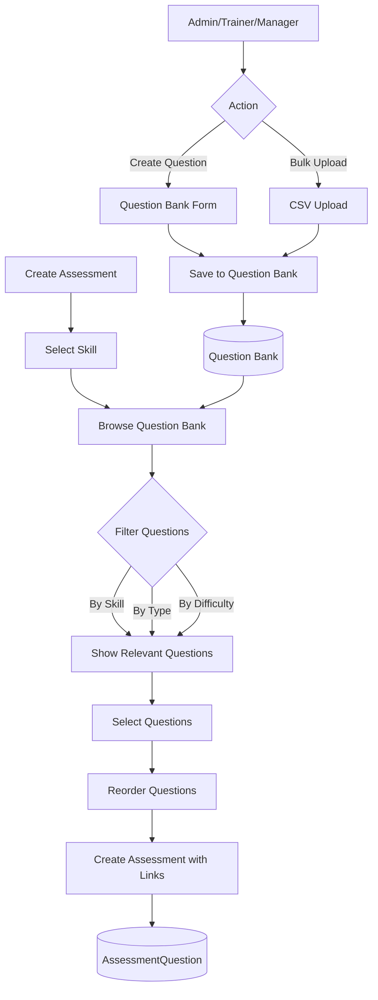
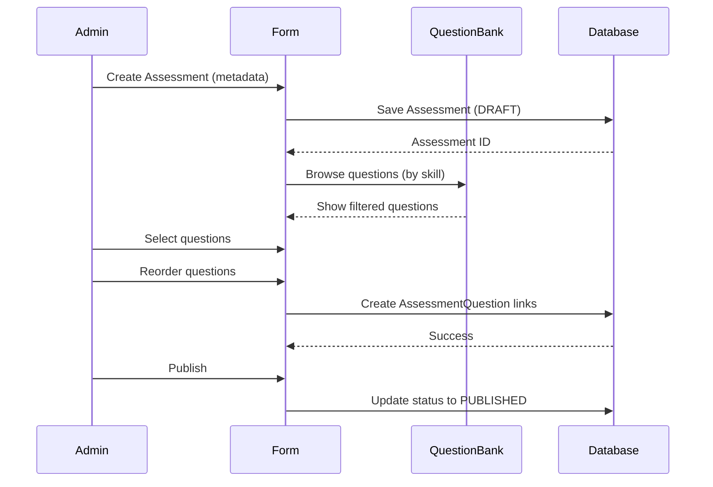

# Assessment Engine with Question Bank - Complete Implementation Plan (UPDATED)

## Key Changes from Original Plan

**MAJOR ARCHITECTURAL CHANGE**: Questions are now **reusable assets** in a question bank, not tied to a single assessment. This enables:
- Questions tagged to skills and stored in a centralized question bank
- Admins/Trainers/Managers can build assessments by selecting questions from the bank
- Same questions can be used across multiple assessments
- Better question management and quality control

## Schema Changes Required

### Update Prisma Schema

**File:** `file:prisma/schema.prisma`

**Changes to Question Model:**
```prisma
model Question {
  id                  String            @id @default(cuid())
  skillId             String            // Link to skill (was assessmentId)
  questionText        String
  questionType        QuestionType
  options             Json?             // For MCQ
  correctAnswer       String?           // For auto-grading
  marks               Int
  difficultyLevel     CompetencyLevel
  aiGenerated         Boolean           @default(false)
  isActive            Boolean           @default(true)  // NEW: For soft delete
  createdBy           String            // NEW: Track who created
  createdAt           DateTime          @default(now())
  updatedAt           DateTime          @updatedAt

  skill               Skill             @relation(fields: [skillId], references: [id])
  creator             User              @relation(fields: [createdBy], references: [id])
  assessmentQuestions AssessmentQuestion[] // NEW: Many-to-many
  answers             Answer[]          // For attempts

  @@index([skillId])
  @@index([createdBy])
  @@index([isActive])
}

// NEW: Junction table for many-to-many relationship
model AssessmentQuestion {
  id           String     @id @default(cuid())
  assessmentId String
  questionId   String
  orderIndex   Int        // Position in this specific assessment
  createdAt    DateTime   @default(now())

  assessment   Assessment @relation(fields: [assessmentId], references: [id], onDelete: Cascade)
  question     Question   @relation(fields: [questionId], references: [id], onDelete: Cascade)

  @@unique([assessmentId, questionId]) // Can't add same question twice
  @@index([assessmentId])
  @@index([questionId])
}
```

**Update Assessment Model:**
```prisma
model Assessment {
  id                  String              @id @default(cuid())
  title               String
  description         String?
  skillId             String              // Primary skill focus
  totalMarks          Int
  passingScore        Int                 // Percentage
  duration            Int                 // Minutes
  isPreAssessment     Boolean             @default(false)
  status              String              @default("DRAFT") // DRAFT, PUBLISHED, ARCHIVED
  createdBy           String
  createdAt           DateTime            @default(now())
  updatedAt           DateTime            @updatedAt

  skill               Skill               @relation(fields: [skillId], references: [id])
  creator             User                @relation(fields: [createdBy], references: [id])
  assessmentQuestions AssessmentQuestion[] // NEW: Many-to-many with questions
  attempts            AssessmentAttempt[]

  @@index([skillId])
  @@index([status])
  @@index([createdBy])
}
```

**Migration Command:**
After schema changes, run: `npx prisma migrate dev --name add-question-bank`

## Implementation Steps

### 1. Database Migration

**Steps:**
1. Update `prisma/schema.prisma` with new Question and AssessmentQuestion models
2. Create migration: `npx prisma migrate dev --name add-question-bank`
3. Update existing data (if any) with migration script to move questions to question bank

### 2. Update Validation Schemas

**File:** `file:lib/validation.ts`

Add/Update schemas:

```typescript
// Question Bank Schema (for creating/editing questions in the bank)
export const questionBankSchema = z.object({
  skillId: z.string().min(1, 'Skill is required'),
  questionText: z.string().min(5, 'Question must be at least 5 characters'),
  questionType: z.enum(['MCQ', 'DESCRIPTIVE', 'TRUE_FALSE', 'FILL_BLANK']),
  options: z.array(z.string()).optional(),
  correctAnswer: z.string().optional(),
  marks: z.coerce.number().min(1, 'Marks must be at least 1'),
  difficultyLevel: z.enum(['BEGINNER', 'INTERMEDIATE', 'ADVANCED', 'EXPERT']),
}).refine((data) => {
  if (data.questionType === 'MCQ' && (!data.options || data.options.length < 2)) {
    return false
  }
  if (['MCQ', 'TRUE_FALSE', 'FILL_BLANK'].includes(data.questionType) && !data.correctAnswer) {
    return false
  }
  return true
}, {
  message: 'MCQ requires options, and objective questions require correct answer'
})

// Assessment with question selection
export const assessmentWithQuestionsSchema = z.object({
  title: z.string().min(3),
  description: z.string().optional(),
  skillId: z.string().min(1),
  questionIds: z.array(z.string()).min(1, 'Select at least one question'),
  passingScore: z.coerce.number().min(0).max(100),
  duration: z.coerce.number().min(1),
  isPreAssessment: z.coerce.boolean(),
})

// Bulk question upload for question bank
export const bulkQuestionBankSchema = z.array(questionBankSchema)
```

### 3. Create Question Bank Server Actions

**File:** `file:actions/question-bank.ts` (NEW FILE)

```typescript
'use server'

import { auth } from '@/lib/auth'
import { prisma } from '@/lib/prisma'
import { questionBankSchema, bulkQuestionBankSchema } from '@/lib/validation'
import { revalidatePath } from 'next/cache'
import type { FormState } from './types'

// Create question in bank
export async function createQuestion(prevState: FormState, formData: FormData): Promise<FormState> {
  const session = await auth()
  if (!session?.user?.systemRoles?.some(role => ['ADMIN', 'TRAINER', 'MANAGER'].includes(role))) {
    return { message: 'Unauthorized', success: false }
  }

  const validatedFields = questionBankSchema.safeParse({
    skillId: formData.get('skillId'),
    questionText: formData.get('questionText'),
    questionType: formData.get('questionType'),
    options: formData.get('options') ? JSON.parse(formData.get('options') as string) : undefined,
    correctAnswer: formData.get('correctAnswer'),
    marks: formData.get('marks'),
    difficultyLevel: formData.get('difficultyLevel'),
  })

  if (!validatedFields.success) {
    return {
      errors: validatedFields.error.flatten().fieldErrors,
      message: 'Validation failed',
      success: false,
    }
  }

  try {
    await prisma.question.create({
      data: {
        ...validatedFields.data,
        createdBy: session.user.id,
        options: validatedFields.data.options || undefined,
      },
    })

    revalidatePath('/admin/question-bank')
    return { message: 'Question created successfully', success: true }
  } catch (error) {
    return { message: 'Failed to create question', success: false }
  }
}

// Get questions from bank with filters
export async function getQuestionBank(params: {
  skillId?: string
  questionType?: string
  difficultyLevel?: string
  search?: string
  page?: number
  limit?: number
  createdBy?: string
}) {
  const { skillId, questionType, difficultyLevel, search, page = 1, limit = 20, createdBy } = params

  const where = {
    isActive: true,
    ...(skillId && { skillId }),
    ...(questionType && { questionType }),
    ...(difficultyLevel && { difficultyLevel }),
    ...(createdBy && { createdBy }),
    ...(search && {
      questionText: { contains: search, mode: 'insensitive' as const },
    }),
  }

  try {
    const [questions, total] = await Promise.all([
      prisma.question.findMany({
        where,
        include: {
          skill: true,
          creator: { select: { name: true } },
          _count: { select: { assessmentQuestions: true } }, // How many times used
        },
        orderBy: { createdAt: 'desc' },
        skip: (page - 1) * limit,
        take: limit,
      }),
      prisma.question.count({ where }),
    ])

    return { questions, total, pages: Math.ceil(total / limit) }
  } catch (error) {
    return { questions: [], total: 0, pages: 0 }
  }
}

// Update question in bank
export async function updateQuestion(
  questionId: string,
  prevState: FormState,
  formData: FormData
): Promise<FormState> {
  const session = await auth()
  if (!session?.user?.systemRoles?.some(role => ['ADMIN', 'TRAINER', 'MANAGER'].includes(role))) {
    return { message: 'Unauthorized', success: false }
  }

  const validatedFields = questionBankSchema.safeParse({
    skillId: formData.get('skillId'),
    questionText: formData.get('questionText'),
    questionType: formData.get('questionType'),
    options: formData.get('options') ? JSON.parse(formData.get('options') as string) : undefined,
    correctAnswer: formData.get('correctAnswer'),
    marks: formData.get('marks'),
    difficultyLevel: formData.get('difficultyLevel'),
  })

  if (!validatedFields.success) {
    return {
      errors: validatedFields.error.flatten().fieldErrors,
      message: 'Validation failed',
      success: false,
    }
  }

  try {
    await prisma.question.update({
      where: { id: questionId },
      data: {
        ...validatedFields.data,
        options: validatedFields.data.options || undefined,
      },
    })

    revalidatePath('/admin/question-bank')
    return { message: 'Question updated successfully', success: true }
  } catch (error) {
    return { message: 'Failed to update question', success: false }
  }
}

// Soft delete question
export async function deleteQuestion(questionId: string): Promise<FormState> {
  const session = await auth()
  if (!session?.user?.systemRoles?.some(role => ['ADMIN', 'TRAINER', 'MANAGER'].includes(role))) {
    return { message: 'Unauthorized', success: false }
  }

  try {
    await prisma.question.update({
      where: { id: questionId },
      data: { isActive: false },
    })

    revalidatePath('/admin/question-bank')
    return { message: 'Question deleted successfully', success: true }
  } catch (error) {
    return { message: 'Failed to delete question', success: false }
  }
}

// Bulk upload questions to bank
export async function bulkUploadQuestions(
  skillId: string,
  questionsData: any[]
): Promise<FormState> {
  const session = await auth()
  if (!session?.user?.systemRoles?.some(role => ['ADMIN', 'TRAINER', 'MANAGER'].includes(role))) {
    return { message: 'Unauthorized', success: false }
  }

  const validatedFields = bulkQuestionBankSchema.safeParse(questionsData)
  if (!validatedFields.success) {
    return {
      message: 'Validation failed: ' + JSON.stringify(validatedFields.error.flatten()),
      success: false,
    }
  }

  try {
    await prisma.$transaction(
      validatedFields.data.map((questionData) =>
        prisma.question.create({
          data: {
            ...questionData,
            createdBy: session.user.id,
            options: questionData.options || undefined,
          },
        })
      )
    )

    revalidatePath('/admin/question-bank')
    return {
      message: `${validatedFields.data.length} questions uploaded successfully`,
      success: true,
    }
  } catch (error) {
    return { message: 'Failed to upload questions', success: false }
  }
}
```

### 4. Update Assessment Server Actions

**File:** `file:actions/assessments.ts`

Key changes:

```typescript
// Create assessment with selected questions
export async function createAssessmentWithQuestions(
  prevState: FormState,
  formData: FormData
): Promise<FormState> {
  const session = await auth()
  if (!session?.user?.systemRoles?.some(role => ['ADMIN', 'TRAINER', 'MANAGER'].includes(role))) {
    return { message: 'Unauthorized', success: false }
  }

  const questionIds = JSON.parse(formData.get('questionIds') as string)
  
  const validatedFields = assessmentWithQuestionsSchema.safeParse({
    title: formData.get('title'),
    description: formData.get('description'),
    skillId: formData.get('skillId'),
    questionIds,
    passingScore: formData.get('passingScore'),
    duration: formData.get('duration'),
    isPreAssessment: formData.get('isPreAssessment') === 'true',
  })

  if (!validatedFields.success) {
    return {
      errors: validatedFields.error.flatten().fieldErrors,
      message: 'Validation failed',
      success: false,
    }
  }

  try {
    // Get questions to calculate total marks
    const questions = await prisma.question.findMany({
      where: { id: { in: questionIds }, isActive: true },
    })

    const totalMarks = questions.reduce((sum, q) => sum + q.marks, 0)

    // Create assessment and link questions in transaction
    const assessment = await prisma.$transaction(async (tx) => {
      const newAssessment = await tx.assessment.create({
        data: {
          title: validatedFields.data.title,
          description: validatedFields.data.description,
          skillId: validatedFields.data.skillId,
          totalMarks,
          passingScore: validatedFields.data.passingScore,
          duration: validatedFields.data.duration,
          isPreAssessment: validatedFields.data.isPreAssessment,
          createdBy: session.user.id,
        },
      })

      // Link questions with order
      await tx.assessmentQuestion.createMany({
        data: questionIds.map((qId: string, index: number) => ({
          assessmentId: newAssessment.id,
          questionId: qId,
          orderIndex: index,
        })),
      })

      return newAssessment
    })

    revalidatePath('/admin/assessments')
    return {
      message: 'Assessment created successfully',
      success: true,
      data: { id: assessment.id },
    }
  } catch (error) {
    return { message: 'Failed to create assessment', success: false }
  }
}

// Add questions to existing assessment
export async function addQuestionsToAssessment(
  assessmentId: string,
  questionIds: string[]
): Promise<FormState> {
  const session = await auth()
  if (!session?.user?.systemRoles?.some(role => ['ADMIN', 'TRAINER', 'MANAGER'].includes(role))) {
    return { message: 'Unauthorized', success: false }
  }

  try {
    // Get current max order index
    const maxOrder = await prisma.assessmentQuestion.aggregate({
      where: { assessmentId },
      _max: { orderIndex: true },
    })

    let currentOrder = (maxOrder._max.orderIndex || -1) + 1

    // Add new questions
    await prisma.assessmentQuestion.createMany({
      data: questionIds.map((qId) => ({
        assessmentId,
        questionId: qId,
        orderIndex: currentOrder++,
      })),
      skipDuplicates: true, // Skip if already added
    })

    // Recalculate total marks
    const questions = await prisma.question.findMany({
      where: {
        assessmentQuestions: {
          some: { assessmentId },
        },
      },
    })

    const totalMarks = questions.reduce((sum, q) => sum + q.marks, 0)

    await prisma.assessment.update({
      where: { id: assessmentId },
      data: { totalMarks },
    })

    revalidatePath(`/admin/assessments/${assessmentId}`)
    return { message: 'Questions added successfully', success: true }
  } catch (error) {
    return { message: 'Failed to add questions', success: false }
  }
}

// Remove question from assessment
export async function removeQuestionFromAssessment(
  assessmentId: string,
  questionId: string
): Promise<FormState> {
  const session = await auth()
  if (!session?.user?.systemRoles?.some(role => ['ADMIN', 'TRAINER', 'MANAGER'].includes(role))) {
    return { message: 'Unauthorized', success: false }
  }

  try {
    await prisma.assessmentQuestion.delete({
      where: {
        assessmentId_questionId: {
          assessmentId,
          questionId,
        },
      },
    })

    // Recalculate total marks
    const questions = await prisma.question.findMany({
      where: {
        assessmentQuestions: {
          some: { assessmentId },
        },
      },
    })

    const totalMarks = questions.reduce((sum, q) => sum + q.marks, 0)

    await prisma.assessment.update({
      where: { id: assessmentId },
      data: { totalMarks },
    })

    revalidatePath(`/admin/assessments/${assessmentId}`)
    return { message: 'Question removed successfully', success: true }
  } catch (error) {
    return { message: 'Failed to remove question', success: false }
  }
}

// Get assessment with questions (updated to use new relation)
export async function getAssessmentById(assessmentId: string) {
  try {
    const assessment = await prisma.assessment.findUnique({
      where: { id: assessmentId },
      include: {
        skill: true,
        assessmentQuestions: {
          include: {
            question: true,
          },
          orderBy: { orderIndex: 'asc' },
        },
        _count: {
          select: { attempts: true },
        },
      },
    })

    if (!assessment) return null

    // Transform to match expected structure
    return {
      ...assessment,
      questions: assessment.assessmentQuestions.map((aq) => aq.question),
    }
  } catch (error) {
    return null
  }
}
```

### 5. Build Question Bank Management UI

**File:** `file:app/(dashboard)/admin/question-bank/page.tsx`

```typescript
import { auth } from '@/lib/auth'
import { redirect } from 'next/navigation'
import { getQuestionBank } from '@/actions/question-bank'
import { Card, CardContent, CardHeader, CardTitle } from '@/components/ui/card'
import { Button } from '@/components/ui/button'
import { RiAddLine } from '@remixicon/react'
import { QuestionBankFilters } from '@/components/dashboard/question-bank/QuestionBankFilters'
import { QuestionBankTable } from '@/components/dashboard/question-bank/QuestionBankTable'
import Link from 'next/link'

export default async function QuestionBankPage({
  searchParams,
}: {
  searchParams: { [key: string]: string | string[] | undefined }
}) {
  const session = await auth()
  if (!session?.user || !session.user.systemRoles?.some(role => ['ADMIN', 'TRAINER', 'MANAGER'].includes(role))) {
    redirect('/unauthorized')
  }

  const skillId = searchParams.skill as string
  const questionType = searchParams.type as string
  const difficultyLevel = searchParams.difficulty as string
  const search = searchParams.search as string
  const page = Number(searchParams.page) || 1

  const { questions, total, pages } = await getQuestionBank({
    skillId,
    questionType,
    difficultyLevel,
    search,
    page,
  })

  return (
    <div className="space-y-6">
      <div className="flex items-center justify-between">
        <div>
          <h1 className="text-3xl font-bold">Question Bank</h1>
          <p className="text-muted-foreground">
            Manage reusable questions for assessments
          </p>
        </div>
        <Link href="/admin/question-bank/create">
          <Button>
            <RiAddLine className="mr-2 h-4 w-4" />
            Create Question
          </Button>
        </Link>
      </div>

      <Card>
        <CardHeader>
          <CardTitle>All Questions ({total})</CardTitle>
        </CardHeader>
        <CardContent className="space-y-4">
          <QuestionBankFilters />
          <QuestionBankTable
            questions={questions}
            currentPage={page}
            totalPages={pages}
          />
        </CardContent>
      </Card>
    </div>
  )
}
```

**File:** `file:components/dashboard/question-bank/QuestionBankTable.tsx`

Table showing all questions with:
- Question text (truncated)
- Skill badge
- Type badge (MCQ/DESCRIPTIVE/etc)
- Difficulty badge
- Marks
- Usage count (how many assessments use this)
- Creator name
- Actions: Edit, Delete, Preview
- Click row to preview full question

**File:** `file:components/dashboard/question-bank/QuestionBankFilters.tsx`

Filters for:
- Skill dropdown
- Question type
- Difficulty level
- Search by question text
- Creator filter (show only my questions)

**File:** `file:components/dashboard/question-bank/QuestionForm.tsx`

Form for creating/editing questions in the bank (similar to old QuestionForm but saves to Question table directly)

### 6. Update Assessment Creation Flow

**File:** `file:components/dashboard/assessments/CreateAssessmentForm.tsx`

**New Two-Step Flow:**

**Step 1: Assessment Metadata**
- Title, description, skill selection
- Passing score, duration
- isPreAssessment toggle
- Submit creates assessment in DRAFT status

**Step 2: Select Questions from Bank**
- Show question browser/selector
- Filter by skill (default to assessment's skill)
- Search/filter questions
- Multi-select questions (checkboxes)
- Preview question before adding
- Show running total of marks
- Reorder selected questions (drag-drop)
- "Add Questions" button
- "Publish Assessment" button when ready

**File:** `file:components/dashboard/assessments/QuestionSelector.tsx`

Component for selecting questions from bank:
- Displays questions in cards/list
- Checkbox for selection
- Preview modal on click
- Shows: question text, type, difficulty, marks, usage count
- Filter panel
- Selected questions summary (count, total marks)
- "Add Selected" button

**File:** `file:components/dashboard/assessments/SelectedQuestionsList.tsx`

Shows questions added to assessment:
- Drag-drop reordering
- Remove button
- Edit order index
- Total marks calculation
- Question details preview

### 7. Update Assessment Display

**File:** `file:components/dashboard/assessments/AssessmentQuestionsList.tsx`

When viewing an assessment, show:
- All linked questions via AssessmentQuestion
- Order index
- Question details
- Option to add more questions from bank
- Option to remove questions
- Reorder capability

### 8. Add Question Bank Navigation

**File:** `file:components/dashboard/sidebar.tsx`

Add to adminNavItems and trainerNavItems:
```typescript
{
  title: "Question Bank",
  href: "/admin/question-bank",
  icon: RiQuestionLine, // from @remixicon/react
}
```

### 9. Update Types

**File:** `file:types/assessment.ts`

```typescript
import { Assessment, Question, AssessmentAttempt, Answer, User, Skill, AssessmentQuestion } from '@prisma/client'

export type QuestionWithSkill = Question & {
  skill: Skill
  creator: { name: string }
  _count: { assessmentQuestions: number }
}

export type AssessmentWithQuestions = Assessment & {
  questions: Question[]
  skill: Skill
  assessmentQuestions: AssessmentQuestion[]
  _count: { attempts: number }
}

export type AttemptWithDetails = AssessmentAttempt & {
  assessment: Assessment & { skill: Skill }
  answers: (Answer & { question: Question })[]
  user: User
}

export type SkillScore = {
  skillName: string
  score: number
  maxScore: number
  percentage: number
}
```

## Migration Guide

For existing implementations, follow this migration path:

1. **Backup Database**: `pg_dump` or export data
2. **Update Schema**: Apply new Prisma schema
3. **Run Migration**: `npx prisma migrate dev --name add-question-bank`
4. **Data Migration Script**: 
   ```typescript
   // Migrate existing questions to question bank
   const assessments = await prisma.assessment.findMany({ include: { questions: true } })
   
   for (const assessment of assessments) {
     for (const question of assessment.questions) {
       // Update question to reference skill instead of assessment
       await prisma.question.update({
         where: { id: question.id },
         data: {
           skillId: assessment.skillId,
           createdBy: assessment.createdBy,
         },
       })
       
       // Create AssessmentQuestion link
       await prisma.assessmentQuestion.create({
         data: {
           assessmentId: assessment.id,
           questionId: question.id,
           orderIndex: question.orderIndex,
         },
       })
     }
   }
   ```
5. **Deploy New UI**: Roll out question bank interface
6. **Test**: Verify question reuse across assessments

## Benefits of Question Bank Architecture

1. **Reusability**: Create questions once, use in multiple assessments
2. **Quality Control**: Centralized review and improvement of questions
3. **Efficiency**: Faster assessment creation by selecting existing questions
4. **Analytics**: Track which questions are most used/effective
5. **Collaboration**: Multiple trainers can contribute to question bank
6. **Versioning**: Can add version control for questions later
7. **AI Integration**: Can add AI-generated questions to bank for review

## Updated Flow Diagrams

### Question Bank Flow


### Assessment Creation Flow


## Summary of Changes

| Component | Old Approach | New Approach |
|-----------|-------------|--------------|
| Question Storage | Tied to Assessment | Independent Question Bank |
| Question Creation | During assessment creation | Separate question bank management |
| Question Reuse | Copy/Duplicate | Link same question to multiple assessments |
| Data Model | Question -> Assessment (1:M) | Question <-> Assessment (M:M) via AssessmentQuestion |
| Total Marks | Pre-defined | Auto-calculated from selected questions |
| Who Can Create | ADMIN, TRAINER | ADMIN, TRAINER, MANAGER |
| Question Organization | By assessment | By skill |

## Next Steps After Implementation

1. Add question analytics (success rate, difficulty validation)
2. Implement question versioning
3. Add AI-powered question generation to bank
4. Create question review/approval workflow
5. Add question tags for better organization
6. Export/import question banks between systems
