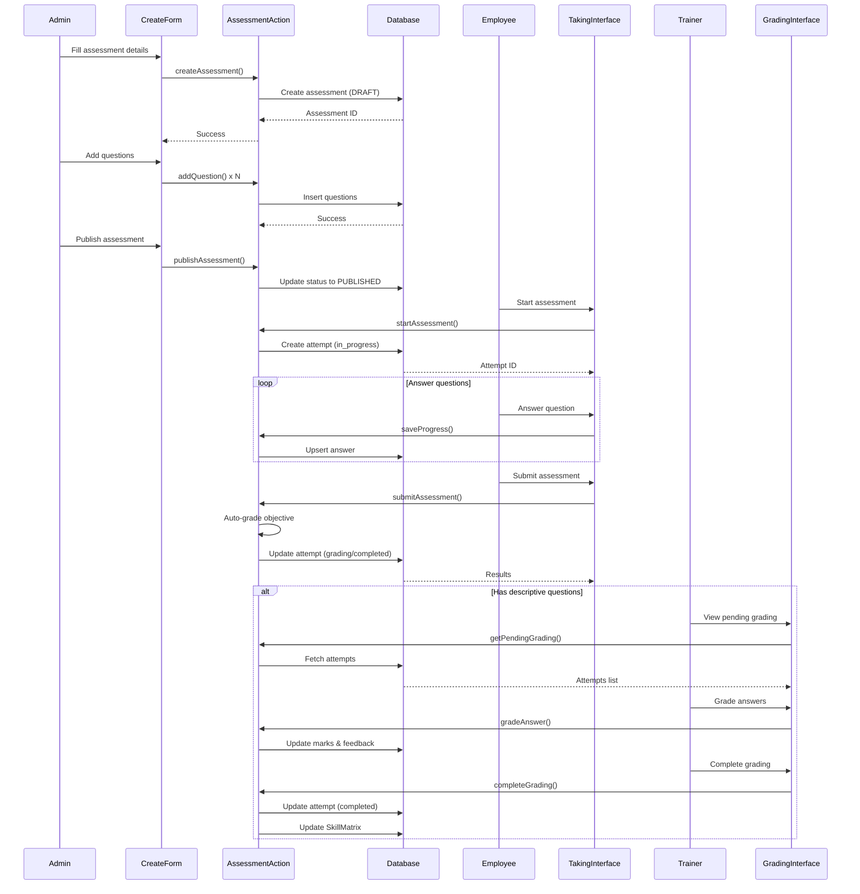
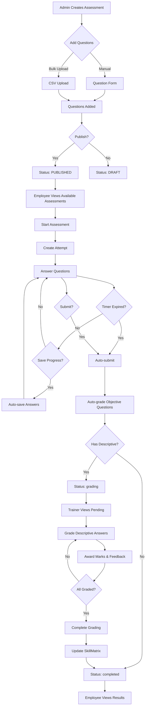
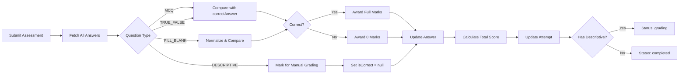

I have created the following plan after thorough exploration and analysis of the codebase. Follow the below plan verbatim. Trust the files and references. Do not re-verify what's written in the plan. Explore only when absolutely necessary. First implement all the proposed file changes and then I'll review all the changes together at the end.

# Assessment Engine - Complete Implementation Plan

## Observations

The codebase has a solid foundation with:
- Prisma schema containing all assessment-related models (`Assessment`, `Question`, `AssessmentAttempt`, `Answer`) with proper cascade delete relationships
- NextAuth v5 (beta.30) authentication with role-based access control
- React 19.2.3 with `useActionState` hook for form handling
- Zod 4.3.6 for validation with existing patterns in `lib/validation.ts`
- shadcn/ui components with recharts@3.7.0 already installed for charts
- Remix Icons (@remixicon/react@4.8.0) for consistent iconography
- Server actions pattern with FormState return type for error handling
- Prisma relations configured with `onDelete: Cascade` where appropriate

The schema supports four question types (MCQ, DESCRIPTIVE, TRUE_FALSE, FILL_BLANK) with auto-grading capabilities and manual grading workflows.

## Approach

The implementation follows a layered approach starting with validation schemas and server actions, then building the admin assessment creation interface with question bank management, followed by the employee assessment-taking interface with timer and auto-save, and finally the trainer grading interface for descriptive answers. This sequence ensures data layer stability before UI implementation, allows parallel development of admin and employee interfaces, and integrates seamlessly with existing authentication and authorization patterns. The approach prioritizes reusable components, type safety with Zod schemas, and follows the established server actions pattern without API routes.

## Implementation Steps

### 1. Create Validation Schemas

**File:** `file:lib/validation.ts`

Add comprehensive Zod schemas for assessment operations:

- `assessmentSchema` - Validate assessment metadata:
  - title: `z.string().min(3, 'Title must be at least 3 characters')`
  - description: `z.string().optional()`
  - skillId: `z.string().min(1, 'Skill is required')`
  - totalMarks: `z.number().min(1, 'Total marks must be at least 1')`
  - passingScore: `z.number().min(0).max(100, 'Passing score must be between 0 and 100')`
  - duration: `z.number().min(1, 'Duration must be at least 1 minute')`
  - isPreAssessment: `z.boolean()`

- `questionSchema` - Validate question data:
  - questionText: `z.string().min(5, 'Question must be at least 5 characters')`
  - questionType: `z.enum(['MCQ', 'DESCRIPTIVE', 'TRUE_FALSE', 'FILL_BLANK'])`
  - options: `z.array(z.string()).min(2).optional()` (required if MCQ)
  - correctAnswer: `z.string().optional()` (required for MCQ, TRUE_FALSE, FILL_BLANK)
  - marks: `z.number().min(1, 'Marks must be at least 1')`
  - difficultyLevel: `z.enum(['BEGINNER', 'INTERMEDIATE', 'ADVANCED', 'EXPERT'])`
  - Use `.refine()` to validate conditional requirements based on questionType

- `bulkQuestionSchema` - `z.array(questionSchema)`

- `assessmentAttemptSchema` - Validate attempt submission:
  - assessmentId: `z.string()`
  - answers: `z.array(z.object({ questionId: z.string(), answerText: z.string() }))`

- `answerSchema` - Validate individual answer:
  - questionId: `z.string()`
  - answerText: `z.string().min(1, 'Answer is required')`

- `gradingSchema` - Validate manual grading:
  - answerId: `z.string()`
  - marksAwarded: `z.number().min(0, 'Marks cannot be negative')`
  - trainerFeedback: `z.string().optional()`

Export TypeScript types using `z.infer` for type safety: `export type AssessmentFormData = z.infer<typeof assessmentSchema>`

### 2. Create Assessment Server Actions

**File:** `file:actions/assessments.ts`

Implement server actions following the established pattern:

**CRUD Operations:**
- `createAssessment(prevState, formData)` - Create assessment with ADMIN/TRAINER authorization, validate with Zod, return FormState with `{ message?: string; errors?: Record<string, string[]>; success?: boolean }`
- `updateAssessment(assessmentId, prevState, formData)` - Update assessment metadata, return FormState
- `deleteAssessment(assessmentId)` - Soft delete by setting status to ARCHIVED, call `revalidatePath('/admin/assessments')`
- `publishAssessment(assessmentId)` - Change status from DRAFT to PUBLISHED, call `revalidatePath('/admin/assessments')`
- `getAssessments(params)` - Fetch with filters (skillId, status, isPreAssessment), pagination, include `_count: { questions: true, attempts: true }`
- `getAssessmentById(assessmentId)` - Fetch with `include: { questions: { orderBy: { orderIndex: 'asc' } }, skill: true, _count: { select: { attempts: true } } }`

**Question Management:**
- `addQuestion(assessmentId, prevState, formData)` - Add single question with orderIndex auto-increment (fetch max orderIndex + 1), validate question type and required fields, return FormState
- `updateQuestion(questionId, prevState, formData)` - Update question details, return FormState
- `deleteQuestion(questionId)` - Delete question using Prisma cascade (will cascade delete to Answer model), reorder remaining questions, call `revalidatePath`
- `bulkUploadQuestions(assessmentId, csvData)` - Parse CSV, validate with `bulkQuestionSchema`, use transaction to create multiple questions atomically, return FormState
- `reorderQuestions(assessmentId, questionIds)` - Update orderIndex for drag-drop reordering using transaction, call `revalidatePath`

**Assessment Taking:**
- `startAssessment(assessmentId)` - Create AssessmentAttempt with status "in_progress", return attemptId
- `saveProgress(attemptId, answers)` - Use Prisma's upsert operation for atomic create-or-update of answers, allow resume later
- `submitAssessment(attemptId)` - Auto-grade objective questions, set status to "grading" if descriptive exists, "completed" otherwise
- `getAttemptById(attemptId)` - Fetch attempt with answers and questions for review

**Auto-Grading Logic:**
- Implement in `submitAssessment` - Compare answers with correctAnswer for MCQ/TRUE_FALSE
- For FILL_BLANK: Normalize strings (trim, lowercase) before comparison
- Calculate score, percentage, update AssessmentAttempt
- Mark descriptive questions for manual grading (set isCorrect to null, marksAwarded to null)

**Manual Grading:**
- `getPendingGrading(params)` - Fetch attempts with status "grading", include `user`, `assessment.skill`, count of ungraded descriptive answers
- `gradeAnswer(answerId, prevState, formData)` - Award marks, add feedback, update Answer record, return FormState
- `completeGrading(attemptId)` - Recalculate total score from all answers, update attempt status to "completed" and final score/percentage, update or create SkillMatrix record with currentLevel based on score, call `revalidatePath`
from `next/cache` after mutations to invalidate cache (e.g., `revalidatePath('/admin/assessments')`), proper error handling with try-catch, and return structured responses following FormState pattern
Use `revalidatePath` after mutations, proper error handling with try-catch, and return structured responses.

### 3. Build Assessment Builder UI - Admin Page

**File:** `file:app/(dashboard)/admin/assessments/page.tsx`

Server component for assessments list:

- Check session with `auth()`, redirect if not ADMIN/TRAINER
- Fetch assessments using `getAssessments` with searchParams (skill, status, page)
- Display page header with "Create Assessment" button
- Render `<AssessmentsFilters />` for skill dropdown, status filter, search
- Render `<AssessmentsTable />` with data
- Show pagination controls

**File:** `file:app/(dashboard)/admin/assessments/create/page.tsx`

Assessment creation page:

- Server component with skill list fetch for dropdown
- Render `<CreateAssessmentForm />` client component
- Pass skills data as props
- Breadcrumb navigation (Admin > Assessments > Create)

### 4. Create Assessment Form Components

**File:** `file:components/dashboard/assessments/CreateAssessmentForm.tsx`

Multi-step form client component:

**Step 1: Assessment Dehook from React 19: `const [state, formAction, pending] = useActionState(createAssessment, initialState)`
- Form fields: title (Input), description (Textarea), skillId (Select/Combobox), totalMarks (Input number), passingScore (Input number), duration (Input number), isPreAssessment (Switch)
- Validation errors display from `state.errors` (e.g., `state?.errors?.title`)
- Disable submit button when `pending` is true
- "Next" button to proceed to Step 2 after successful submissionte.errors
- "Next" button to proceed to Step 2

**Step 2: Add Questions**
- After assessment created, show question builder
- Tabs for "Add Manually" and "Bulk Upload"
- Manual tab: `<QuestionForm />` component
- Bulk upload tab: CSV file upload with template download, parse and validate
- Display added questions in `<QuestionsList />` with edit/delete/reorder
- "Publish Assessment" button to change status

**File:** `file:components/dashboard/assessments/QuestionForm.tsx`

Dynamic question form:

- Question type selector (Select) - MCQ, DESCRIPTIVE, TRUE_FALSE, FILL_BLANK
- Question text (Textarea)
- Conditional rendering based on type:
  - MCQ: Options array (dynamic inputs with add/remove), correct answer radio selection
  - TRUE_FALSE: Correct answer radio (True/False)
  - FILL_BLANK: Correct answer input (case-insensitive matching)
  - DESCRIPTIVE: No correct answer field
- Marks (Input number) (from CompetencyLevel enum)
- Use `useActionState` hook: `const [state, formAction, pending] = useActionState(addQuestion, initialState)`
- Display validation errors from `state.errors`
- Reset form after successful submission (when `state.success` is true)` action
- Reset form after successful submission

**File:** `file:components/dashboard/assessments/QuestionsList.tsx`

Questions display and management:

- Table showing questionText, type, marks, difficulty, actions
- Drag-drop reordering using HTML5 drag API or library
- Edit button opens `<EditQuestionDialog />`
- Delete button with confirmation `<AlertDialog />`
- Call `reorderQuestions` on drag end

**File:** `file:components/dashboard/assessments/BulkUploadQuestions.tsx`

CSV upload interface:

- File input accepting .csv
- Download template button (generates CSV with headers: questionText, questionType, options, correctAnswer, marks, difficultyLevel)
- Parse CSV using FileReader API
- Validate with `bulkQuestionSchema`
- Display preview table before submission
- Submit button calls `bulkUploadQuestions` action
- Show progress indicator and success/error messages

### 5. Build Assessments Table and Filters

**File:** `file:components/dashboard/assessments/AssessmentsTable.tsx`

Client component for data display:

- shadcn Table with columns: Title, Skill, Questions Count, Status (Badge), Type (Pre/Post), Duration, Actions
- Status badges with colors (DRAFT: gray, PUBLISHED: green, ARCHIVED: red)
- DropdownMenu for actions: View, Edit, Publish (if DRAFT), Archive, Delete
- Pagination controls with page navigation
- Handle delete with `<AlertDialog />` confirmation
- Call `deleteAssessment` action on confirm

**File:** `file:components/dashboard/assessments/AssessmentsFilters.tsx`

Client component for filtering:

- Skill filter (Combobox with search)
- Status filter (Select - All, DRAFT, PUBLISHED, ARCHIVED)
- Assessment type (Select - All, Pre-Assessment, Post-Assessment)
- Search input for title
- Update URL searchParams on change using `useRouter`

### 6. Build Assessment Taking Interface - Employee

**File:** `file:app/(dashboard)/employee/assessments/page.tsx`

Server component for available assessments:

- Fetch published assessments for employee's skills
- Show assigned assessments with status (Not Started, In Progress, Completed)
- Display assessment cards with title, skill, duration, questions count, passing score
- "Start Assessment" or "Resume" button based on attempt status
- Show previous attempts with scores

**File:** `file:app/(dashboard)/employee/assessments/[id]/page.tsx`

Assessment taking page:

- Server component to fetch assessment details
- Check if user has active attempt, resume or create new
- Render `<AssessmentTakingInterface />` client component
- Pass assessment, questions, existing answers (if resuming)

**File:** `file:components/dashboard/assessments/AssessmentTakingInterface.tsx`

Interactive assessment interface:

**Features:**
- Timer display using `useState` and `useEffect` with countdown
- Auto-submit when timer reaches zero
- Question navigation (numbered buttons, current question highlighted)
- Question display with type-specific input:
  - MCQ: Radio buttons for options
  - TRUE_FALSE: Radio buttons (True/False)
  - FILL_BLANK: Text input
  - DESCRIPTIVE: Textarea
- "Save & Next" button - calls `saveProgress` action
- "Previous" button for navigation
- Progress indicator (X of Y questions answered)
- "Submit Assessment" button (enabled when all answered or time up)
- Confirmation dialog before submit
- Auto-save every 30 seconds using `useEffect`

**State Management:**
- `currentQuestionIndex` - Track current question
- `answers` - Map of questionId to answerText
- `timeRemaining` - Countdown timer
- `isSaving` - Loading state for auto-save
- `isSubmitting` - Loading state for final submit

**Timer Logic:**
- Calculate end time on mount (startedAt + duration)
- Update every second
- Show warning when < 5 minutes remaining
- Auto-submit at 0

**File:** `file:components/dashboard/assessments/AssessmentResults.tsx`

Results display after submission:

- Show score, percentage, pass/fail status
- Skill-wise breakdown (group questions by skill, show score per skill)
- Question-by-question review (question, user answer, correct answer for objective, marks awarded)
- For descriptive: Show "Pending Grading" status
- Recharts bar chart for skill-wise performance
- "Retake Assessment" button if allowed by system config

### 7. Build Manual Grading Interface - Trainer

**File:** `file:app/(dashboard)/trainer/grading/page.tsx`

Server component for pending grading:

- Fetch attempts with status "grading" using `getPendingGrading`
- Filter by assessment, employee, date range
- Display `<PendingGradingTable />` with attempt details
- Show count of pending descriptive answers

**File:** `file:components/dashboard/trainer/PendingGradingTable.tsx`

Table of attempts needing grading:

- Columns: Employee Name, Assessment Title, Submitted Date, Pending Answers Count, Actions
- "Grade" button opens grading interface
- Sort by submission date (oldest first)

**File:** `file:app/(dashboard)/trainer/grading/[attemptId]/page.tsx`

Grading interface page:

- Server component to fetch attempt with answers and questions
- Filter descriptive questions only
- Render `<GradingInterface />` client component

**File:** `file:components/dashboard/trainer/GradingInterface.tsx`

Manual grading form:

- Display employee info, assessment title, submission date
- List descriptive questions with employee answers
- For each answer:
  - Show question text
  - Show employee's answer (Textarea, read-only)
  - Marks input (Input number, max = question.marks)
  - Trainer feedback (Textarea)
  - Use `useActionState` with `gradeAnswer` action
- "Save & Next" button to grade and move to next
- Progress indicator (X of Y graded)
- "Complete Grading" button when all graded - calls `completeGrading`
- Show total score calculation in real-time
- Confirmation before completing

### 8. Add Assessment Navigation to Sidebar

**File:** `file:components/dashboard/sidebar.tsx`

Update navigation items:

- Add to `adminNavItems`: "Assessments" with href `/admin/assessments`, icon `RiFileChartLine` from `@remixicon/react`
- Add to `trainerNavItems`: "Grading" with href `/trainer/grading`, icon `RiEditLine` from `@remixicon/react`
- Add to `learnerNavItems`: "Assessments" with href `/employee/assessments`, icon `RiFileChartLine` from `@remixicon/react` (if not already present)

### 9. Create Shared Components
(questionText, questionType, options, correctAnswer, marks, difficultyLevel) and example rows
- `parseQuestionCSV(file: File)` - Parse CSV file using FileReader API or similar, return array of question objects
- `validateQuestionRow(row)` - Validate single CSV row against `questionSchema`
- Handle encoding issues (UTF-8), trim whitespace, validate required fields
- For options field: Parse JSON array string or pipe-separated values (e.g., "Option 1|Option 2|Option 3")

- Display assessment title, skill badge, duration, questions count
- Status badge (color-coded)
- Action button (Start/Resume/View Results) (multiple card/table row skeletons)
- `file:app/(dashboard)/admin/assessments/create/loading.tsx` - Skeleton for form (multiple input skeletons)
- `file:app/(dashboard)/employee/assessments/[id]/loading.tsx` - Skeleton for assessment interface (question and options skeletons)
- `file:app/(dashboard)/trainer/grading/loading.tsx` - Skeleton for grading list (table row skeletons)

Use shadcn `<Skeleton />` component (already available in `@/components/ui/skeleton`) for loading states with appropriate dimension

- MCQ: `RiCheckboxMultipleLine` from `@remixicon/react`
- DESCRIPTIVE: `RiFileTextLine` from `@remixicon/react` with 'use client' directive, reset function, and error message display
- `file:app/(dashboard)/employee/assessments/[id]/error.tsx` - Error UI for assessment taking with retry functionality

Note: Error boundaries must be client components in Next.js App Router
- FILL_BLANK: `RiInputMethodLine` from `@remixicon/react`
- Props: type, className

**File:** `file:components/dashboard/assessments/SkillBreakdownChart.tsx`

Chart component for skill-wise scores using shadcn/ui chart component:

- Use shadcn/ui `chart` component (already has recharts@3.7.0 installed as dependency)
- Bar chart showing skills on X-axis, score percentage on Y-axis
- Color-coded bars (green > 70%, yellow 50-70%, red < 50%)
- Props: skillScores array `{ skillName: string, score: number, maxScore: number }`
- Import from `@/components/ui/chart`

### 10. Implement CSV Template Generation

**File:** `file:lib/csv-utils.ts`

Utility functions for CSV operations:

- `generateQuestionTemplate()` - Return CSV string with headers and example rows
- `parseQuestionCSV(file: File)` - Parse CSV file, return array of question objects
- `validateQuestionRow(row)` - Validate single CSV row against schema
- Handle encoding issues, trim whitespace, validate required fields

### 11. Add Loading and Error States

**Files:** 
- `file:app/(dashboardassessment.ts` (create new file in types directory)

Export types for assessment domain using Prisma types:

```typescript
import { Assessment, Question, AssessmentAttempt, Answer, User, Skill } from '@prisma/client'

export type AssessmentWithQuestions = Assessment & {
  questions: Question[]
  skill: Skill
  _count: { attempts: number; questions: number }
}

export type AttemptWithDetails = AssessmentAttempt & {
  assessment: Assessment & { skill: Skill }
  answers: (Answer & { question: Question })[]
  user: User
}

export type QuestionWithAnswer = Question & {
  answer?: Answer | null
}

export type SkillScore = {
  skillName: string
  score: number
  maxScore: number
  percentage: number
}
```

These types should match the Prisma `include` patterns used in server actions.kill: Skill
  _count: { attempts: number }
}

export type AttemptWithDetails = AssessmentAttempt & {
  assessment: Assessment & { skill: Skill }
  answers: (Answer & { question: Question })[]
  user: User
}

export type QuestionWithAnswer = Question & {
  answer?: Answer
}
```

## Sequence Diagram



## Assessment Flow Diagram



## Data Flow for Auto-Grading

