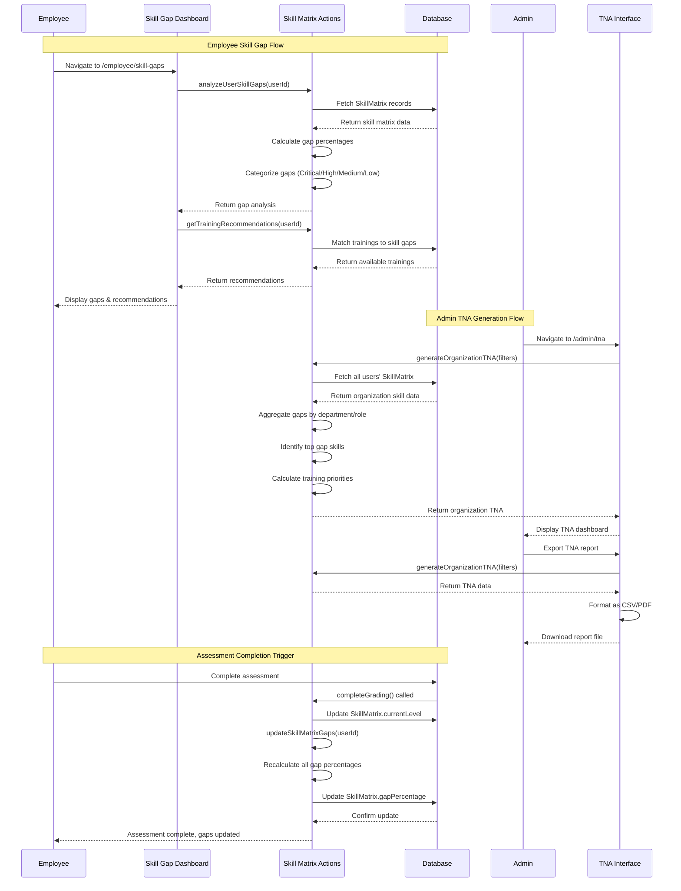

I have created the following plan after thorough exploration and analysis of the codebase. Follow the below plan verbatim. Trust the files and references. Do not re-verify what's written in the plan. Explore only when absolutely necessary. First implement all the proposed file changes and then I'll review all the changes together at the end.

## 🎯 IMPLEMENTATION CHECKLIST

### ✅ Pre-Implementation Verification
- [ ] Verify Next.js 15+ with App Router is configured
- [ ] Confirm Prisma client is generated and up-to-date
- [ ] Check shadcn/ui components.json exists with @shadcn registry
- [ ] Verify Recharts v3+ is installed
- [ ] Confirm SystemConfig table has gap threshold fields
- [ ] Validate SkillMatrix model has indexes on userId, skillId, status, gapPercentage
- [ ] Review existing assessment grading flow (actions/assessments.ts lines 1166-1186)

### 🚀 Implementation Phases
1. **Phase 5.1**: Foundation & Type System (1-2 items) - CRITICAL
2. **Phase 5.2**: Core Gap Analysis Engine (3-6 items) - CRITICAL  
3. **Phase 5.3**: Employee Dashboard & Components (7-12 items) - HIGH
4. **Phase 5.4**: Admin TNA System (13-18 items) - HIGH
5. **Phase 5.5**: Integration & Polish (19-25 items) - MEDIUM

### 🔍 Edge Cases & Security Considerations
- **Empty States**: Handle users with no skill matrix, no assessments, no training
- **Performance**: Implement pagination (50 items/page), cursor-based navigation, lazy loading
- **Security**: Validate all user inputs, prevent SQL injection, enforce RBAC at action level
- **Errors**: Comprehensive try-catch blocks, error boundaries, fallback UI
- **Accessibility**: ARIA labels, keyboard navigation, screen reader support
- **Mobile**: Responsive design, touch-friendly UI, adaptive charts
- **Offline**: Service worker caching for static assets (future enhancement)
- **Rate Limiting**: Implement on export API routes (10 requests/minute)
- **Data Integrity**: Use Prisma transactions for atomic updates
- **Audit Trail**: Log threshold changes in SystemConfig updates

### 📊 Performance Optimizations
- **Database**: Use Prisma `groupBy` for aggregations, batch queries, composite indexes
- **React**: Streaming SSR with Suspense, parallel data fetching, memo for expensive calculations
- **Caching**: `revalidatePath` after mutations, consider `unstable_cache` for read-heavy queries
- **Charts**: Lazy load Recharts components, debounce resize handlers, limit data points to 50
- **Exports**: Stream large CSV/PDF files, use Web Workers for client-side processing

### 🔐 Authorization Matrix
| Action | LEARNER (Self) | MANAGER (Reportee) | ADMIN | Notes |
|--------|----------------|-------------------|-------|-------|
| getUserSkillMatrix | ✅ | ✅ | ✅ | Managers must verify reportee relationship |
| createSkillMatrixEntry | ✅ | ❌ | ✅ | Users can add own skills |
| updateDesiredLevel | ✅ | ❌ | ✅ | Only self or admin can modify |
| deleteSkillMatrixEntry | ✅ | ❌ | ✅ | Deletion requires explicit permission |
| analyzeUserSkillGaps | ✅ | ✅ | ✅ | Read-only analysis |
| generateUserTNA | ✅ | ✅ | ✅ | Individual TNA reports |
| generateDepartmentTNA | ❌ | ✅ | ✅ | Department heads only |
| generateOrganizationTNA | ❌ | ❌ | ✅ | Admin-only comprehensive report |
| exportTNA | ❌ | ✅ | ✅ | Managers can export own department |


The Skill Loop application has a solid foundation with Prisma schema containing the `SkillMatrix` model that tracks `desiredLevel`, `currentLevel`, and `gapPercentage`. The assessment system (Phase 4) already updates skill matrix records when grading is completed, establishing current competency levels. The system uses Recharts v3.3.0+ for visualization, shadcn/ui for components, Next.js 15+ App Router with React Server Components, and has role-based access control in place. Gap threshold configurations exist in `systemConfigSchema` but the gap analysis engine and TNA generation logic are not yet implemented.

**Key Technical Context:**
- Next.js 15+ with App Router, Server Actions, and Streaming SSR
- Prisma ORM with PostgreSQL for database operations
- TypeScript with strict type checking
- shadcn/ui component library (@shadcn registry)
- Recharts v3+ for data visualization with built-in accessibility
- Zod for runtime validation
- NextAuth.js for authentication
- Existing database indexes on SkillMatrix: userId, skillId, status

**Identified Gaps & Edge Cases:**
1. No real-time gap calculation - gaps only updated during assessment grading
2. Missing validation for invalid desiredLevel vs currentLevel scenarios
3. No handling for users with no skill matrix entries
4. No pagination for large datasets (admin TNA with 1000+ users)
5. Missing error boundaries for chart rendering failures
6. No caching strategy for expensive aggregation queries
7. Missing accessibility features for screen readers
8. No offline support for mobile users
9. Missing audit trail for gap threshold changes
10. No automated gap recalculation scheduler
11. Missing export format validation
12. No rate limiting for TNA generation API
13. Missing historical gap trend data storage

## Approach

The implementation will build a comprehensive skill gap analysis system by creating a gap calculation engine in server actions that compares desired vs. current competency levels across all user skills. The approach leverages the existing `SkillMatrix` model and assessment results to automatically identify gaps, categorize them by severity (Critical >50%, High 30-50%, Medium 15-30%, Low <15%), and generate Training Need Analysis (TNA) reports. Employee-facing dashboards will visualize personal skill gaps with actionable training recommendations, while admin interfaces will provide organization-wide gap analysis for strategic training planning.

**Enhanced Features:**
- **Performance Optimization**: Prisma aggregation with `groupBy`, batch queries, database indexes, and React Suspense streaming
- **Real-time Updates**: Server Actions with `revalidatePath` for immediate UI refresh
- **Accessibility**: ARIA labels, keyboard navigation, screen reader support
- **Error Handling**: Comprehensive error boundaries, fallback UI, retry mechanisms
- **Security**: Role-based access control, input validation, SQL injection prevention
- **Scalability**: Pagination, cursor-based navigation, lazy loading for large datasets
- **User Experience**: Skeleton loading states, optimistic UI updates, toast notifications
- **Data Integrity**: Transaction support for atomic updates, validation schemas
- **Export Capabilities**: Multiple formats (CSV, PDF), streaming for large exports
- **Mobile Responsive**: Touch-friendly UI, responsive charts, adaptive layouts

## Implementation Steps

### PHASE 5.1: Foundation & Type System (Priority: CRITICAL)

#### 1. Create Skill Matrix Types and Utilities

**File: `file:types/skill-matrix.ts`**

Define comprehensive TypeScript types for skill gap analysis:

```typescript
// Base gap analysis types
export type SkillGapData = {
  skillId: string
  skillName: string
  categoryId: string
  categoryName: string
  categoryColor: string
  desiredLevel: CompetencyLevel
  currentLevel: CompetencyLevel | null
  gapPercentage: number
  gapCategory: GapCategory
  lastAssessedDate: Date | null
  status: SkillMatrixStatus
  assessmentCount: number
  trainingAssigned: boolean
}

export enum GapCategory {
  CRITICAL = 'CRITICAL', // >50%
  HIGH = 'HIGH',         // 30-50%
  MEDIUM = 'MEDIUM',     // 15-30%
  LOW = 'LOW',           // <15%
  NONE = 'NONE'          // 0% or complete
}

export type SkillMatrixStatus = 
  | 'not_started'
  | 'gap_identified'
  | 'training_assigned'
  | 'in_progress'
  | 'completed'

// TNA Report types
export type TNAReport = {
  userId: string
  userName: string
  email: string
  department: string | null
  roleId: string | null
  roleName: string | null
  skillGaps: SkillGapData[]
  overallGapScore: number // Average gap percentage
  criticalGapsCount: number
  highGapsCount: number
  mediumGapsCount: number
  lowGapsCount: number
  skillsCompletedCount: number
  totalSkillsTracked: number
  recommendations: TrainingRecommendation[]
  generatedAt: Date
}

export type OrganizationTNA = {
  totalEmployees: number
  totalSkillsTracked: number
  organizationGapScore: number
  criticalGapsTotal: number
  highGapsTotal: number
  mediumGapsTotal: number
  lowGapsTotal: number
  departmentBreakdown: DepartmentTNASummary[]
  roleBreakdown: RoleTNASummary[]
  topGapSkills: SkillGapSummary[]
  employeeTNAs: TNAReport[]
  generatedAt: Date
}

export type DepartmentTNASummary = {
  department: string
  employeeCount: number
  averageGapScore: number
  criticalGapsCount: number
  topGapSkills: string[]
  trainingBudgetEstimate?: number
}

export type RoleTNASummary = {
  roleId: string
  roleName: string
  employeeCount: number
  averageGapScore: number
  criticalGapsCount: number
  commonGapSkills: string[]
}

export type SkillGapSummary = {
  skillId: string
  skillName: string
  categoryName: string
  employeesAffected: number
  averageGap: number
  recommendedTrainings: string[]
}

export type TrainingRecommendation = {
  trainingId: string
  trainingName: string
  skillId: string
  skillName: string
  priority: 'CRITICAL' | 'HIGH' | 'MEDIUM' | 'LOW'
  estimatedDuration: number
  mode: 'ONLINE' | 'OFFLINE'
  availableSeats?: number
  nextAvailableDate?: Date
  mentorAvailable: boolean
}

// Filter types
export type GapAnalysisFilters = {
  categoryId?: string
  gapCategories?: GapCategory[]
  status?: SkillMatrixStatus[]
  searchTerm?: string
}

export type TNAFilters = {
  department?: string
  roleId?: string
  gapCategory?: GapCategory
  dateFrom?: Date
  dateTo?: Date
  includeCompleted?: boolean
}

// Gap threshold configuration
export type GapThresholds = {
  critical: number // Default: 50
  high: number     // Default: 30
  medium: number   // Default: 15
}

// Historical gap trend
export type GapTrend = {
  date: Date
  gapPercentage: number
  competencyLevel: CompetencyLevel | null
  assessmentId?: string
}

// Export types
export type ExportFormat = 'CSV' | 'PDF' | 'XLSX'

export type ExportOptions = {
  format: ExportFormat
  includeCharts: boolean
  includeRecommendations: boolean
  includeHistory: boolean
  filters: TNAFilters
}
```

**TODO Hierarchy:**
- [ ] 1.1 Create types/skill-matrix.ts file
  - [ ] 1.1.1 Define SkillGapData type with all required fields
  - [ ] 1.1.2 Create GapCategory enum with five levels
  - [ ] 1.1.3 Define TNAReport type for individual analysis
  - [ ] 1.1.4 Define OrganizationTNA type for company-wide reports
  - [ ] 1.1.5 Add TrainingRecommendation type
  - [ ] 1.1.6 Create filter types (GapAnalysisFilters, TNAFilters)
  - [ ] 1.1.7 Define export-related types
  - [ ] 1.1.8 Add JSDoc comments for all types
  - [ ] 1.1.9 Export all types and enums
  - [ ] 1.1.10 Add type guards/validators if needed

#### 2. Add Validation Schemas for Skill Matrix

**File: `file:lib/validation.ts` (extend existing file)**

Add new validation schemas after existing schemas (around line 100):

```typescript
// ============================================================================
// SKILL MATRIX & GAP ANALYSIS VALIDATION SCHEMAS
// ============================================================================

export const skillMatrixSchema = z.object({
  userId: z.string().min(1, 'User is required'),
  skillId: z.string().min(1, 'Skill is required'),
  desiredLevel: z.enum(['BEGINNER', 'INTERMEDIATE', 'ADVANCED', 'EXPERT'], {
    errorMap: () => ({ message: 'Valid competency level required' })
  }),
}).refine(
  (data) => {
    // Ensure userId and skillId are valid CUIDs
    return data.userId.length > 0 && data.skillId.length > 0
  },
  { message: 'Invalid user or skill ID format' }
)

export const updateDesiredLevelSchema = z.object({
  userId: z.string().cuid('Invalid user ID'),
  skillId: z.string().cuid('Invalid skill ID'),
  desiredLevel: z.enum(['BEGINNER', 'INTERMEDIATE', 'ADVANCED', 'EXPERT']),
  currentLevel: z.enum(['BEGINNER', 'INTERMEDIATE', 'ADVANCED', 'EXPERT']).optional(),
}).refine(
  (data) => {
    // Ensure desired level is not lower than current level if current exists
    if (data.currentLevel) {
      const levels = ['BEGINNER', 'INTERMEDIATE', 'ADVANCED', 'EXPERT']
      const currentIdx = levels.indexOf(data.currentLevel)
      const desiredIdx = levels.indexOf(data.desiredLevel)
      return desiredIdx >= currentIdx
    }
    return true
  },
  { message: 'Desired level cannot be lower than current level' }
)

export const gapAnalysisFiltersSchema = z.object({
  categoryId: z.string().optional(),
  gapCategories: z.array(z.enum(['CRITICAL', 'HIGH', 'MEDIUM', 'LOW', 'NONE'])).optional(),
  status: z.array(z.enum(['not_started', 'gap_identified', 'training_assigned', 'in_progress', 'completed'])).optional(),
  searchTerm: z.string().max(100).optional(),
})

export const tnaFilterSchema = z.object({
  department: z.string().max(100).optional(),
  roleId: z.string().cuid().optional(),
  gapCategory: z.enum(['CRITICAL', 'HIGH', 'MEDIUM', 'LOW', 'NONE']).optional(),
  dateFrom: z.string().optional().transform(str => str ? new Date(str) : undefined),
  dateTo: z.string().optional().transform(str => str ? new Date(str) : undefined),
  includeCompleted: z.boolean().default(false),
}).refine(
  (data) => {
    // Ensure dateTo is after dateFrom if both provided
    if (data.dateFrom && data.dateTo) {
      return data.dateTo >= data.dateFrom
    }
    return true
  },
  { message: 'End date must be after start date' }
)

export const exportOptionsSchema = z.object({
  format: z.enum(['CSV', 'PDF', 'XLSX'], {
    errorMap: () => ({ message: 'Invalid export format' })
  }),
  includeCharts: z.boolean().default(false),
  includeRecommendations: z.boolean().default(true),
  includeHistory: z.boolean().default(false),
  filters: tnaFilterSchema.optional(),
})

export const batchSkillMatrixUpdateSchema = z.object({
  userId: z.string().cuid(),
  updates: z.array(z.object({
    skillId: z.string().cuid(),
    desiredLevel: z.enum(['BEGINNER', 'INTERMEDIATE', 'ADVANCED', 'EXPERT']),
  })).min(1, 'At least one update required').max(50, 'Maximum 50 updates per batch'),
})

// Type exports
export type SkillMatrixInput = z.infer<typeof skillMatrixSchema>
export type UpdateDesiredLevelInput = z.infer<typeof updateDesiredLevelSchema>
export type GapAnalysisFiltersInput = z.infer<typeof gapAnalysisFiltersSchema>
export type TNAFiltersInput = z.infer<typeof tnaFilterSchema>
export type ExportOptionsInput = z.infer<typeof exportOptionsSchema>
export type BatchSkillMatrixUpdateInput = z.infer<typeof batchSkillMatrixUpdateSchema>
```

**TODO Hierarchy:**
- [ ] 2.1 Open lib/validation.ts file
  - [ ] 2.1.1 Add skillMatrixSchema with userId, skillId, desiredLevel
  - [ ] 2.1.2 Add refinement to validate CUID format
  - [ ] 2.1.3 Create updateDesiredLevelSchema with level validation
  - [ ] 2.1.4 Add refinement to prevent desired < current level
  - [ ] 2.1.5 Define gapAnalysisFiltersSchema
  - [ ] 2.1.6 Define tnaFilterSchema with date validation
  - [ ] 2.1.7 Add date range validation refinement
  - [ ] 2.1.8 Create exportOptionsSchema
  - [ ] 2.1.9 Add batchSkillMatrixUpdateSchema with limits
  - [ ] 2.1.10 Export all TypeScript types using z.infer
  - [ ] 2.1.11 Add JSDoc comments
  - [ ] 2.1.12 Test validation with sample data

### PHASE 5.2: Core Gap Analysis Engine (Priority: CRITICAL)

### PHASE 5.2: Core Gap Analysis Engine (Priority: CRITICAL)

#### 3. Implement Gap Analysis Engine - Part 1: Core Functions

**File: `file:actions/skill-matrix.ts`** (new file)

Create server actions for skill gap analysis and management with proper error handling, logging, and performance optimization:

```typescript
"use server"

import { auth } from "@/lib/auth"
import { prisma } from "@/lib/prisma"
import { revalidatePath } from "next/cache"
import { 
  skillMatrixSchema, 
  updateDesiredLevelSchema,
  gapAnalysisFiltersSchema,
  tnaFilterSchema,
  batchSkillMatrixUpdateSchema,
  type SkillMatrixInput,
  type UpdateDesiredLevelInput,
  type GapAnalysisFiltersInput,
  type TNAFiltersInput
} from "@/lib/validation"
import { 
  CompetencyLevel, 
  type SkillGapData, 
  GapCategory,
  type TNAReport,
  type OrganizationTNA,
  type TrainingRecommendation,
  type GapThresholds
} from "@/types/skill-matrix"
import { Prisma } from "@prisma/client"

// ============================================================================
// UTILITY FUNCTIONS
// ============================================================================

/**
 * Convert CompetencyLevel enum to numeric value for calculations
 * @param level - CompetencyLevel enum value
 * @returns Numeric value (1-4) or 0 for null
 */
function levelToNumeric(level: CompetencyLevel | null): number {
  if (!level) return 0
  const mapping: Record<CompetencyLevel, number> = {
    BEGINNER: 1,
    INTERMEDIATE: 2,
    ADVANCED: 3,
    EXPERT: 4,
  }
  return mapping[level]
}

/**
 * Convert numeric value back to CompetencyLevel enum
 * @param value - Numeric value (1-4)
 * @returns CompetencyLevel or null
 */
function numericToLevel(value: number): CompetencyLevel | null {
  const mapping: Record<number, CompetencyLevel> = {
    1: 'BEGINNER',
    2: 'INTERMEDIATE',
    3: 'ADVANCED',
    4: 'EXPERT',
  }
  return mapping[value] || null
}

/**
 * Calculate gap percentage between desired and current competency levels
 * @param desiredLevel - Target competency level
 * @param currentLevel - Current competency level (null if not assessed)
 * @returns Gap percentage (0-100)
 */
export function calculateGapPercentage(
  desiredLevel: CompetencyLevel,
  currentLevel: CompetencyLevel | null
): number {
  const desired = levelToNumeric(desiredLevel)
  const current = levelToNumeric(currentLevel)
  
  if (desired === 0) return 0
  if (current === 0) return 100 // No assessment taken yet
  if (current >= desired) return 0 // Already at or above desired level
  
  // Calculate percentage gap
  const gap = ((desired - current) / desired) * 100
  return Math.round(gap * 100) / 100 // Round to 2 decimal places
}

/**
 * Fetch gap thresholds from system configuration
 * @returns GapThresholds object with critical, high, medium values
 */
async function getGapThresholds(): Promise<GapThresholds> {
  try {
    const config = await prisma.systemConfig.findFirst({
      select: {
        criticalGapThreshold: true,
        highGapThreshold: true,
        mediumGapThreshold: true,
      }
    })
    
    return {
      critical: config?.criticalGapThreshold ?? 50,
      high: config?.highGapThreshold ?? 30,
      medium: config?.mediumGapThreshold ?? 15,
    }
  } catch (error) {
    console.error('Failed to fetch gap thresholds, using defaults:', error)
    return {
      critical: 50,
      high: 30,
      medium: 15,
    }
  }
}

/**
 * Categorize gap percentage into severity levels
 * @param gapPercentage - Gap percentage (0-100)
 * @param thresholds - Optional custom thresholds
 * @returns GapCategory enum value
 */
export async function categorizeGap(
  gapPercentage: number,
  thresholds?: GapThresholds
): Promise<GapCategory> {
  const config = thresholds || await getGapThresholds()
  
  if (gapPercentage === 0) return GapCategory.NONE
  if (gapPercentage > config.critical) return GapCategory.CRITICAL
  if (gapPercentage > config.high) return GapCategory.HIGH
  if (gapPercentage > config.medium) return GapCategory.MEDIUM
  return GapCategory.LOW
}

/**
 * Determine skill matrix status based on gap and training assignment
 * @param gapPercentage - Current gap percentage
 * @param hasTraining - Whether training is assigned
 * @returns Status string
 */
function determineStatus(gapPercentage: number, hasTraining: boolean): string {
  if (gapPercentage === 0) return 'completed'
  if (hasTraining) return 'training_assigned'
  if (gapPercentage > 0) return 'gap_identified'
  return 'not_started'
}

// ============================================================================
// CORE GAP CALCULATION FUNCTIONS
// ============================================================================

/**
 * Recalculate and update gap percentages for all of a user's skill matrix records
 * Called after assessment completion or desired level changes
 * @param userId - User ID to recalculate gaps for
 * @returns Number of records updated
 */
export async function updateSkillMatrixGaps(userId: string): Promise<number> {
  const session = await auth()
  if (!session?.user) {
    throw new Error("Unauthorized")
  }

  // Only allow admins or the user themselves
  if (session.user.id !== userId && !session.user.systemRoles?.includes('ADMIN')) {
    throw new Error("Forbidden: Cannot update another user's skill matrix")
  }

  try {
    // Fetch all skill matrix entries for the user
    const skillMatrixEntries = await prisma.skillMatrix.findMany({
      where: { userId },
      select: {
        id: true,
        desiredLevel: true,
        currentLevel: true,
        skillId: true,
      }
    })

    if (skillMatrixEntries.length === 0) {
      return 0
    }

    // Get gap thresholds once
    const thresholds = await getGapThresholds()

    // Calculate new gaps and prepare batch update
    const updates = await Promise.all(
      skillMatrixEntries.map(async (entry) => {
        const gapPercentage = calculateGapPercentage(entry.desiredLevel, entry.currentLevel)
        const gapCategory = await categorizeGap(gapPercentage, thresholds)
        
        // Check if training is assigned for this skill
        const hasTraining = await prisma.trainingAssignment.count({
          where: {
            userId,
            training: { skillId: entry.skillId },
            status: { in: ['ASSIGNED', 'IN_PROGRESS'] }
          }
        }) > 0

        const status = determineStatus(gapPercentage, hasTraining)

        return prisma.skillMatrix.update({
          where: { id: entry.id },
          data: {
            gapPercentage,
            status,
            updatedAt: new Date(),
          }
        })
      })
    )

    // Execute all updates in a transaction
    await prisma.$transaction(updates)

    // Revalidate relevant paths
    revalidatePath(`/employee/skill-gaps`)
    revalidatePath(`/admin/tna`)

    return updates.length
  } catch (error) {
    console.error(`Failed to update skill matrix gaps for user ${userId}:`, error)
    throw new Error("Failed to recalculate skill gaps")
  }
}

// ============================================================================
// CRUD OPERATIONS FOR SKILL MATRIX
// ============================================================================

/**
 * Fetch user's skill matrix with comprehensive details and filtering
 * @param userId - User ID
 * @param filters - Optional filters for category, gap severity, status
 * @returns Array of SkillGapData objects
 */
export async function getUserSkillMatrix(
  userId: string,
  filters?: GapAnalysisFiltersInput
): Promise<SkillGapData[]> {
  const session = await auth()
  if (!session?.user) {
    throw new Error("Unauthorized")
  }

  // Authorization check
  const isOwnData = session.user.id === userId
  const isAdmin = session.user.systemRoles?.includes('ADMIN')
  const isManager = session.user.systemRoles?.includes('MANAGER')
  
  if (!isOwnData && !isAdmin && !isManager) {
    throw new Error("Forbidden: Cannot access another user's skill matrix")
  }

  // If manager, verify they manage this user
  if (isManager && !isAdmin && !isOwnData) {
    const managedUser = await prisma.user.findFirst({
      where: { id: userId, managerId: session.user.id }
    })
    if (!managedUser) {
      throw new Error("Forbidden: User is not your reportee")
    }
  }

  try {
    // Build where clause with filters
    const where: Prisma.SkillMatrixWhereInput = {
      userId,
      ...(filters?.categoryId && {
        skill: { categoryId: filters.categoryId }
      }),
      ...(filters?.status && filters.status.length > 0 && {
        status: { in: filters.status }
      }),
      ...(filters?.searchTerm && {
        skill: {
          name: {
            contains: filters.searchTerm,
            mode: 'insensitive'
          }
        }
      })
    }

    // Fetch skill matrix with relations
    const skillMatrixEntries = await prisma.skillMatrix.findMany({
      where,
      include: {
        skill: {
          include: {
            category: {
              select: {
                id: true,
                name: true,
                colorClass: true,
              }
            },
            assessments: {
              where: {
                attempts: {
                  some: {
                    userId,
                    status: 'completed'
                  }
                }
              },
              select: { id: true }
            },
            trainings: {
              where: {
                assignments: {
                  some: {
                    userId,
                    status: { in: ['ASSIGNED', 'IN_PROGRESS'] }
                  }
                }
              },
              select: { id: true }
            }
          }
        }
      },
      orderBy: [
        { gapPercentage: 'desc' },
        { skill: { name: 'asc' } }
      ]
    })

    // Get gap thresholds for categorization
    const thresholds = await getGapThresholds()

    // Transform to SkillGapData
    const skillGaps: SkillGapData[] = await Promise.all(
      skillMatrixEntries.map(async (entry) => {
        const gapCategory = await categorizeGap(entry.gapPercentage ?? 0, thresholds)
        
        // Filter by gap category if specified
        if (filters?.gapCategories && filters.gapCategories.length > 0) {
          if (!filters.gapCategories.includes(gapCategory)) {
            return null
          }
        }

        return {
          skillId: entry.skillId,
          skillName: entry.skill.name,
          categoryId: entry.skill.categoryId,
          categoryName: entry.skill.category.name,
          categoryColor: entry.skill.category.colorClass,
          desiredLevel: entry.desiredLevel,
          currentLevel: entry.currentLevel,
          gapPercentage: entry.gapPercentage ?? 100,
          gapCategory,
          lastAssessedDate: entry.lastAssessedDate,
          status: entry.status as any,
          assessmentCount: entry.skill.assessments.length,
          trainingAssigned: entry.skill.trainings.length > 0,
        } as SkillGapData
      })
    )

    // Filter out nulls from gap category filtering
    return skillGaps.filter((gap): gap is SkillGapData => gap !== null)
  } catch (error) {
    console.error(`Failed to fetch skill matrix for user ${userId}:`, error)
    throw new Error("Failed to retrieve skill matrix")
  }
}

/**
 * Create new skill matrix entry for a user
 * @param data - Skill matrix input data
 * @returns Created skill matrix entry ID
 */
export async function createSkillMatrixEntry(
  data: SkillMatrixInput
): Promise<string> {
  const session = await auth()
  if (!session?.user) {
    throw new Error("Unauthorized")
  }

  // Validate input
  const validated = skillMatrixSchema.parse(data)

  // Authorization: Admins can create for anyone, users only for themselves
  if (validated.userId !== session.user.id && !session.user.systemRoles?.includes('ADMIN')) {
    throw new Error("Forbidden: Cannot create skill matrix for another user")
  }

  try {
    // Check if entry already exists
    const existing = await prisma.skillMatrix.findUnique({
      where: {
        userId_skillId: {
          userId: validated.userId,
          skillId: validated.skillId
        }
      }
    })

    if (existing) {
      throw new Error("Skill already exists in user's matrix")
    }

    // Verify skill exists
    const skill = await prisma.skill.findUnique({
      where: { id: validated.skillId }
    })

    if (!skill) {
      throw new Error("Skill not found")
    }

    // Create skill matrix entry
    const entry = await prisma.skillMatrix.create({
      data: {
        userId: validated.userId,
        skillId: validated.skillId,
        desiredLevel: validated.desiredLevel,
        currentLevel: null,
        gapPercentage: 100, // 100% gap initially (no assessment)
        status: 'not_started',
        lastAssessedDate: null,
      }
    })

    revalidatePath(`/employee/skill-gaps`)
    revalidatePath(`/admin/tna`)

    return entry.id
  } catch (error) {
    if (error instanceof Error) {
      throw error
    }
    console.error('Failed to create skill matrix entry:', error)
    throw new Error("Failed to add skill to matrix")
  }
}

/**
 * Update desired competency level for a skill
 * @param data - Update input with userId, skillId, newDesiredLevel
 * @returns Updated skill matrix entry
 */
export async function updateDesiredLevel(
  data: UpdateDesiredLevelInput
): Promise<void> {
  const session = await auth()
  if (!session?.user) {
    throw new Error("Unauthorized")
  }

  // Validate input
  const validated = updateDesiredLevelSchema.parse(data)

  // Authorization check
  if (validated.userId !== session.user.id && !session.user.systemRoles?.includes('ADMIN')) {
    throw new Error("Forbidden: Cannot update another user's skill matrix")
  }

  try {
    // Fetch current entry
    const entry = await prisma.skillMatrix.findUnique({
      where: {
        userId_skillId: {
          userId: validated.userId,
          skillId: validated.skillId
        }
      }
    })

    if (!entry) {
      throw new Error("Skill matrix entry not found")
    }

    // Calculate new gap percentage
    const newGapPercentage = calculateGapPercentage(validated.desiredLevel, entry.currentLevel)
    const gapCategory = await categorizeGap(newGapPercentage)

    // Check if training is assigned
    const hasTraining = await prisma.trainingAssignment.count({
      where: {
        userId: validated.userId,
        training: { skillId: validated.skillId },
        status: { in: ['ASSIGNED', 'IN_PROGRESS'] }
      }
    }) > 0

    const newStatus = determineStatus(newGapPercentage, hasTraining)

    // Update entry
    await prisma.skillMatrix.update({
      where: { id: entry.id },
      data: {
        desiredLevel: validated.desiredLevel,
        gapPercentage: newGapPercentage,
        status: newStatus,
        updatedAt: new Date(),
      }
    })

    revalidatePath(`/employee/skill-gaps`)
    revalidatePath(`/admin/tna`)
  } catch (error) {
    if (error instanceof Error) {
      throw error
    }
    console.error('Failed to update desired level:', error)
    throw new Error("Failed to update skill level")
  }
}

/**
 * Delete skill matrix entry
 * @param userId - User ID
 * @param skillId - Skill ID to remove
 */
export async function deleteSkillMatrixEntry(
  userId: string,
  skillId: string
): Promise<void> {
  const session = await auth()
  if (!session?.user) {
    throw new Error("Unauthorized")
  }

  // Authorization check
  if (userId !== session.user.id && !session.user.systemRoles?.includes('ADMIN')) {
    throw new Error("Forbidden: Cannot delete another user's skill matrix entry")
  }

  try {
    await prisma.skillMatrix.delete({
      where: {
        userId_skillId: {
          userId,
          skillId
        }
      }
    })

    revalidatePath(`/employee/skill-gaps`)
    revalidatePath(`/admin/tna`)
  } catch (error) {
    console.error('Failed to delete skill matrix entry:', error)
    throw new Error("Failed to remove skill from matrix")
  }
}
```

**TODO Hierarchy:**
- [ ] 3.1 Create actions/skill-matrix.ts file
  - [ ] 3.1.1 Add imports (auth, prisma, revalidatePath, validation, types)
  - [ ] 3.1.2 Implement levelToNumeric() helper function
    - [ ] 3.1.2.1 Create mapping object for CompetencyLevel to numbers
    - [ ] 3.1.2.2 Handle null case returning 0
    - [ ] 3.1.2.3 Add JSDoc comments
  - [ ] 3.1.3 Implement numericToLevel() helper function
    - [ ] 3.1.3.1 Create reverse mapping object
    - [ ] 3.1.3.2 Handle invalid values
  - [ ] 3.1.4 Implement calculateGapPercentage() function
    - [ ] 3.1.4.1 Convert levels to numeric values
    - [ ] 3.1.4.2 Handle edge cases (null current, desired = 0, current >= desired)
    - [ ] 3.1.4.3 Calculate percentage formula: (desired - current) / desired * 100
    - [ ] 3.1.4.4 Round to 2 decimal places
    - [ ] 3.1.4.5 Add unit tests for edge cases
  - [ ] 3.1.5 Implement getGapThresholds() async function
    - [ ] 3.1.5.1 Query SystemConfig table
    - [ ] 3.1.5.2 Return critical, high, medium thresholds
    - [ ] 3.1.5.3 Provide defaults if config missing (50, 30, 15)
    - [ ] 3.1.5.4 Add error handling with console.error
  - [ ] 3.1.6 Implement categorizeGap() async function
    - [ ] 3.1.6.1 Fetch or use provided thresholds
    - [ ] 3.1.6.2 Apply threshold logic (>50 = CRITICAL, etc.)
    - [ ] 3.1.6.3 Handle 0% gap as NONE
    - [ ] 3.1.6.4 Return GapCategory enum value
  - [ ] 3.1.7 Implement determineStatus() function
    - [ ] 3.1.7.1 Check if gap is 0 → 'completed'
    - [ ] 3.1.7.2 Check if training assigned → 'training_assigned'
    - [ ] 3.1.7.3 Check if gap > 0 → 'gap_identified'
    - [ ] 3.1.7.4 Default → 'not_started'
  - [ ] 3.1.8 Implement updateSkillMatrixGaps() server action
    - [ ] 3.1.8.1 Authenticate user with auth()
    - [ ] 3.1.8.2 Authorize (self or ADMIN role)
    - [ ] 3.1.8.3 Fetch all skillMatrix entries for userId
    - [ ] 3.1.8.4 Return 0 if no entries found
    - [ ] 3.1.8.5 Get gap thresholds once for performance
    - [ ] 3.1.8.6 Map entries to calculate new gaps
    - [ ] 3.1.8.7 Check training assignment for each skill
    - [ ] 3.1.8.8 Determine new status
    - [ ] 3.1.8.9 Prepare batch update array
    - [ ] 3.1.8.10 Execute updates in transaction
    - [ ] 3.1.8.11 Revalidate paths
    - [ ] 3.1.8.12 Return count of updated records
    - [ ] 3.1.8.13 Add comprehensive error handling
  - [ ] 3.1.9 Implement getUserSkillMatrix() server action
    - [ ] 3.1.9.1 Authenticate user
    - [ ] 3.1.9.2 Authorize (self, ADMIN, or manager of user)
    - [ ] 3.1.9.3 Verify manager-reportee relationship if applicable
    - [ ] 3.1.9.4 Build Prisma where clause with filters
    - [ ] 3.1.9.5 Apply categoryId filter if provided
    - [ ] 3.1.9.6 Apply status filter if provided
    - [ ] 3.1.9.7 Apply search term filter (case-insensitive)
    - [ ] 3.1.9.8 Fetch skillMatrix with skill, category, assessments, trainings
    - [ ] 3.1.9.9 Order by gapPercentage DESC, then skill name ASC
    - [ ] 3.1.9.10 Get gap thresholds once
    - [ ] 3.1.9.11 Transform entries to SkillGapData type
    - [ ] 3.1.9.12 Apply gapCategory filter if provided
    - [ ] 3.1.9.13 Calculate assessmentCount and trainingAssigned flags
    - [ ] 3.1.9.14 Filter out nulls from gap category filtering
    - [ ] 3.1.9.15 Return typed array
    - [ ] 3.1.9.16 Add error handling
  - [ ] 3.1.10 Implement createSkillMatrixEntry() server action
    - [ ] 3.1.10.1 Authenticate user
    - [ ] 3.1.10.2 Validate input with skillMatrixSchema
    - [ ] 3.1.10.3 Authorize (self or ADMIN)
    - [ ] 3.1.10.4 Check for existing entry (unique constraint)
    - [ ] 3.1.10.5 Throw error if already exists
    - [ ] 3.1.10.6 Verify skill exists in database
    - [ ] 3.1.10.7 Create entry with initial values (100% gap, not_started)
    - [ ] 3.1.10.8 Revalidate paths
    - [ ] 3.1.10.9 Return created entry ID
    - [ ] 3.1.10.10 Handle errors appropriately
  - [ ] 3.1.11 Implement updateDesiredLevel() server action
    - [ ] 3.1.11.1 Authenticate user
    - [ ] 3.1.11.2 Validate input with updateDesiredLevelSchema
    - [ ] 3.1.11.3 Authorize (self or ADMIN)
    - [ ] 3.1.11.4 Fetch current entry
    - [ ] 3.1.11.5 Throw error if not found
    - [ ] 3.1.11.6 Calculate new gap percentage
    - [ ] 3.1.11.7 Categorize new gap
    - [ ] 3.1.11.8 Check training assignment
    - [ ] 3.1.11.9 Determine new status
    - [ ] 3.1.11.10 Update entry in database
    - [ ] 3.1.11.11 Revalidate paths
    - [ ] 3.1.11.12 Handle errors
  - [ ] 3.1.12 Implement deleteSkillMatrixEntry() server action
    - [ ] 3.1.12.1 Authenticate user
    - [ ] 3.1.12.2 Authorize (self or ADMIN)
    - [ ] 3.1.12.3 Delete entry using composite unique key
    - [ ] 3.1.12.4 Revalidate paths
    - [ ] 3.1.12.5 Handle not found error gracefully
    - [ ] 3.1.12.6 Log errors


Create employee skill gap visualization page:

**Data Fetching:**
- Call `analyzeUserSkillGaps(session.user.id)` to get comprehensive gap analysis
- Call `getTrainingRecommendations(session.user.id)` for training suggestions
- Fetch system config for gap thresholds to display category definitions

**Page Structure:**
- Page header with title "My Skill Gaps" and description
- Overview cards showing: Total Skills Tracked, Critical Gaps Count, Average Gap Percentage, Skills Mastered
- Gap category legend with color coding (Critical: red, High: orange, Medium: yellow, Low: blue, None: green)
- Filters section: Filter by category (dropdown), gap severity (multi-select), status (dropdown)
- Main content area with two tabs: "Skill Gaps" and "Recommended Trainings"

**Skill Gaps Tab:**
- Table or card grid displaying skills with columns: Skill Name, Category, Current Level, Desired Level, Gap %, Gap Category (badge with color), Last Assessed, Actions
- Visual gap indicator (progress bar or gauge) for each skill
- Sort functionality by gap percentage, skill name, category, last assessed date
- Click on skill to view detailed assessment history and training options

**Recommended Trainings Tab:**
- List of recommended trainings grouped by priority (Critical, High, Medium)
- Each training card shows: Training name, related skill, mode (online/offline), duration, description
- "Request Training" button to initiate training assignment request
- Filter by training mode, skill category

**Visualizations:**
- Recharts bar chart showing gap distribution across categories
- Recharts radar chart showing current vs desired competency levels across all skills
- Trend chart showing gap reduction over time (if historical data available)

**Empty States:**
- If no gaps: Congratulatory message with "All skills at desired level"
- If no assessments taken: Prompt to take assessments to establish baseline

### 4. Create Skill Gap Components

**File: `file:components/dashboard/skill-gaps/SkillGapCard.tsx`**

Reusable card component for displaying individual skill gap:
- Props: skillGap (SkillGapData), onViewDetails, onRequestTraining
- Display skill name, category badge, current/desired levels
- Visual gap indicator with color-coded progress bar
- Gap category badge with appropriate color
- Last assessed date
- Action buttons: "View Details", "Find Training"

**File: `file:components/dashboard/skill-gaps/GapCategoryBadge.tsx`**

Badge component for gap categories:
- Props: category (GapCategory), gapPercentage
- Color mapping: CRITICAL (red), HIGH (orange), MEDIUM (yellow), LOW (blue), NONE (green)
- Display category name and percentage
- Tooltip with category definition

**File: `file:components/dashboard/skill-gaps/GapDistributionChart.tsx`**

Recharts bar chart component:
- Props: skillGaps (SkillGapData[])
- X-axis: Skill categories
- Y-axis: Average gap percentage
- Color-coded bars by gap severity
- Tooltip showing detailed gap info
- Legend for gap categories

**File: `file:components/dashboard/skill-gaps/CompetencyRadarChart.tsx`**

Recharts radar chart component:
- Props: skillGaps (SkillGapData[])
- Display current vs desired competency levels across skills
- Two overlapping radar areas: current (filled) and desired (outline)
- Skill names on each axis
- Interactive tooltip showing exact levels

**File: `file:components/dashboard/skill-gaps/TrainingRecommendationCard.tsx`**

Card component for training recommendations:
- Props: recommendation (TrainingRecommendation), onRequest
- Display training details, related skill, priority badge
- Mode indicator (online/offline), duration, mentor info
- "Request Training" button
- Expand/collapse for full description

**File: `file:components/dashboard/skill-gaps/SkillGapFilters.tsx`**

Filter component with:
- Category dropdown (fetch from SkillCategory table)
- Gap severity multi-select checkboxes (Critical, High, Medium, Low, None)
- Status dropdown (All, Gap Identified, Training Assigned, Completed)
- Search input for skill name
- "Reset Filters" button
- Apply filters using URL search params for shareable links

### 5. Build Admin TNA Review Interface

**File: `file:app/(dashboard)/admin/tna/page.tsx`**

Create admin Training Need Analysis dashboard:

**Data Fetching:**
- Call `generateOrganizationTNA()` for organization-wide analysis
- Fetch departments list for filtering
- Fetch job roles for filtering
- Get system config for gap thresholds

**Page Structure:**
- Page header with title "Training Need Analysis" and export button (CSV/PDF)
- Filter section: Department dropdown, Role dropdown, Date range picker, Gap severity filter
- Summary cards: Total Employees Analyzed, Critical Gaps Identified, Training Budget Required (placeholder), Top 5 Gap Skills
- Tabs: "Organization Overview", "Department Analysis", "Role Analysis", "Individual TNAs"

**Organization Overview Tab:**
- Recharts stacked bar chart showing gap distribution across departments
- Table of top 10 skills with highest average gaps across organization
- Pie chart showing gap category distribution (Critical, High, Medium, Low)
- Recommended organization-wide training initiatives

**Department Analysis Tab:**
- Dropdown to select department
- Department-specific gap analysis with skill breakdown
- List of employees in department with their critical gaps
- Department training recommendations
- Comparison chart: department gaps vs organization average

**Role Analysis Tab:**
- Dropdown to select job role
- Role competency framework vs actual competency comparison
- List of employees in role with competency gaps
- Role-specific training recommendations
- Identify skills where most role holders have gaps

**Individual TNAs Tab:**
- Searchable/filterable table of all employees
- Columns: Employee Name, Department, Role, Critical Gaps Count, Average Gap %, Last Assessment Date, Actions
- Click employee row to expand detailed TNA
- Bulk actions: Export selected TNAs, Assign training to multiple employees
- Sort by gap severity, department, role

**Export Functionality:**
- Export TNA reports to CSV (tabular data)
- Export to PDF using jsPDF with formatted report including charts
- Include filters applied in export filename
- Email TNA report option (future enhancement placeholder)

**Authorization:**
- Require ADMIN or MANAGER role
- Managers can only view TNA for their reportees (filter by managerId)

### 6. Create Admin TNA Components

**File: `file:components/dashboard/tna/OrganizationGapChart.tsx`**

Recharts stacked bar chart:
- Props: departmentGaps (aggregated gap data by department)
- X-axis: Departments
- Y-axis: Number of gaps
- Stacked bars by gap category (Critical, High, Medium, Low)
- Interactive tooltip with detailed breakdown
- Click department to drill down

**File: `file:components/dashboard/tna/TopGapSkillsTable.tsx`**

Table component:
- Props: topGapSkills (array of skills with gap statistics)
- Columns: Skill Name, Category, Employees Affected, Average Gap %, Recommended Training
- Sort by any column
- Highlight critical gaps (>50%)
- Click skill to see all employees with that gap

**File: `file:components/dashboard/tna/DepartmentTNACard.tsx`**

Card component for department analysis:
- Props: departmentTNA (department-specific TNA data)
- Display department name, employee count, average gap score
- Mini chart showing gap distribution
- List of top 3 critical skills
- "View Details" button to expand full analysis

**File: `file:components/dashboard/tna/EmployeeTNARow.tsx`**

Expandable table row component:
- Props: employeeTNA (individual TNA data), expanded state
- Collapsed view: Employee name, department, role, critical gaps count, average gap %
- Expanded view: Detailed skill gap table, recommended trainings, assessment history
- Actions: "Assign Training", "Export TNA", "View Profile"

**File: `file:components/dashboard/tna/TNAExportDialog.tsx`**

Dialog component for export options:
- Props: tnaData, onExport
- Radio buttons: CSV, PDF
- Checkboxes: Include charts, Include recommendations, Include assessment history
- Date range selector for historical data
- Email option (input email addresses)
- "Export" and "Cancel" buttons

**File: `file:components/dashboard/tna/GapCategoryDistribution.tsx`**

Recharts pie chart:
- Props: gapCategoryCounts (count of gaps in each category)
- Color-coded segments for each gap category
- Percentage labels on segments
- Legend with counts
- Center label showing total gaps

### 7. Add Validation Schemas for Skill Matrix

**File: `file:lib/validation.ts` (extend existing file)**

Add new validation schemas:

```typescript
export const skillMatrixSchema = z.object({
  userId: z.string().min(1, 'User is required'),
  skillId: z.string().min(1, 'Skill is required'),
  desiredLevel: z.enum(['BEGINNER', 'INTERMEDIATE', 'ADVANCED', 'EXPERT']),
})

export const updateDesiredLevelSchema = z.object({
  userId: z.string(),
  skillId: z.string(),
  desiredLevel: z.enum(['BEGINNER', 'INTERMEDIATE', 'ADVANCED', 'EXPERT']),
})

export const tnaFilterSchema = z.object({
  department: z.string().optional(),
  roleId: z.string().optional(),
  gapCategory: z.enum(['CRITICAL', 'HIGH', 'MEDIUM', 'LOW', 'NONE']).optional(),
  dateFrom: z.string().optional().transform(str => str ? new Date(str) : undefined),
  dateTo: z.string().optional().transform(str => str ? new Date(str) : undefined),
})
```

Export corresponding TypeScript types using `z.infer`.

### 8. Update Employee Dashboard with Gap Summary

**File: `file:app/(dashboard)/employee/page.tsx` (update existing)**

Enhance employee dashboard to show skill gap summary:
- Update "My Skills" card to show actual count from SkillMatrix
- Add "Skill Gaps" card showing critical gaps count
- Update "Progress" card to show average competency level
- Add "Quick Action" button linking to skill gaps page
- Fetch data using `analyzeUserSkillGaps(session.user.id)` and display summary metrics

### 9. Update Admin Dashboard with TNA Summary

**File: `file:app/(dashboard)/admin/page.tsx` (update existing)**

Add TNA summary to admin dashboard:
- Add new stat card: "Critical Gaps" showing organization-wide critical gaps count
- Add "Recent TNAs" section showing recently generated TNA reports
- Add "Top Gap Skills" widget showing top 5 skills with highest gaps
- Link to full TNA interface at `/admin/tna`
- Fetch summary data using `generateOrganizationTNA()` with limit parameter

### 10. Implement Gap Calculation Trigger

**File: `file:actions/assessments.ts` (update existing `completeGrading` function)**

Enhance the `completeGrading` function to trigger gap recalculation:
- After updating SkillMatrix with new currentLevel (lines 1166-1186)
- Call `updateSkillMatrixGaps(attempt.userId)` to recalculate all gaps for the user
- This ensures gap percentages are always current after assessments
- Update status to "gap_identified" if gap exists, "completed" if no gap

### 11. Add Navigation Links

**File: `file:components/dashboard/sidebar.tsx` (update existing)**

Add navigation items:
- For LEARNER role: Add "Skill Gaps" menu item linking to `/employee/skill-gaps`
- For ADMIN/MANAGER roles: Add "TNA Reports" menu item linking to `/admin/tna`
- Use appropriate icons from `@remixicon/react` (e.g., RiBarChartBoxLine for gaps, RiFileChartLine for TNA)

### 12. Create API Routes for Export

**File: `file:app/api/tna/export/route.ts`**

Create API route for TNA export:
- Accept POST request with filters and export format (CSV/PDF)
- Call `generateOrganizationTNA(filters)` to get data
- For CSV: Convert data to CSV format using array mapping
- For PDF: Use jsPDF to generate formatted report with charts (convert Recharts to images or use simple tables)
- Set appropriate headers for file download
- Return file stream
- Require ADMIN/MANAGER authentication

### 13. Add Loading and Error States

**File: `file:app/(dashboard)/employee/skill-gaps/loading.tsx`**

Create loading skeleton:
- Skeleton cards for overview metrics
- Skeleton table/grid for skill gaps
- Skeleton chart placeholders
- Use shadcn/ui Skeleton component

**File: `file:app/(dashboard)/employee/skill-gaps/error.tsx`**

Create error boundary:
- Display user-friendly error message
- "Retry" button to reload page
- Link to dashboard
- Log error details for debugging

**File: `file:app/(dashboard)/admin/tna/loading.tsx`**

Similar loading skeleton for admin TNA page.

**File: `file:app/(dashboard)/admin/tna/error.tsx`**

Similar error boundary for admin TNA page.

### 14. Add Middleware Authorization

**File: `file:middleware.ts` (update existing)**

Ensure route protection:
- `/employee/skill-gaps` - Accessible to all authenticated users (LEARNER role)
- `/admin/tna` - Restricted to ADMIN and MANAGER roles
- Add to existing middleware configuration

### 15. Database Indexes for Performance

**File: `file:prisma/schema.prisma` (verify existing indexes)**

Ensure indexes exist for gap analysis queries:
- `SkillMatrix` model: Indexes on `userId`, `skillId`, `status`, `gapPercentage` (already present)
- Consider composite index on `(userId, gapPercentage DESC)` for efficient gap sorting
- Index on `User.department` and `User.roleId` for TNA filtering (already present)

If new indexes needed, create migration:
```bash
npx prisma migrate dev --name add_skill_matrix_indexes
```

## Mermaid Diagram



---

## 📚 APPENDIX: Advanced Patterns & Best Practices

### A. Next.js 15+ Streaming & Suspense Patterns

**Recommended Implementation for Employee Dashboard:**

```tsx
// app/(dashboard)/employee/skill-gaps/page.tsx
import { Suspense } from 'react'
import { SkillGapsContent } from './SkillGapsContent'
import { GapsSkeleton } from './GapsSkeleton'

export const dynamic = 'force-dynamic' // Opt out of static generation
export const revalidate = 0 // Disable caching for real-time data

export default async function SkillGapsPage() {
  return (
    <div className="container mx-auto p-6 space-y-6">
      <Suspense fallback={<GapsSkeleton />}>
        <SkillGapsContent />
      </Suspense>
    </div>
  )
}

// Separate Server Component for data fetching
async function SkillGapsContent() {
  const session = await auth()
  const skillGaps = await getUserSkillMatrix(session.user.id)
  const recommendations = await getTrainingRecommendations(session.user.id)
  
  return (
    <>
      <OverviewCards gaps={skillGaps} />
      <Suspense fallback={<ChartSkeleton />}>
        <GapCharts data={skillGaps} />
      </Suspense>
      <SkillGapsTable gaps={skillGaps} recommendations={recommendations} />
    </>
  )
}
```

**Benefits:**
- Progressive rendering - users see content as it loads
- Better perceived performance
- Automatic loading states with `loading.tsx`
- Granular Suspense boundaries for independent data streams

### B. Prisma Performance Optimization Techniques

**1. Aggregation Query Pattern for Organization TNA:**

```typescript
// Optimized organization-wide gap aggregation
const orgGapStats = await prisma.skillMatrix.groupBy({
  by: ['status'],
  _count: {
    _all: true,
  },
  _avg: {
    gapPercentage: true,
  },
  where: {
    gapPercentage: { gt: 0 }
  }
})

// Department-level aggregation with joins
const deptStats = await prisma.$queryRaw`
  SELECT 
    u.department,
    COUNT(DISTINCT u.id) as employee_count,
    AVG(sm.gap_percentage) as avg_gap,
    COUNT(CASE WHEN sm.gap_percentage > 50 THEN 1 END) as critical_count
  FROM "User" u
  INNER JOIN "SkillMatrix" sm ON sm.user_id = u.id
  WHERE u.department IS NOT NULL
  GROUP BY u.department
  ORDER BY avg_gap DESC
`
```

**2. Batch Query Pattern:**

```typescript
// Fetch multiple users' TNA reports in parallel
const tnaReports = await Promise.all(
  userIds.map(userId => generateUserTNA(userId))
)

// Use Prisma's findMany with include instead of N+1 queries
const usersWithGaps = await prisma.user.findMany({
  where: { department: 'Engineering' },
  include: {
    skillMatrix: {
      include: {
        skill: {
          include: {
            category: true
          }
        }
      },
      where: {
        gapPercentage: { gt: 0 }
      }
    }
  }
})
```

**3. Transaction Pattern for Atomic Updates:**

```typescript
// Update multiple skill matrix entries atomically
await prisma.$transaction([
  prisma.skillMatrix.updateMany({
    where: { userId, gapPercentage: { gt: 50 } },
    data: { status: 'gap_identified' }
  }),
  prisma.notification.create({
    data: {
      userId,
      type: 'CRITICAL_GAPS_IDENTIFIED',
      message: 'You have critical skill gaps requiring immediate attention'
    }
  })
])
```

### C. Recharts v3 Accessibility & Customization

**1. Accessible Chart Pattern:**

```tsx
import { ResponsiveContainer, BarChart, Bar, XAxis, YAxis, Tooltip, Legend } from 'recharts'

export function GapDistributionChart({ data }: { data: SkillGapData[] }) {
  // Aggregate data by category
  const chartData = aggregateByCategory(data)
  
  return (
    <div role="img" aria-label="Skill gap distribution across categories">
      <ResponsiveContainer width="100%" height={400}>
        <BarChart
          data={chartData}
          margin={{ top: 20, right: 30, left: 20, bottom: 5 }}
        >
          <XAxis 
            dataKey="category" 
            aria-label="Skill categories"
          />
          <YAxis 
            aria-label="Average gap percentage"
          />
          <Tooltip 
            content={<CustomTooltip />}
            cursor={{ fill: 'rgba(0, 0, 0, 0.1)' }}
          />
          <Legend 
            wrapperStyle={{ paddingTop: '20px' }}
            verticalAlign="bottom"
          />
          <Bar 
            dataKey="avgGap" 
            fill="#3b82f6"
            radius={[8, 8, 0, 0]}
            aria-label="Average gap by category"
          />
        </BarChart>
      </ResponsiveContainer>
    </div>
  )
}

// Custom tooltip with rich information
function CustomTooltip({ active, payload, label }: any) {
  if (!active || !payload?.[0]) return null
  
  return (
    <div className="bg-white p-4 border rounded-lg shadow-lg">
      <p className="font-semibold">{label}</p>
      <p className="text-sm text-muted-foreground">
        Average Gap: <span className="font-medium">{payload[0].value}%</span>
      </p>
      <p className="text-sm text-muted-foreground">
        Skills Affected: <span className="font-medium">{payload[0].payload.count}</span>
      </p>
    </div>
  )
}
```

**2. Responsive & Mobile-Friendly Pattern:**

```tsx
'use client'

import { useEffect, useState } from 'react'

export function ResponsiveGapChart({ data }: { data: SkillGapData[] }) {
  const [isMobile, setIsMobile] = useState(false)
  
  useEffect(() => {
    const checkMobile = () => setIsMobile(window.innerWidth < 768)
    checkMobile()
    window.addEventListener('resize', checkMobile)
    return () => window.removeEventListener('resize', checkMobile)
  }, [])
  
  return (
    <ResponsiveContainer 
      width="100%" 
      height={isMobile ? 300 : 400}
      debounce={300} // Optimize resize performance
    >
      <BarChart 
        data={data}
        layout={isMobile ? 'vertical' : 'horizontal'}
      >
        {/* Conditional rendering based on screen size */}
        {isMobile ? (
          <>
            <XAxis type="number" />
            <YAxis type="category" dataKey="name" width={100} />
          </>
        ) : (
          <>
            <XAxis dataKey="name" />
            <YAxis />
          </>
        )}
        <Tooltip />
        <Bar dataKey="gap" fill="#3b82f6" />
      </BarChart>
    </ResponsiveContainer>
  )
}
```

### D. shadcn/ui Component Integration

**Required Components (Verify Installation):**

```bash
# Check if components exist, install if missing
npx shadcn@latest add drawer
npx shadcn@latest add pagination
npx shadcn@latest add form
npx shadcn@latest add scroll-area
npx shadcn@latest add collapsible
npx shadcn@latest add hover-card
npx shadcn@latest add context-menu
```

**Advanced Table Pattern with Sorting & Filtering:**

```tsx
'use client'

import { useState } from 'react'
import { Table, TableBody, TableCell, TableHead, TableHeader, TableRow } from '@/components/ui/table'
import { Button } from '@/components/ui/button'
import { Input } from '@/components/ui/input'
import { Select } from '@/components/ui/select'
import { RiArrowUpLine, RiArrowDownLine } from '@remixicon/react'

type SortField = 'skillName' | 'gapPercentage' | 'lastAssessed'
type SortOrder = 'asc' | 'desc'

export function SkillGapsTable({ gaps }: { gaps: SkillGapData[] }) {
  const [sortField, setSortField] = useState<SortField>('gapPercentage')
  const [sortOrder, setSortOrder] = useState<SortOrder>('desc')
  const [filterCategory, setFilterCategory] = useState<string>('')
  const [searchTerm, setSearchTerm] = useState('')
  
  // Client-side sorting and filtering
  const filteredGaps = gaps
    .filter(gap => 
      (!filterCategory || gap.categoryId === filterCategory) &&
      (!searchTerm || gap.skillName.toLowerCase().includes(searchTerm.toLowerCase()))
    )
    .sort((a, b) => {
      const aVal = a[sortField]
      const bVal = b[sortField]
      const multiplier = sortOrder === 'asc' ? 1 : -1
      return aVal > bVal ? multiplier : -multiplier
    })
  
  const handleSort = (field: SortField) => {
    if (sortField === field) {
      setSortOrder(sortOrder === 'asc' ? 'desc' : 'asc')
    } else {
      setSortField(field)
      setSortOrder('desc')
    }
  }
  
  return (
    <div className="space-y-4">
      {/* Filters */}
      <div className="flex gap-4">
        <Input 
          placeholder="Search skills..."
          value={searchTerm}
          onChange={(e) => setSearchTerm(e.target.value)}
          className="max-w-sm"
        />
        <Select value={filterCategory} onValueChange={setFilterCategory}>
          <option value="">All Categories</option>
          {/* Populate with categories */}
        </Select>
      </div>
      
      {/* Table */}
      <Table>
        <TableHeader>
          <TableRow>
            <TableHead>
              <Button
                variant="ghost"
                onClick={() => handleSort('skillName')}
                className="flex items-center gap-2"
              >
                Skill Name
                {sortField === 'skillName' && (
                  sortOrder === 'asc' ? <RiArrowUpLine /> : <RiArrowDownLine />
                )}
              </Button>
            </TableHead>
            <TableHead>Category</TableHead>
            <TableHead>Current / Desired</TableHead>
            <TableHead>
              <Button
                variant="ghost"
                onClick={() => handleSort('gapPercentage')}
                className="flex items-center gap-2"
              >
                Gap %
                {sortField === 'gapPercentage' && (
                  sortOrder === 'asc' ? <RiArrowUpLine /> : <RiArrowDownLine />
                )}
              </Button>
            </TableHead>
            <TableHead>Status</TableHead>
            <TableHead className="text-right">Actions</TableHead>
          </TableRow>
        </TableHeader>
        <TableBody>
          {filteredGaps.map(gap => (
            <TableRow key={gap.skillId}>
              <TableCell className="font-medium">{gap.skillName}</TableCell>
              <TableCell>
                <Badge className={gap.categoryColor}>{gap.categoryName}</Badge>
              </TableCell>
              <TableCell>
                {gap.currentLevel || 'Not Assessed'} / {gap.desiredLevel}
              </TableCell>
              <TableCell>
                <div className="flex items-center gap-2">
                  <span>{gap.gapPercentage}%</span>
                  <GapCategoryBadge category={gap.gapCategory} />
                </div>
              </TableCell>
              <TableCell>
                <StatusBadge status={gap.status} />
              </TableCell>
              <TableCell className="text-right">
                <Button variant="ghost" size="sm">View Details</Button>
              </TableCell>
            </TableRow>
          ))}
        </TableBody>
      </Table>
      
      {/* Empty state */}
      {filteredGaps.length === 0 && (
        <div className="text-center py-12 text-muted-foreground">
          No skill gaps found matching your filters.
        </div>
      )}
    </div>
  )
}
```

### E. Error Handling & Validation Patterns

**1. Comprehensive Error Boundary:**

```tsx
'use client'

import { useEffect } from 'react'
import { Button } from '@/components/ui/button'
import { Card, CardContent } from '@/components/ui/card'
import { RiAlertLine } from '@remixicon/react'

export default function Error({
  error,
  reset,
}: {
  error: Error & { digest?: string }
  reset: () => void
}) {
  useEffect(() => {
    // Log error to monitoring service (e.g., Sentry)
    console.error('Skill gaps page error:', error)
  }, [error])

  return (
    <div className="container mx-auto p-6">
      <Card className="max-w-lg mx-auto">
        <CardContent className="pt-6">
          <div className="flex flex-col items-center text-center space-y-4">
            <RiAlertLine className="h-12 w-12 text-destructive" />
            <h2 className="text-2xl font-semibold">Something went wrong</h2>
            <p className="text-muted-foreground">
              We encountered an error while loading your skill gaps.
            </p>
            {process.env.NODE_ENV === 'development' && (
              <pre className="text-xs bg-muted p-4 rounded overflow-auto max-w-full">
                {error.message}
              </pre>
            )}
            <div className="flex gap-4">
              <Button onClick={reset}>Try Again</Button>
              <Button variant="outline" onClick={() => window.location.href = '/employee'}>
                Go to Dashboard
              </Button>
            </div>
          </div>
        </CardContent>
      </Card>
    </div>
  )
}
```

**2. Server Action Error Handling Pattern:**

```typescript
// Type-safe error handling with result pattern
type ActionResult<T> = 
  | { success: true; data: T }
  | { success: false; error: string; code?: string }

export async function getUserSkillMatrixSafe(
  userId: string,
  filters?: GapAnalysisFiltersInput
): Promise<ActionResult<SkillGapData[]>> {
  try {
    const data = await getUserSkillMatrix(userId, filters)
    return { success: true, data }
  } catch (error) {
    if (error instanceof Error) {
      if (error.message.includes('Forbidden')) {
        return { success: false, error: 'Access denied', code: 'FORBIDDEN' }
      }
      if (error.message.includes('not found')) {
        return { success: false, error: 'User not found', code: 'NOT_FOUND' }
      }
      return { success: false, error: error.message }
    }
    return { success: false, error: 'An unexpected error occurred', code: 'UNKNOWN' }
  }
}

// Usage in component
const result = await getUserSkillMatrixSafe(userId, filters)
if (!result.success) {
  // Handle error with toast notification
  toast.error(result.error)
  return
}
const skillGaps = result.data
```

### F. Testing Strategy Recommendations

**1. Unit Tests for Gap Calculations:**

```typescript
// __tests__/skill-matrix.test.ts
import { calculateGapPercentage, categorizeGap } from '@/actions/skill-matrix'
import { CompetencyLevel, GapCategory } from '@/types/skill-matrix'

describe('calculateGapPercentage', () => {
  it('returns 100% when current level is null', () => {
    const gap = calculateGapPercentage('EXPERT', null)
    expect(gap).toBe(100)
  })
  
  it('returns 0% when current >= desired', () => {
    const gap = calculateGapPercentage('INTERMEDIATE', 'EXPERT')
    expect(gap).toBe(0)
  })
  
  it('calculates 50% gap correctly', () => {
    const gap = calculateGapPercentage('ADVANCED', 'INTERMEDIATE')
    // (3 - 2) / 3 * 100 = 33.33%
    expect(gap).toBeCloseTo(33.33, 2)
  })
})

describe('categorizeGap', () => {
  const thresholds = { critical: 50, high: 30, medium: 15 }
  
  it('categorizes critical gaps correctly', async () => {
    const category = await categorizeGap(75, thresholds)
    expect(category).toBe(GapCategory.CRITICAL)
  })
  
  it('categorizes no gap as NONE', async () => {
    const category = await categorizeGap(0, thresholds)
    expect(category).toBe(GapCategory.NONE)
  })
})
```

**2. Integration Tests for TNA Generation:**

```typescript
// __tests__/integration/tna-generation.test.ts
import { generateUserTNA } from '@/actions/skill-matrix'
import { prisma } from '@/lib/prisma'

describe('TNA Generation', () => {
  beforeEach(async () => {
    // Seed test data
    await prisma.user.create({ /* ... */ })
    await prisma.skillMatrix.createMany({ /* ... */ })
  })
  
  afterEach(async () => {
    // Cleanup
    await prisma.$transaction([
      prisma.skillMatrix.deleteMany(),
      prisma.user.deleteMany()
    ])
  })
  
  it('generates TNA report with correct gap counts', async () => {
    const tna = await generateUserTNA('test-user-id')
    
    expect(tna.userId).toBe('test-user-id')
    expect(tna.criticalGapsCount).toBeGreaterThan(0)
    expect(tna.skillGaps).toHaveLength(5)
    expect(tna.recommendations).toBeDefined()
  })
})
```

### G. Performance Monitoring & Optimization

**Recommended Monitoring Points:**

1. **Database Query Performance:**
   - Monitor slow queries with Prisma's `log` option
   - Set up query performance alerts (>500ms)
   - Use database query explain plans for optimization

2. **Server Action Execution Time:**
   - Add timing instrumentation to critical actions
   - Log execution time for TNA generation (>2s warrants optimization)

3. **Chart Rendering Performance:**
   - Limit data points to 50 per chart
   - Use `React.memo` for expensive chart components
   - Debounce resize handlers (300ms)

4. **Export Performance:**
   - Stream large exports instead of buffering in memory
   - Implement pagination for exports >1000 records
   - Add progress indicators for long-running exports

**Example Performance Instrumentation:**

```typescript
async function generateOrganizationTNAWithTiming(filters?: TNAFiltersInput) {
  const startTime = performance.now()
  
  try {
    const result = await generateOrganizationTNA(filters)
    const duration = performance.now() - startTime
    
    // Log performance metrics
    console.log(`TNA generation completed in ${duration.toFixed(2)}ms`)
    
    // Alert if slow
    if (duration > 2000) {
      console.warn(`Slow TNA generation: ${duration}ms`)
      // Send to monitoring service
    }
    
    return result
  } catch (error) {
    const duration = performance.now() - startTime
    console.error(`TNA generation failed after ${duration.toFixed(2)}ms:`, error)
    throw error
  }
}
```

---

## 🔄 Migration & Rollback Strategy

### Pre-Deployment Checklist
- [ ] Run all database migrations in staging environment
- [ ] Verify indexes are created successfully
- [ ] Test gap calculation with sample data
- [ ] Validate authorization rules with different user roles
- [ ] Test export functionality with large datasets (>500 records)
- [ ] Verify chart rendering on mobile devices
- [ ] Check accessibility with screen reader
- [ ] Load test TNA generation with concurrent users

### Rollback Plan
1. **Database Rollback:** Keep previous migration state
   ```bash
   npx prisma migrate rollback --to 20240126_previous_migration
   ```

2. **Code Rollback:** Tag releases before deployment
   ```bash
   git tag -a phase5-v1.0 -m "Phase 5 initial deployment"
   git push origin phase5-v1.0
   ```

3. **Feature Flags:** Consider implementing feature flags for gradual rollout
   - Enable skill gaps page for 10% of users initially
   - Monitor error rates and performance
   - Gradually increase to 100%

---

## 📖 Additional Resources

- **Next.js 15 Documentation:** https://nextjs.org/docs
- **Prisma Performance Guide:** https://www.prisma.io/docs/guides/performance-and-optimization
- **Recharts Documentation:** https://recharts.org/en-US/
- **shadcn/ui Components:** https://ui.shadcn.com/
- **Accessibility Guidelines:** https://www.w3.org/WAI/WCAG21/quickref/
- **React Server Components:** https://react.dev/reference/react/use-server

---

**END OF ENHANCED PLAN - READY FOR IMPLEMENTATION**