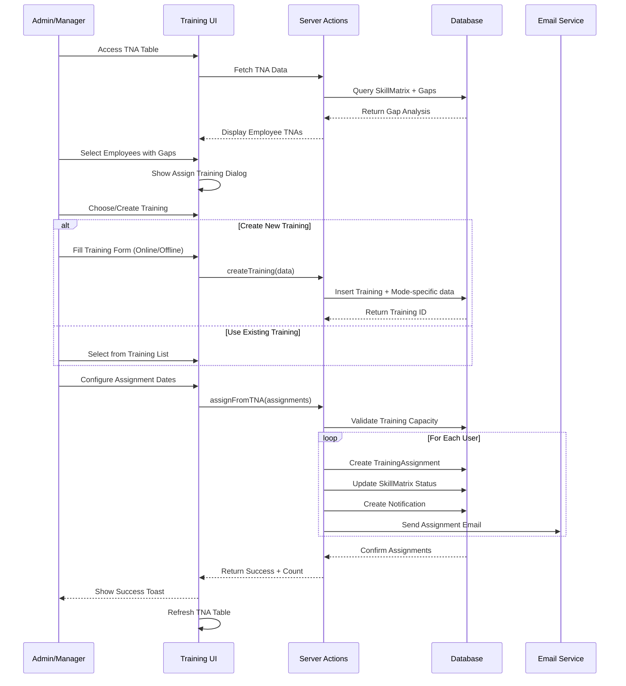

I have created the following plan after thorough exploration and analysis of the codebase. Follow the below plan verbatim. Trust the files and references. Do not re-verify what's written in the plan. Explore only when absolutely necessary. First implement all the proposed file changes and then I'll review all the changes together at the end.

## Observations

The codebase follows a well-structured Next.js 16 architecture with Prisma ORM, NextAuth v5 for authentication, and shadcn/ui components. The database schema already includes `Training`, `OnlineTraining`, `OfflineTraining`, and `TrainingAssignment` models. The TNA (Training Need Analysis) system is fully implemented with skill gap analysis and training recommendations. The existing patterns use server actions with Zod validation, `useActionState` hook for form handling, and dialog-based UI components. UploadThing is available for file uploads, and the system supports role-based access control (ADMIN, TRAINER, EMPLOYEE, MANAGER).

## Approach

The implementation will create a comprehensive training management system that integrates seamlessly with the existing TNA infrastructure. We'll build validation schemas for training data, server actions for CRUD operations, and UI components for both online and offline training modes. The key innovation is enabling direct training assignment from the TNA table, allowing admins and managers to quickly address identified skill gaps. The system will support bulk assignment to multiple users based on TNA recommendations, with separate configuration flows for online (mentor-based, resource-driven) and offline (schedule-based, venue-driven) training modes. All components will follow existing patterns for consistency and maintainability.

## Implementation Steps

### 1. Create Training Validation Schemas

**File**: `file:lib/validation.ts`

Add comprehensive Zod schemas for training management:

```typescript
// Training validation schemas
export const trainingSchema = z.object({
  topicName: z.string().min(3, 'Topic name must be at least 3 characters'),
  description: z.string().optional(),
  mode: z.enum(['ONLINE', 'OFFLINE']),
  duration: z.coerce.number().min(1, 'Duration must be at least 1 hour'),
  skillId: z.string().min(1, 'Skill is required'),
  resources: z.string().optional(), // JSON string
  venue: z.string().optional(),
  meetingLink: z.string().url().optional().or(z.literal('')),
  maxParticipants: z.coerce.number().min(1).optional(),
})

export const onlineTrainingSchema = z.object({
  trainingId: z.string(),
  resourceLinks: z.array(z.object({
    title: z.string(),
    url: z.string().url(),
    type: z.string(),
  })).min(1, 'At least one resource is required'),
  estimatedDuration: z.coerce.number().min(1),
  mentorRequired: z.boolean(),
})

export const offlineTrainingSchema = z.object({
  trainingId: z.string(),
  schedule: z.array(z.object({
    date: z.string(),
    startTime: z.string(),
    endTime: z.string(),
    sessionTitle: z.string().optional(),
  })).min(1, 'At least one session is required'),
  venue: z.string().min(1, 'Venue is required'),
  materials: z.array(z.object({
    name: z.string(),
    url: z.string(),
    type: z.string(),
  })).optional(),
  trainerIds: z.array(z.string()).min(1, 'At least one trainer is required'),
})

export const trainingAssignmentSchema = z.object({
  trainingId: z.string(),
  userIds: z.array(z.string()).min(1, 'At least one user is required'),
  trainerId: z.string().optional(),
  mentorId: z.string().optional(),
  startDate: z.string().transform(str => new Date(str)),
  targetCompletionDate: z.string().transform(str => new Date(str)),
}).refine(
  (data) => data.targetCompletionDate > data.startDate,
  { message: 'Target completion date must be after start date' }
)

export const bulkTrainingAssignmentSchema = z.object({
  trainingId: z.string(),
  assignments: z.array(z.object({
    userId: z.string(),
    trainerId: z.string().optional(),
    mentorId: z.string().optional(),
    startDate: z.string(),
    targetCompletionDate: z.string(),
  })).min(1, 'At least one assignment is required').max(100, 'Maximum 100 assignments per batch'),
})

export const tnaBasedAssignmentSchema = z.object({
  skillId: z.string(),
  userIds: z.array(z.string()).min(1),
  createNewTraining: z.boolean(),
  existingTrainingId: z.string().optional(),
  trainingData: trainingSchema.optional(),
  startDate: z.string(),
  targetCompletionDate: z.string(),
}).refine(
  (data) => data.createNewTraining ? !!data.trainingData : !!data.existingTrainingId,
  { message: 'Either select existing training or provide new training data' }
)
```

Export TypeScript types:
```typescript
export type TrainingInput = z.infer<typeof trainingSchema>
export type OnlineTrainingInput = z.infer<typeof onlineTrainingSchema>
export type OfflineTrainingInput = z.infer<typeof offlineTrainingSchema>
export type TrainingAssignmentInput = z.infer<typeof trainingAssignmentSchema>
export type BulkTrainingAssignmentInput = z.infer<typeof bulkTrainingAssignmentSchema>
export type TNABasedAssignmentInput = z.infer<typeof tnaBasedAssignmentSchema>
```

### 2. Create Training Server Actions

**File**: `file:actions/trainings.ts`

Implement comprehensive server actions following the existing pattern from `file:actions/assessments.ts`:

**CRUD Operations**:
- `createTraining(data: TrainingInput)` - Create base training with auth check (ADMIN/TRAINER)
- `createOnlineTraining(data: OnlineTrainingInput)` - Create online training metadata
- `createOfflineTraining(data: OfflineTrainingInput)` - Create offline training metadata
- `updateTraining(id: string, data: Partial<TrainingInput>)` - Update training details
- `deleteTraining(id: string)` - Soft delete with cascade checks
- `getTrainings(filters?, skip?, take?)` - Paginated list with filters (mode, skillId, status)
- `getTrainingById(id: string)` - Detailed fetch with relations (skill, creator, assignments, online/offline data)

**Assignment Operations**:
- `assignTraining(data: TrainingAssignmentInput)` - Assign training to users with validation
- `bulkAssignTraining(data: BulkTrainingAssignmentInput)` - Bulk assignment with transaction
- `assignFromTNA(data: TNABasedAssignmentInput)` - Create/assign training based on TNA recommendations
- `unassignTraining(assignmentId: string)` - Remove assignment with status check
- `updateAssignmentDates(assignmentId: string, dates)` - Modify assignment timeline
- `getAssignedUsers(trainingId: string)` - List users assigned to training
- `getUserTrainings(userId: string)` - List trainings for specific user

**Helper Functions**:
- `getAvailableTrainers()` - Fetch users with TRAINER role
- `getAvailableMentors(skillId: string)` - Fetch mentors for specific skill
- `validateTrainingCapacity(trainingId: string, userCount: number)` - Check offline training capacity
- `updateSkillMatrixStatus(userId: string, skillId: string)` - Update status to 'training_assigned'

Each action should:
1. Check authentication with `await auth()`
2. Validate role permissions (ADMIN, MANAGER, TRAINER)
3. Parse and validate input with Zod schemas
4. Perform Prisma operations with proper error handling
5. Revalidate relevant paths (`/admin/training`, `/manager/assign-training`, `/employee/my-trainings`)
6. Return typed responses or throw descriptive errors

### 3. Create Training Topic Builder Page

**File**: `file:app/(dashboard)/admin/training/create/page.tsx`

Server component with role check and data fetching:

```typescript
export default async function CreateTrainingPage() {
  const session = await auth()
  if (!session?.user) redirect('/login')
  
  const isAdmin = session.user.systemRoles?.includes('ADMIN')
  const isTrainer = session.user.systemRoles?.includes('TRAINER')
  if (!isAdmin && !isTrainer) redirect('/unauthorized')
  
  // Fetch skills for dropdown
  const skills = await prisma.skill.findMany({
    include: { category: true },
    orderBy: { name: 'asc' }
  })
  
  // Fetch trainers for offline training
  const trainers = await prisma.user.findMany({
    where: { systemRoles: { has: 'TRAINER' } },
    select: { id: true, name: true, email: true }
  })
  
  return <CreateTrainingForm skills={skills} trainers={trainers} />
}
```

**Component**: `file:components/dashboard/training/CreateTrainingForm.tsx`

Client component with mode toggle and conditional rendering:

- Use `useActionState` with `createTraining` action
- Mode selector (Online/Offline) with visual toggle
- Common fields: topicName, description, skillId (searchable combobox), duration
- Conditional rendering based on mode:
  - **Online**: Render `<OnlineTrainingForm />` component
  - **Offline**: Render `<OfflineTrainingForm />` component
- Submit button with loading state
- Success/error toast notifications
- Redirect to training list on success

### 4. Create Online Training Configuration Component

**File**: `file:components/training/OnlineTrainingForm.tsx`

Client component for online training specific fields:

**Fields**:
- Resource Links (dynamic array):
  - Title input
  - URL input with validation
  - Resource type dropdown (UDEMY, COURSE, ARTICLE, VIDEO, DOCUMENTATION)
  - Add/Remove buttons for multiple resources
- Estimated Duration (hours) - number input
- Mentor Required - checkbox toggle
- Mentor Selection - searchable combobox (if mentor required)
  - Fetch mentors with `getAvailableMentors(skillId)`
  - Display mentor name, email, expertise level

**UI Features**:
- Drag-and-drop reordering for resources
- URL validation with visual feedback
- Resource preview cards
- Estimated completion date calculator based on duration
- Integration with existing `file:components/dashboard/skill-gaps/training-resources.tsx` for preview

### 5. Create Offline Training Configuration Component

**File**: `file:components/training/OfflineTrainingForm.tsx`

Client component for offline training specific fields:

**Fields**:
- Schedule Builder (dynamic array):
  - Date picker (react-day-picker)
  - Start time input
  - End time input
  - Session title input
  - Add/Remove session buttons
- Venue - text input with autocomplete (previous venues)
- Meeting Link - optional URL input (for hybrid sessions)
- Max Participants - number input with capacity warning
- Trainer Selection - multi-select combobox
  - Display trainer name, email, department
  - Minimum 1 trainer required
- Materials Upload:
  - UploadThing integration for file uploads
  - Support PDF, PPTX, DOCX, ZIP files
  - Display uploaded files with preview/download links
  - Alternative: URL input for online materials

**UI Features**:
- Calendar view for schedule visualization
- Time conflict detection across sessions
- Venue availability checker (optional)
- Trainer availability validation
- Session duration calculator
- Material size limit warnings

### 6. Create Training Assignment Interface for Managers

**File**: `file:app/(dashboard)/manager/assign-training/page.tsx`

Server component with manager-specific data:

```typescript
export default async function AssignTrainingPage() {
  const session = await auth()
  if (!session?.user) redirect('/login')
  
  const isManager = session.user.systemRoles?.includes('MANAGER')
  const isAdmin = session.user.systemRoles?.includes('ADMIN')
  if (!isManager && !isAdmin) redirect('/unauthorized')
  
  // Fetch reportees for managers
  const reportees = isAdmin 
    ? await prisma.user.findMany({ where: { resigned: false } })
    : await prisma.user.findMany({ where: { managerId: session.user.id } })
  
  // Fetch available trainings
  const trainings = await prisma.training.findMany({
    include: { skill: true, onlineTraining: true, offlineTraining: true }
  })
  
  return <AssignTrainingInterface reportees={reportees} trainings={trainings} />
}
```

**Component**: `file:components/dashboard/training/AssignTrainingInterface.tsx`

Client component with assignment workflow:

**Features**:
- Training selection dropdown with search and filters (mode, skill)
- User selection:
  - Multi-select table with checkboxes
  - Search and filter by department, role, skill gaps
  - Display user name, email, department, current skill level
- Assignment configuration:
  - Start date picker
  - Target completion date picker
  - Trainer/Mentor assignment (optional)
  - Bulk apply settings to all selected users
- Preview section showing assignment summary
- Submit with `bulkAssignTraining` action
- Success confirmation with assignment count

### 7. Integrate Training Assignment with TNA Table

**File**: `file:components/dashboard/tna/EmployeeTNATable.tsx`

Enhance existing component with training assignment actions:

**Modifications**:
1. Add "Assign Training" button in Actions column
2. Add bulk selection checkboxes for multiple employees
3. Add bulk action toolbar when employees are selected
4. Create `<AssignTrainingDialog />` component:
   - Triggered from row action or bulk action
   - Pre-populate with employee's skill gaps
   - Show recommended trainings for each gap
   - Allow creating new training or selecting existing
   - Support assigning different trainings for different skills
   - Use `assignFromTNA` action for submission

**Component**: `file:components/dashboard/tna/AssignTrainingDialog.tsx`

Dialog component for TNA-based assignment:

**Props**: `{ userIds: string[], skillGaps: SkillGapData[] }`

**UI Flow**:
1. Display selected employees and their critical/high gaps
2. For each skill gap:
   - Show existing trainings for that skill
   - Option to create new training (inline form)
   - Select training mode (online/offline)
3. Configure assignment dates (bulk or per-user)
4. Assign trainers/mentors
5. Submit with `assignFromTNA` action
6. Show success summary with assignment details

### 8. Create Bulk Training Assignment Interface

**File**: `file:app/(dashboard)/admin/bulk-assign/page.tsx`

Admin-only page for organization-wide assignments:

**Features**:
- Filter employees by:
  - Department
  - Role
  - Skill gap category (Critical, High)
  - Specific skill
- Display filtered employee list with gap details
- Select training to assign
- Configure assignment parameters:
  - Start date (same for all or staggered)
  - Completion date (same for all or calculated based on duration)
  - Trainer/Mentor assignment strategy (auto-assign, manual, none)
- Preview assignments before submission
- Submit with `bulkAssignTraining` action
- Export assignment report

### 9. Create Training List and Management Page

**File**: `file:app/(dashboard)/admin/training/page.tsx`

Server component for training catalog:

```typescript
export default async function TrainingsPage({ searchParams }) {
  const session = await auth()
  if (!session?.user) redirect('/login')
  
  const filters = {
    mode: searchParams.mode,
    skillId: searchParams.skillId,
    searchTerm: searchParams.search,
  }
  
  const trainings = await getTrainings(filters)
  
  return <TrainingsTable trainings={trainings} />
}
```

**Component**: `file:components/dashboard/training/TrainingsTable.tsx`

Table component with CRUD actions:

**Columns**: Topic Name, Skill, Mode, Duration, Assigned Users, Created By, Actions

**Features**:
- Search by topic name
- Filter by mode, skill, creator
- Sort by name, duration, created date
- Row actions: View, Edit, Assign, Delete
- Bulk actions: Delete, Export
- Click row to view details page

### 10. Create Training Details Page

**File**: `file:app/(dashboard)/admin/training/[id]/page.tsx`

Server component showing training details:

```typescript
export default async function TrainingDetailsPage({ params }) {
  const training = await getTrainingById(params.id)
  if (!training) notFound()
  
  return (
    <div>
      <TrainingHeader training={training} />
      <TrainingContent training={training} />
      <AssignedUsersSection trainingId={training.id} />
    </div>
  )
}
```

**Components**:
- `<TrainingHeader />` - Title, skill, mode badge, edit/delete actions
- `<TrainingContent />` - Description, duration, resources/schedule based on mode
- `<AssignedUsersSection />` - Table of assigned users with status, progress

### 11. Add Training Assignment Notifications

**Integration**: Update `file:actions/trainings.ts` assignment functions

After successful assignment:
1. Create notification record in database:
```typescript
await prisma.notification.create({
  data: {
    recipientId: userId,
    type: 'TRAINING_ASSIGNED',
    subject: `New Training Assigned: ${training.topicName}`,
    message: `You have been assigned to ${training.topicName} training. Start date: ${startDate}`,
  }
})
```

2. Send email notification using `file:lib/email.ts`:
```typescript
await sendEmail({
  to: user.email,
  subject: 'New Training Assignment',
  template: 'training-assigned',
  data: { userName, trainingName, startDate, completionDate, mode }
})
```

### 12. Create Training Assignment Status Updates

**File**: `file:actions/trainings.ts`

Add status management functions:

- `updateAssignmentStatus(assignmentId: string, status: TrainingStatus)` - Update status with validation
- `startTraining(assignmentId: string)` - Change status to IN_PROGRESS
- `completeTraining(assignmentId: string)` - Change status to COMPLETED, update skill matrix
- `cancelTraining(assignmentId: string, reason: string)` - Change status to CANCELLED with reason

Each status change should:
1. Validate current status (state machine logic)
2. Update TrainingAssignment record
3. Update SkillMatrix status if applicable
4. Create notification
5. Revalidate relevant paths

## Mermaid Diagram



## Summary Table

| Component | File Path | Purpose |
|-----------|-----------|---------|
| Validation Schemas | `lib/validation.ts` | Zod schemas for training data validation |
| Server Actions | `actions/trainings.ts` | CRUD operations and assignment logic |
| Training Builder | `app/(dashboard)/admin/training/create/page.tsx` | Create new training topics |
| Online Form | `components/training/OnlineTrainingForm.tsx` | Configure online training resources |
| Offline Form | `components/training/OfflineTrainingForm.tsx` | Configure offline training schedule |
| Manager Assignment | `app/(dashboard)/manager/assign-training/page.tsx` | Assign trainings to reportees |
| TNA Integration | `components/dashboard/tna/AssignTrainingDialog.tsx` | Direct assignment from TNA table |
| Bulk Assignment | `app/(dashboard)/admin/bulk-assign/page.tsx` | Organization-wide bulk assignments |
| Training List | `app/(dashboard)/admin/training/page.tsx` | Training catalog management |
| Training Details | `app/(dashboard)/admin/training/[id]/page.tsx` | View training details and assignments |