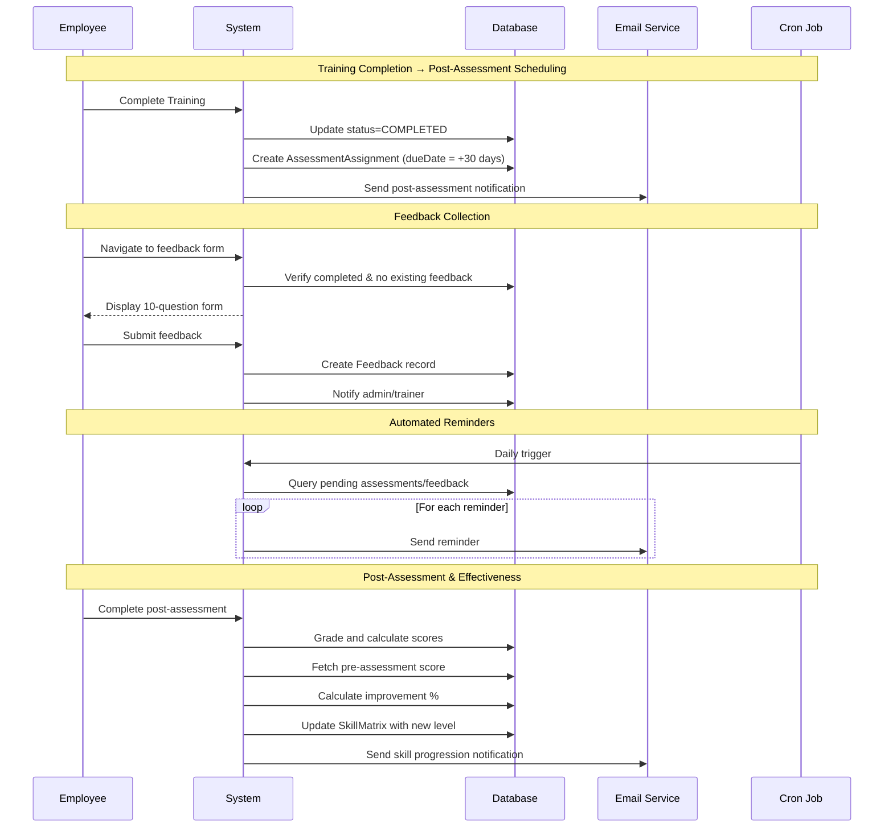

I have created the following plan after thorough exploration and analysis of the codebase. Follow the below plan verbatim. Trust the files and references. Do not re-verify what's written in the plan. Explore only when absolutely necessary. First implement all the proposed file changes and then I'll review all the changes together at the end.

## Observations

The codebase has a solid foundation with Prisma schema including the `Feedback` model, comprehensive assessment and training management systems, and email notification infrastructure using nodemailer. The skill matrix update mechanism exists in `file:skillloop/actions/skill-matrix.ts` with gap recalculation logic. However, there's no feedback collection UI, no automated post-training assessment scheduling (assessments are currently assigned at training start, not 30 days post-completion), no training effectiveness calculation comparing pre/post scores, and no scheduled job system for automated reminders.

## Approach

## Overview
Build a comprehensive post-training evaluation system with detailed feedback collection, automated assessment scheduling 30 days post-completion, training effectiveness analytics comparing pre/post scores, and automated reminder

## Implementation Steps

### 1. Validation Schemas

**Add to `lib/validation.ts`:**

**`feedbackSchema`** with fields:
- assignmentId (string)
- likeMost (string, max 1000) - Q1
- keyLearnings (string, max 1000) - Q2
- confusingTopics (string, optional, max 1000) - Q3
- materialHelpful (1-5 scale) - Q4
- interactiveEngaging (1-5 scale) - Q5
- trainerAnswered (1-5 scale) - Q6
- qualityRating (enum: "Excellent", "Good", "Average", "Below Average") - Q7
- contentSatisfaction (1-5 scale) - Q8
- competentConfident (string, max 1000) - Q9
- suggestions (string, optional, max 1000) - Q10

**`feedbackFilterSchema`** for reports:
- dateRange, department, trainingMode, ratingRange

Export types: `FeedbackInput`, `FeedbackFilterInput`

---

### 2. Feedback Server Actions

**Create `actions/feedback.ts`:**

- `submitFeedback(data: FeedbackInput)` - Create feedback, notify admin/trainer, send thank-you email
- `getTrainingFeedback(trainingId: string)` - Aggregate all feedback with averages
- `getFeedbackSummary(filters?)` - Analytics with NPS, trends, trainer rankings
- `exportFeedbackReport(filters?)` - Generate CSV export

---

### 3. Feedback Form Page

**Create `app/(dashboard)/employee/training/[id]/feedback/page.tsx`:**

Modern multi-step feedback form:
- **Step 1**: Open-ended questions (Q1-Q3)
- **Step 2**: Rating scales (Q4-Q8) 
- **Step 3**: Final thoughts (Q9-Q10)

**shadcn components:** `card`, `form`, `textarea`, `radio-group`, `button`, `progress`, `separator`, `label`

---

### 4. Feedback Analytics Dashboard

**Create `app/(dashboard)/admin/reports/feedback/page.tsx`:**

Modern analytics interface with:

**Filter Panel:**
- Date range picker (calendar-23 component)
- Department/mode/trainer selects
- Rating range slider

**Metrics Cards:**
- Total responses
- Average scores with trend indicators
- NPS score gauge
- Response rate %

**Visualizations (Recharts):**
- **RadarChart** - Multi-dimensional ratings (trainer, content, material, etc.)
- **ComposedChart** - Trends over time (line + bar)
- **BarChart** - Comparison by department/mode
- **PieChart** - Quality rating distribution

**Data Table:**
- Sortable columns
- Comments preview
- Export CSV button

**shadcn components:** `card`, `tabs`, `select`, `button`, `table`, `badge`, `calendar`, `slider`

---

### 5. Post-Assessment Scheduling

**Modify `actions/trainings.ts` → `updateTrainingCompletion`:**

On training completion:
- Calculate `postAssessmentDate = completionDate + 30 days`
- Create/update `AssessmentAssignment` with future due date
- Store `preAssessmentAttemptId` reference
- Send "post-assessment scheduled" email
- Create notification

---

### 6. Training Effectiveness Calculation

**Enhance `actions/assessments.ts` → `completeGrading`:**

After grading post-assessment:
- Fetch pre-assessment score
- Calculate improvement: `(post - pre) / pre * 100`
- Update `SkillMatrix`:
  - `currentLevel` based on post-score (0-40: BEGINNER, 41-60: INTERMEDIATE, 61-80: ADVANCED, 81-100: EXPERT)
  - Higher confidence if improvement >20%
  - Recalculate gap percentage
  - Set status to 'completed' if gap <15%
- Create notification about skill progression
- Trigger gap recalculation

---

### 7. Automated Reminders System

**Create `app/api/cron/reminders/route.ts`:**

Daily cron job (protected by `CRON_SECRET`):
- **Assessment reminders** - 3 days before due date
- **Feedback reminders** - 7 days after training completion (if not submitted)
- **Progress reminders** - Weekly updates overdue >7 days

Return counts of reminders sent
---

### 8. Email Templates

**Add to `lib/email.ts`:**

- **`feedback-reminder`** - Friendly request, 7-day window, direct link
- **`progress-reminder`** - Weekly update nudge, mentor info
- **`post-assessment-scheduled`** - Congratulations + 30-day notice + prep tips
- **`skill-progression`** - Updated skill level notification

---

### 9. Feedback Summary Component

**Create `components/dashboard/training/FeedbackSummaryCard.tsx`:**

Reusable widget for training pages:
- Average ratings with stars/badges
- Response count + rate
- Recent comments carousel (3-5 latest)
- RadarChart mini visualization
- "View Full Report" button

**shadcn components:** `card`, `badge`, `carousel`, `button`, `separator`

---

### 10. Training Effectiveness Report

**Create `components/dashboard/admin/TrainingEffectivenessChart.tsx`:**

Pre/Post comparison dashboard:
- **ComposedChart** - Pre vs post scores (grouped bars)
- **BarChart** - Improvement distribution (negative, 0-20%, 20-50%, >50%)
- Statistics: mean improvement, median, success rate
- Data table with individual learner results
- Export functionality

**shadcn components:** `card`, `table`, `badge`, `button`, `tabs`

---

### 11. Integration Updates

**Update `actions/trainings.ts` → `assignTraining`:**
- Remove post-assessment auto-scheduling
- Keep only pre-assessment assignment
- Document post-assessment scheduling on completion

**Update `components/dashboard/training/MyTrainingsList.tsx`:**
- Show "Submit Feedback" button for completed trainings (7-day window)
- Display feedback submission status

**Update `app/(dashboard)/trainer/page.tsx`:**
- Add "Pending Feedback Reviews" count card
- Link to feedback reports

---

### 12. System Configuration

**Add to `actions/config.ts`:**

Configurable reminder settings:
- `FEEDBACK_REMINDER_ENABLED` (boolean)
- `FEEDBACK_REMINDER_DAYS` (default: 7)
- `ASSESSMENT_REMINDER_DAYS` (default: 3)
- `PROGRESS_REMINDER_DAYS` (default: 7)

Admin UI to manage in config page

---

## Modern UI Enhancements

**Form Design:**
- Multi-step wizard with progress indicator
- Smooth transitions between steps
- Inline validation with helpful messages
- Auto-save drafts
- Character counters on textareas
- Star rating with hover animations
- Radio groups with card-style options

**Analytics:**
- Glassmorphism cards with gradients
- Animated charts (Recharts transitions)
- Interactive tooltips
- Heatmap for response patterns
- Trend indicators (↑↓) with colors
- Empty states with illustrations

**Color Coding:**
- Red: Below Average, <3.0 ratings
- Yellow: Average, 3.0-3.9
- Green: Good/Excellent, 4.0+

---

## shadcn Components Summary

Core: `card`, `form`, `textarea`, `radio-group`, `button`, `badge`, `label`, `separator`, `progress`, `tabs`, `select`, `table`, `calendar`, `slider`, `carousel`

Charts: Use `chart` wrapper with Recharts

Blocks: `calendar-23` (date range picker)

---

## Testing Checklist

- [ ] Feedback form submits with all 10 questions
- [ ] Multi-step navigation works smoothly
- [ ] Analytics charts render with data
- [ ] Post-assessment schedules 30 days after completion
- [ ] Effectiveness calculation compares pre/post correctly
- [ ] Email reminders send on schedule
- [ ] CSV export generates properly
- [ ] Notifications trigger correctly
- [ ] Skill matrix updates based on post-scores
- [ ] Mobile responsive
- [ ] Permission checks enforce

---

## Sequence Diagram

1.What did you like the most about the training? Was the training relevant to your job or potential job?

2.Please list 2-3 key learnings from today's training. How do you anticipate to applying them to your work in future?

3.Was there any topic which was confusing? If so, please provide with specific examples.

4.Was the training material and content helpful to you?

5.Was the training program interactive and engaging?

6.Was the trainer able to answer all your questions during the training?

7.How would you rate the quality of this training session?
Excellent Good Average Below Average
8.Were you satisfied with the learning content and material?

9.Do you feel competent and confident at the end of the training program? Please share any concerns or knowledge gaps.

10.Do you have any suggestions that can help us improve the training program?