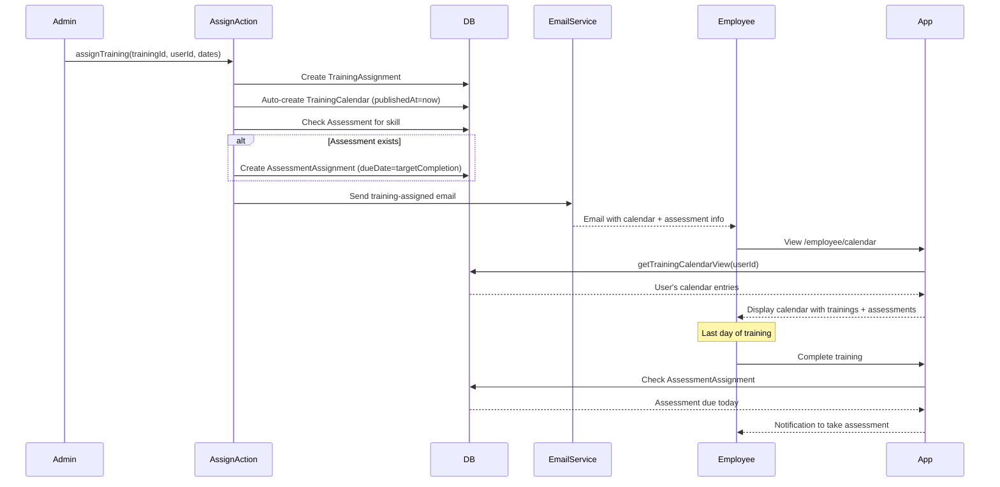

I have created the following plan after thorough exploration and analysis of the codebase. Follow the below plan verbatim. Trust the files and references. Do not re-verify what's written in the plan. Explore only when absolutely necessary. First implement all the proposed file changes and then I'll review all the changes together at the end.

## Overview

Build an automatic training calendar system that generates calendar entries from training assignments, displays beautiful timeline visualizations with role-based views (admin/manager see all, employees see their own), and automatically schedules assessments on the last training day. The system uses existing Prisma models (TrainingCalendar, TrainingAssignment, Assessment) and leverages Recharts for visualization.

## Key Requirements

1. **Automatic Calendar Generation**: Calendar entries auto-created when training is assigned using TrainingAssignment startDate/targetCompletionDate
2. **Assessment Auto-Scheduling**: Assessment automatically scheduled on training's last day (targetCompletionDate)
3. **Role-Based Views**: Admin/Manager see all trainings, Employees see only their assigned trainings
4. **Beautiful Calendar UI**: Multiple view modes with Recharts (Timeline, Weekly, Monthly, List)
5. **Training Records**: Track individual training progress, attendance, and assessment linkage

## Implementation Steps

### 1. Extend Training Assignment Action with Automatic Calendar Generation

**File**: `actions/trainings.ts`

Modify `assignTraining` function to:
- After creating TrainingAssignment, automatically create TrainingCalendar entry with trainingDate = startDate
- If training mode is OFFLINE, create calendar entries for each training session between startDate and targetCompletionDate
- Auto-publish calendar entry (set publishedAt) so it's immediately visible
- Trigger email notification with calendar details

### 2. Create Calendar Server Actions

**File**: `actions/calendar.ts`

Implement:
- `getCalendarEntries(filters)`: Fetch calendar entries with filters (userId, dateRange, trainingId, published). Include Training, Skill, Attendance count, TrainingAssignment details
- `getUpcomingTrainings(userId)`: Fetch next 30 days of published trainings for user (filter by TrainingAssignment.userId)
- `updateCalendarEntry(id, data)`: Update date/venue/link and notify affected users
- `getTrainingCalendarView(userId, role, dateRange)`: Role-based calendar data (ADMIN/MANAGER get all, others get own)
- `markAttendance(calendarId, userId, status)`: Record attendance for training sessions

Authorization: Check user role (ADMIN, TRAINER, MANAGER access all; others access own trainings only)

### 3. Auto-Schedule Assessment on Training Completion

**File**: `actions/trainings.ts`

Add `scheduleTrainingAssessment` function:
- When training is assigned, check if Assessment exists for the training's skillId (isPreAssessment = false)
- If assessment exists, create AssessmentAssignment with dueDate = targetCompletionDate
- If no assessment exists, log warning (admin can create later)
- Send notification to user about scheduled assessment

Modify `assignTraining` to call `scheduleTrainingAssessment` after creating TrainingAssignment

### 4. Build Training Calendar Component

**File**: `components/training/TrainingCalendar.tsx`

Client component with view modes:

**Calendar View** (default):
- Use shadcn Calendar component as base, extend to show trainings on each date
- Month grid layout (7 columns for days, rows for weeks)
- Each date cell shows: Training count badge, color dots for mode (blue=ONLINE, orange=OFFLINE)
- **For Admin/Manager view**: Show all users' trainings on each date, grouped/color-coded by user or department
- Click date to expand and show all trainings for that day in a Sheet/Popover with user grouping
- Multi-training dates have stacked indicators with user avatars
- Current day highlighted, weekend styling
- Month/Year navigation controls
- Legend showing user colors/departments

**Gantt Chart View**:
- Custom Gantt chart implementation using HTML table or Recharts
- Y-axis: User names (rows), X-axis: Timeline (dates)
- Each training shown as horizontal colored bar (start to end date)
- Bar shows: Training name, duration
- Hover tooltip: Full training details (skill, trainer, venue/link)
- Color-coded by mode: ONLINE (blue), OFFLINE (orange)
- Search/filter by user, department, trainer
- Zoom controls (day/week/month granularity)

**List View**:
- Table with columns: Date, Time, Training, Skill, Mode, Venue/Link, Trainer, Assigned Users (count), Status, Actions
- Advanced search: Training name, skill, trainer, date range
- Filters: Mode, Department, Trainer, Status (Published/Unpublished)
- Sort by: Date (default), Training name, Mode, Trainer
- Pagination (20 per page)
- Bulk actions: Select multiple, Publish, Export

**Props**: `calendarEntries`, `users`, `viewMode`, `isAdmin`, `onEventClick`, `filters`

**Required shadcn components**: `npx shadcn@latest add @shadcn/calendar @shadcn/sheet @shadcn/tabs @shadcn/popover @shadcn/select @shadcn/progress @shadcn/tooltip @shadcn/separator @shadcn/table`

### 5. Admin Calendar Management Page

**File**: `app/(dashboard)/admin/calendar/page.tsx`

Server component structure:
- Fetch all calendar entries + users using `getTrainingCalendarView(null, 'ADMIN', dateRange)`
- Top filter bar: Date range, Search (training/user name), Department filter, Trainer filter, Mode filter, Status filter
- Stats cards: Total Trainings, This Week, This Month, Active Users
- View mode tabs: **Calendar View | Gantt Chart | List View** (admins can switch between all 3)
- **Default to Gantt Chart** for admins (best for seeing all users at once)
- **Calendar View for Admin**: Shows month grid with ALL users' trainings
  - Each date shows training count with breakdown (5 trainings, 3 users)
  - Click date opens Sheet showing all trainings grouped by user
  - Color-coded by department or user (with legend)
  - Filter by specific user/department to declutter
- **Gantt Chart**: User timeline view (rows=users, columns=dates, bars=trainings)
- **List View**: Table with all trainings, users, advanced filters
- Quick actions: Publish Selected, Export Calendar (CSV/iCal), Print
- Calendar event click opens Sheet with: Training details, Assigned users list, Edit button, Mark attendance

**File**: `app/(dashboard)/admin/calendar/[id]/page.tsx`
- Single calendar entry details page
- Edit form: Date, Time, Venue/Link, MaxParticipants
- Assigned users list with attendance checkboxes
- Attendance tracking table (mark Present/Absent/Late)
- Send notification button (reschedule alerts)
- Link to related training and assessment

### 6. Employee Calendar Page
efault to Calendar View (month grid) showing user's assigned trainings
- Filter toggle: "My Trainings" (assigned) vs "All Department Trainings"
- Each training shown on calendar date with color badge
- Click date to see training details, venue/link, time
- Upcoming section (right sidebar): Next 7 days trainings with countdown
- "Join Meeting" button for online trainings (active 15 mins before start)
- Download .ics file option for each training
- Show only published entries
- Filter: "My Trainings" (assigned) vs "All Department Trainings"
- Upcoming trainings card (next 7 days) with countdown timer
- "Join Meeting" button for online trainings (active 15 mins before start)'s reportees
- Default to Gantt Chart view showing team members (rows) and their training timelines
- Filter by team member name, department, training status
- Stats: Team training hours this month, Attendance rate, Pending assessments, Completion rate
- View modes: Gantt Chart | Calendar View | List View
- Export team calendar (CSV/iCal/PDF)
- Click training bar to see details and attendance statusr/calendar/page.tsx`

- Fetch team trainings using `getTrainingCalendarView(null, 'MANAGER', dateRange)` + filter by managerId
- Display TrainingCalendar component
- Show all team members' trainings
- Stats: Team training hours this month, Attendance rate, Pending assessments
- Export team calendar (CSV/iCal)

### 8. Update Employee Dashboard with Upcoming Trainings

**File**: `app/(dashboard)/employee/page.tsx`

Add "Upcoming Trainings" section:
- Fetch `getUpcomingTrainings(session.user.id)` (next 7 days)
- Display Card with training list: Name, Date/Time, Mode badge, Countdown (if < 24hrs)
- Show linked assessment due date (from AssessmentAssignment)
- "Add to Calendar" button (generate .ics file)
- "View All" link to `/employee/calendar`

### 9. Email Notifications for Calendar Events

**File**: `lib/email.ts`

Add email templates:
- `training-assigned`: Include calendar details, training schedule, assessment due date
- `calendar-updated`: Notify when training date/venue changes
- `training-reminder`: 24hrs before training (can be implemented as cron job later)
- `assessment-due`: Reminder about assessment scheduled for training completion

Template includes:
- Training name, Skill, Trainer
- Date/Time, Venue/Link
- Assessment info (if scheduled)
- .ics calendar attachment link

### 10. Training Record View with Calendar Integration

**File**: `app/(dashboard)/employee/my-trainings/page.tsx`

Enhance existing page:
- For each training assignment, fetch related calendar entries
- Display training timeline: Start date → Sessions → End date → Assessment due
- Show attendance records with status badges
- Progress bar: (attended sessions / total sessions)
- Link to scheduled assessment
- Certificate download (if completed)

**File**: `components/dashboard/training/TrainingRecordCard.tsx`

New component showing:
- Training header: Name, Skill, Mode, Status
- Timeline visualization (Recharts Line chart showing progress)
- Calendar Visualization**:
- Shadcn Calendar component (extended) for month grid view
- Custom Gantt Chart (HTML table or Recharts) for user timeline view
- Table component for list view with advanced filtering

**Shadcn Components Required**:
```bash
npx shadcn@latest add @shadcn/calendar @shadcn/sheet @shadcn/tabs @shadcn/popover @shadcn/select @shadcn/progress @shadcn/tooltip @shadcn/separator @shadcn/table
```

**Gantt Chart Implementation**:
- Option 1: Custom HTML/CSS table with absolute positioned bars
- Option 2: Use Recharts BarChart with rotated categories (users as Y-axis, dates as X-axis)
- Each bar represents training duration (startDate to targetCompletionDate)
- Color-coded by mode, clickable for detailsomposedChart for timeline view (Bar + Line)
- AreaChart for weekly trend
- BarChart for monthly distribution
- LineChart for individual training progress

**Shadcn Components Required**:
```bash
npx shadcn@latest add @shadcn/calendar @shadcn/sheet @shadcn/tabs @shadcn/popover @shadcn/select @shadcn/progress @shadcn/tooltip @shadcn/separator
```

**Database Flow**:
1. Training created → Training tableall view modes (Calendar/Gantt/List), can edit
  - Calendar view shows ALL users' trainings on each date
  - Gantt view shows ALL users as rows with training timelines
  - Default: Gantt Chart (best overview)
- TRAINER: View trainings they're assigned to, all view modes
- LEARNER: View only their assigned trainings
  - Calendar view shows personal trainings only
  - Default: Calendar View (focused on own schedule)ningDate = startDate, publishedAt = now)
4. Auto-assign → AssessmentAssignment (dueDate = targetCompletionDate)
5. Attendance recorded → Attendance table (linked to TrainingCalendar)

**Role-Based Access**:
- ADMIN/MANAGER: Full access to all calendars, can edit
- TRAINER: View trainings they're assigned to
- LEARNER: View only their assigned trainings

---

## Sequence Diagram

